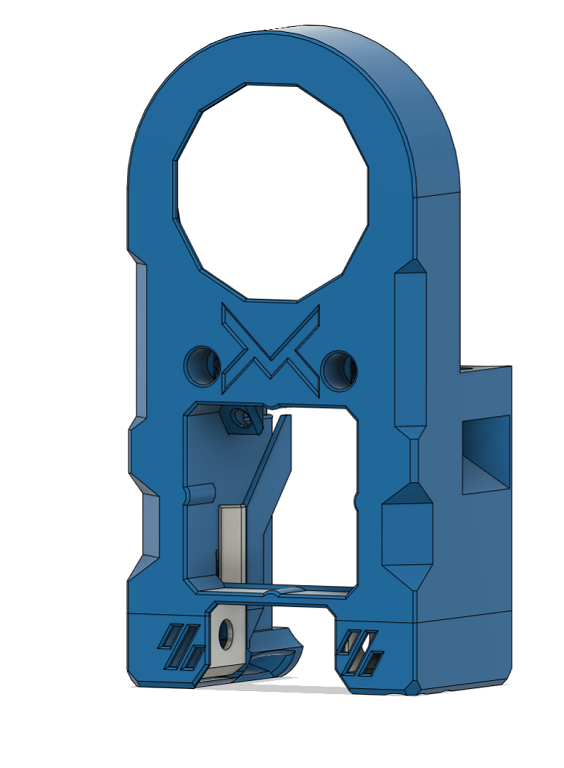

# 5015 Toolhead v4 (The Mailbox)

This is a Voron V0.1 toolhead that uses the guts of a 5015 fan for part cooling and incorporates Neopixel RGBW leds. It currently works with the LGX Lite extruder, the [Voron PocketWatch 2](https://github.com/VoronDesign/Pocket-Watch) and the [RoundHouse](https://github.com/waytotheweb/voron/tree/main/general/RoundHouse) and the [RoundAbout](https://github.com/waytotheweb/voron/tree/main/general/RoundAbout) extruders designed specifically for this hotend.

It uses the standard Voron V0.1 X carriage (and the MGN9C mod X carriage), is inspired by the [Mini-AfterSherpa](https://github.com/KurioHonoo/Mini-AfterSherpa).

This toolhead should not lose any X, Z travel. Y axis loss depends on the hotend and bed positioning. The Revo Voron losing none, but larger hotends losing up to ~3mm.


### v4 - Front:


### v4 - Back:


Computation Fluid Dynamics results:


## Printing:

- Use the Voron defaults and print in ABS or better
- The parts are orientated correctly in the STLs
- The cowl has different variants for choice of probe, or no probe
- Choose the mount for the specific hotend to be used
- If using the [Voron Pocket-Watch 2](https://github.com/VoronDesign/Pocket-Watch) extruder, print the source STL's from the repository, but use the [Guts_p2_x1.stl](STLs/Guts_p2_x1.stl) from this project instead. The Pocket-Watch is [inverted for this toolhead](images/PocketWatch2.jpg). (Note: The PTFE tube will likely pop out of the top of extruder when fully unloading filament as there is no room for the tube retainer)

## BOM:

- 2x M3x35mm SHCS/BHCS (2 for the X carriage mount)
- 2x M3x20mm  SHCS/BHCS (for the hotend/extruder mount)
- 2(4)x Brass heat inserts (2 for cowl hotend mount, 2 optional for ADXL mount)
- 1x 5015 part cooling fan that you are happy to cut to pieces
- 1x 3010 hotend fan (24v recommended)
- 2x Neopixels and wiring (optional)

The cowl variants support a no probe setup, [SlideSwipe magnetic probe](https://github.com/chestwood96/SlideSwipe), [ZeroClick probe](https://github.com/zruncho3d/ZeroClick), [(Un)Klicky Probe](https://github.com/jlas1/Klicky-Probe) and a MiniSlideSwipe using the SlideSwipe mechanism

## Supported Hotends:

- Revo Voron
- Dragon SF/HF
- DragonFly
- Rapido HF / Mellow Crazy Dragon / Dragon UHF (without extender)
- Mellow NF Crazy (/Mozzie)

## Fans:

I am using these fans:

- 24v Blower 5015: [Gdstime](https://www.aliexpress.com/item/32867546212.html)
- 24v Axial 3010: [Gdstime](https://www.aliexpress.com/item/1005002857100082.html)

## Heatsink Thermistor:

Each cowl includes a hole at the top to insert a thermistor. With this in place, klipper can track the temperature of the heatsink to watch for heat creep from the heatbreak. You can have klipper abort and shutdown before your whole toolhead melts! You only need a simple klipper entry for the appropriate pin on your MCU, e.g.:

```
[temperature_sensor Heatsink]
sensor_type: Generic 3950
sensor_pin: expander:PA5
max_temp: 85
```

Klipper will shutdown if the top of the heatsink hits 85C. You can use thermal paste to help keep a bulb thermistor in contact with the heatsink and route the wires through the provided groove, then fit the extruder on top to hold it in place.

## Assembly:


Place brass inserts into the cowl for mounting the hotend and the adxl mount if using this.

Remove the fan duct supports carefully. Check that none of the removed plastic has fallen into the ducts:




The 3010 hotend fan is meant to be press fit. If it's too tight, sand or file the opening but don't force it in otherwise it can deform and the blades will hit the casing. If it's too lose or rattles, use M3 screws to secure it through the top two holes into the cowl. Routing of the fans cables are through the channel provided:


You need to remove most of the outer shell of the 5015 fan. Before doing so, please connect the fan to your MCU/toolhead board and ensure that it responds to pmw from klipper.

You need to split the 5015 fan casing in half by poking the tabs on the fan. Once done, take the half with the fan attached and carefully trim off the casing up to the fins. I use side cutters, but a craft knife should work. If more breaks off it shouldn't be a problem. What you want to be left with is a ~35mm circle of casing that matches the diameter of the actual fan. Be very careful not to cut the fan wires, or to manipulate the wires too much as they can easily break from their solder patches (a dab of hot glue helps):


Using VHB tape, cut to fit the back of the fan. You might want to remove any stickers on the back of the fan casing to ensure a good bond:


Affix the fan to the fan cap by threading the wires through the hole and centre the fan into the middle of the fan cap. It does not need to be 100% central, but the closer the better it will look:


Fit the fan cap onto the cowl and ensure that it sits well without rubbing on the cowl:


The fan cover is a light friction fit and is held in place by the extruder mount:


If you are going to use Neopixels, remove the two tabs at the inner base of the cowl to expose the Neopixel holes:


Route the Neopixel cable through the provided groove and align with the hole:


Place the Neopixel diffuser/holder over the top of the Neopixel with the longer sides facing down and the front:


Push the diffuser/holder into the whole being careful not to dislodge the Neopixel being careful not to leave the cables pinched:


Affix your chosen hotend mount to your hotend:


Affix the extruder mount to the bottom of the extruder:


Mount the extruder on top of the hotend onto the cowl using 2 M3x20 screws to check the assembly:


You can now route your cables and secure them to the cable-tie mounts provided.

The following is a complete installation with the [RoundHouse](https://github.com/waytotheweb/voron/tree/main/general/RoundHouse) extruder and a custom hotend:


Neopixel cable routing can be seen on these two images:


Offer up the cowl and extruder assembly to the X carriage and secure using 2 M3x35mm screws. Be careful not to catch any wires between the surfaces and that when the toolhead moves the X and Y axis endstops are triggered. Also check that the X axis can move completely to the left:


Zip-tie the wires at the back of the assembly.

Plugin, test the fans and redo your X offset as it will have changed slightly.

## Neopixels:

Make sure the cables interconnecting the two Neopixels is long enough to loop up both sides of the cowl and above the extruder mount at the rear:


For creating the actual wiring, refer to page 46 of the [StealthBurner manual](https://github.com/VoronDesign/Voron-Stealthburner/blob/main/Manual/Assembly_Manual_SB.pdf)

To configure the Neopixels in Klipper, I'd suggest using the [StealthBurner config file](https://github.com/VoronDesign/Voron-Stealthburner/blob/main/Firmware/stealthburner_leds.cfg) and change the following to assign the two Neopixels a wider range of colour options:

```
variable_logo_idx:              "1,2"
variable_nozzle_idx:            "3" # not used
```

## MiniSlideSwipe

This uses the standard [SlideSwipe magnetic probe](https://github.com/chestwood96/SlideSwipe) mechanism, but with a different probe.

There are 2 variants:

- Microswitch

This uses a BOM microswitch. Print [MiniSlideSwipe_Shuttle_Klicky.stl](STLs/MiniSlideSwipe_Shuttle_Klicky.stl). Solder a short piece of stripped wire on the two end posts on the microswitch. Pass the bare wires up into the magnet recesses and push in the microswitch. Push (optionally glue) two magnets with the same polarity into the shuttle.

- Unklicky

This uses a magnet and 2 M3x6mm SHCS/BHCS screws. Print [MiniSlideSwipe_Shuttle_Unklicky.stl](STLs/MiniSlideSwipe_Shuttle_Unklicky.stl) and [MiniSlideSwipe_Probe_Unklicky.stl](STLs/MiniSlideSwipe_Probe_Unklicky.stl). Push one magnet into the probe. Push the probe into the shuttle and partly screw in the M3x6mm SHCS/BHCS screws to the sides of the shuttle. Using 2 pieces of stripped wire, wrap one end around the screw and place the other into the corresponding magnet hole and then tighten up the screw. Repeat for the other side of the shuttle. Push (optionally glue) two magnets with the same polarity into the shuttle. The polarity of those 2 magnets must be the reverse of the probe magnet so that the probe should now move up and down as you press it.

- For both:

Use a multimeter and check for continuity. It should show continuity when the probe is not triggered and no continuity when the switch is pressed.

On the cowl, use two wires from inside the right LED mounting hole. Use coiled bare wire from the two pieces and thread the wire into the LED mounting hole and then push (optionally glue) the magnets into the base, ensuring that they have the correct polarity so that the shuttle probe will attach to them. Run the wires up the LED channel on the inside of the hotend cowl and attach as you would for a normal [SlideSwipe magnetic probe](https://github.com/chestwood96/SlideSwipe).

Once again, a multimeter and check for continuity. It should show continuity when the probe is attached to the hotend cowl but not triggered and no continuity when the switch is pressed.

## v1 Changelog:

- 2022-06-03 WIP release
- 2022-06-04 Added support for the Voron PocketWatch 2 extruder
- 2022-06-05 Added cable exit hole in Klicky cowl
- 2022-06-05 Added cable ducts to all cowls
- 2022-06-05 Moved zip-ties from cowls to hotend mounts
- 2022-06-07 Added Neopixel support
- 2022-06-08 Updated all STLs, images and docs
- 2022-06-11 Updated the assembly instructions
- 2022-06-13 Fixed the Revo Voron mount
- 2022-06-13 Added Rapido HF mount with no loss in Z
- 2022-07-03 Added ZeroClick support

## New version 2:

- Moved to Fusion 360
- Increased and improved airflow
- Improved heat warping protection around RGBW ducts
- Improved cable routing
- Improved RapidoHF support
- Improved hotend fan push fit
- Improved RGBW logo lighting
- Improved RGBW installation and wiring instructions
- 2 screw X carriage support (3rd screw was unnecessary)

## v2 Changelog:

- 2022-07-30 Version 2 release
- 2022-07-30 RoundHouse extruder release

## New version 3:

- Improved easy mounting using front screws
- Improved size with an reclaimed 1mm on the Y axis (it all counts!)
- Improved cable routing
- Improved RapidoHF support
- Improved fan cover
- Improved airflow using CFD for the part cooling ducts
- Improved RGBW install and routing
- New MiniSlideSwipe probe (for use with SlideSwipe)
- Improved ZeroClick support
- Improved heatbreak temperature sensor routing
- Improved built-in supports

## v3 Changelog:

- 2022-08-15 Version 3 release

## New version 4:

- Improved LED cable routing
- Modified part cooling ducts provide more space for with wide hotends and long
  heater cartridges, e.g. Dragonfly
- Improved LED covers and fitting
- Improved LED housing geometry to improve print quality
- New Mellow NF Crazy (/Mozzy) hotend mount

## v4 Changelog:

- 2022-09-16 Version 4 release
- 2022-09-22 Released bowden mount with strain relief and PCB mount
- 2022-09-25 Updated Dragon Mount. Increased depth to better cater for X carriage screws
- 2022-10-05 Added MiniSlideSwipe documentation
