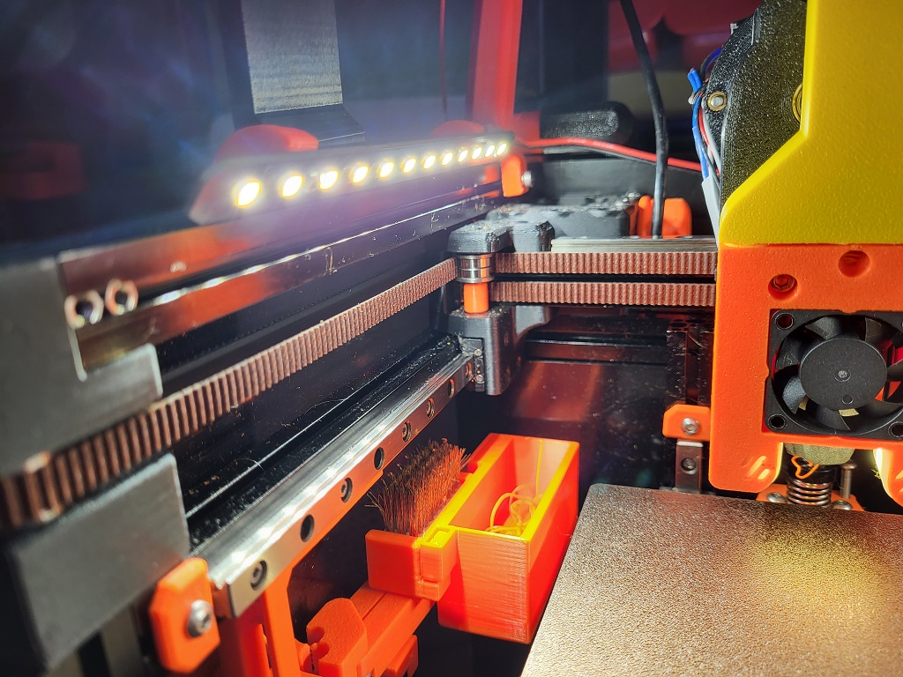
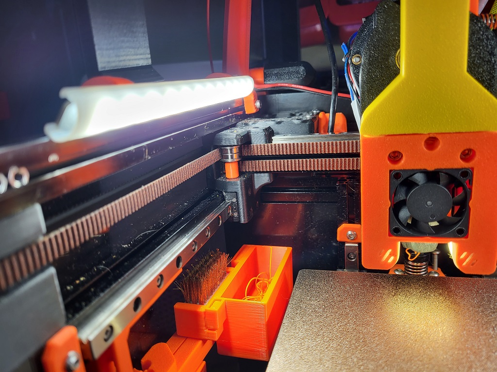

# Daylight on a Matchstick Diffuser

I made these to mount [Daylight on a Matchstick](https://github.com/VoronDesign/Voron-Hardware/tree/master/Daylight) on a v0.1 on top of the Y extrusions to point down at a 35deg angle.

### Before:

### After:

## BOM:

- 2x Daylight on a Matchstick
- 4x M3x6mm
- 4x Brass heat inserts
- Translucent filament (e.g. Natural ABS)

## Printing:

The diffusers can easily be resized in the Z plane to any height. If printing on a v0.1 resize to 80mm and print 4, 2 for each side. Otherwise, they are sized to fit if printed on a larger printer. You will likely need a Brim of Raft to print the diffusers as they must be printed upright for durability. Choose a material that is slightly opaque. Natural ABS is perfect, you might get away with PETG but I'd give PLA a miss with the enclosure plus LED heat.

If you have enough cooling, they can be printed in vase-mode, just be aware that insufficient cooling at speed may produce wobble sticks.

The mounts have been beefed up a little to give a better snap and to avoid interference from the Tophat. They use 4x M3x6mm SHCS/BHCS and 4x Brass heat inserts in total for both sides.

## Credits:

- Mounts based on clips by Zruncho for their [ZeroPanels](https://github.com/zruncho3d/ZeroPanels)
