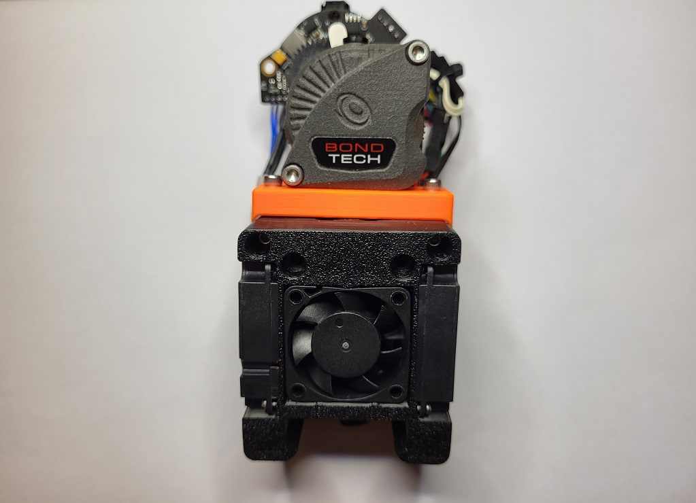

# Dragon Burner v2

I wanted to improve the cooling of the Dragon HF hotend and provide improved part cooling when printing filament that needs it (e.g. PLA). I designed this toolhead to use 2 4010 blower fans for part cooling and a 3010 fan for hotend cooling.

It uses the standard Voron X carriage, and is inspired by the [Mini-AfterSherpa](https://github.com/KurioHonoo/Mini-AfterSherpa)


## Features:

### Hotend support:

- Dragon SF and HF hotend support
- Dragonfly hotend support
- Revo Voron hotend support
- Rapido HF hotend support
- NF Crazy hotend support

### Extruder support:

- LGX Lite extruder support
- Sherpa Mini extruder support
- Sherpa Micro extruder support
- Sailfin/Sharkfin extruder support
- Orbiter v1.5 extruder support
- Orbiter v2 extruder support
- [RoundHouse extruder](https://github.com/waytotheweb/voron/tree/main/general/RoundHouse) support
- [RoundAbout extruder](https://github.com/waytotheweb/voron/tree/main/general/RoundAbout) support

### Fan support:

- Single 3010 24v hotend cooling fan
- Twin 4010 24v blower part cooling fans
- Screwless hotend fan attachment

### Probe support:

- [SlideSwipe magnetic probe](https://github.com/chestwood96/SlideSwipe) support
- [(Un)Klicky Probe](https://github.com/jlas1/Klicky-Probe) support
- [ZeroClick probe](https://github.com/zruncho3d/ZeroClick) support

### Extras:

- ADXL345 mount point and board mount
- Heatsink thermistor support

## Printing:

- Use the Voron defaults and print in ABS or better. The parts are orientated correctly in the STL.
- Print the appropriate cowl for your sensor probe if you use one
- Print the appropriate hotend mount
- Print the extruder mount

Note: If using an Orbiter v1.5 extruder, you will need the extruder mount and the hotend mounts from the [STL Orbiter1.5 subdirectory](STLs/Orbiter1.5). With this extruder you loose the addition of the heatbreak thermistor.

Note: If using an Orbiter v2 extruder, you will need the extruder mount and the hotend mounts from the [STL Orbiter2 subdirectory](STLs/Orbiter2).

Note: If using the Sherpa Mini or a derivative, depending on which hotend you use, you may need the Sherpa_Mini_Mount.stl to clear the X carriage.

## BOM:

- 2x M3x35mm SHCS/BHCS (2 for the X carriage mount)
- 6x M3x5x4mm heat inserts (4 for extruder mount, optional: 2 for ADXL mount)
- 2x M3x35mm SHCS/BHCS (2 for the X carriage mount)
- 6x M3x8mm SHCS/BHCS (4 for extruder mount, optional: 2 for ADXL mount)
- 2x M2x10mm self tapping screws (for blower fans)
- 2x M2x8mm BHCS and nuts (optional: to mount ADXL)
- 2x 4010 blower fans (24v recommended)
- 1x 3010 hotend fan (24v recommended)

The cowls support a no probe setup, [SlideSwipe magnetic probe](https://github.com/chestwood96/SlideSwipe), [(Un)Klicky Probe](https://github.com/jlas1/Klicky-Probe) and [ZeroClick probe](https://github.com/zruncho3d/ZeroClick)

## Fans:

I am using these fans:

- 24v Axial 3010: [Gdstime](https://www.aliexpress.com/item/1005002857100082.html)
- 24v Blower 4010: [Gdstime](https://www.aliexpress.com/item/32799324058.html)

## Heatsink Thermistor:

Each cowl includes a hole at the top to insert a thermistor. With this in place, klipper can track the temperature of the heatsink to watch for heat creep from the heatbreak. You can have klipper abort and shutdown before your whole toolhead melts! You only need a simple klipper entry for the appropriate pin on your MCU, e.g.:

```
[temperature_sensor Heatsink]
sensor_type: Generic 3950
sensor_pin: expander:PA5
max_temp: 85
```

Klipper will shutdown if the top of the heatsink hits 85C. You can use thermal paste to help keep a bulb thermistor in contact with the heatsink and route the wires through the provided groove, then fit the extruder on top to hold it in place.

## Assembly:


Add heat inserts into the cowl and hotend mount:


Insert the fans. You will need to release the cable from their tabs on the front-end and one of the 4010 fans. This is to allow the cables to be routed correctly. Care should be taken with the cables after doing this as too much movement could break off the wires from the fans.

Fit the 4010 fan that you released the cable from into the cowl, passing the cable through the provided round hole:


The 3010 hotend fan is meant to be press fit. If it's too tight, sand or file the opening but don't force it in otherwise it can deform and the blades will hit the casing. If it's too lose or rattles, use electrical tape to slightly widen the fan. Routing of the fans cables are through the channel provided:


Now slot in the second 4010 fan and use 2x M2x10mm self tapping screws to secure the fans into the cowl:


Place the hotend onto the cowl. There are two locator tabs to help align the two parts. From the front use 2 M3x8mm screws to secure the cowl and the hotend mount together:


Attach the extruder mount to your chosen extruder, shown here with the LGX Lite:


Mount the extruder to the hotend mount:




Offer up the cowl and extruder assembly to the X carriage and secure using 2 M3x35mm screws. Be careful not to catch any wires between the surfaces and that when the toolhead moves the X and Y axis endstops are triggered. Also check that the X axis can move completely to the left:

Zip-tie the wires at the back of the assembly.

Plugin, test the fans and redo your X offset as it will have changed slightly.

## v1 Changelog:

- 2022-04-12 First release
- 2022-04-12 Fixed issue with incorrect part placement
- 2022-04-13 Added mounts for the Dragonfly hotend
- 2022-04-13 Added mounts for the Rapido HF hotend
- 2022-04-13 Fixed clearance to socks on Rapido and Dragonfly
- 2022-04-16 Fixed misalignment of filament tube hole for Dragonfly
- 2022-04-16 New ducts improve airflow over nozzle
- 2022-04-19 New ducts improve airflow direction
- 2022-04-19 Added hole and wire groove for heatsink thermistor
- 2022-04-21 Added Klicky variant support
- 2022-04-21 Reorganised repo to separate hotends
- 2022-04-21 Added screwless 3010 hotend fan mount
- 2022-04-27 Added mounts for the E3D Revo Voron hotend
- 2022-05-07 Added wire exit for Klicky mount for all hotends
- 2022-05-08 Modified all toolheads to use removeable fan ducts
- 2022-05-10 Links to public Tinkercad added
- 2022-05-11 Updated Klicky fan ducts
- 2022-05-21 Added bridging supports to Klicky fan ducts
- 2022-06-03 Added ZeroClick variant support
- 2022-06-05 Easier to print fan ducts and magnet helper for ZeroClick

## Release v2:

- Redesigned in Fusion 360
- Integrated fan ducts
- Separate hotend mounts
- Redesigned part cooling fan ducts using CFD
- Significantly better airflow for part cooling
- Improved cable routing
- Improved documentation (with pictures!)
- Improved printability of all parts
- Improved duct design to provide more space for heater cartridges
- Improved support for RapidoHF

## v2 Changelog:

- 2022-08-27 v2 released
- 2022-08-28 Made a little more space for cabling
- 2022-08-28 Added NF Crazy mount and cowl changes (untested)
- 2022-08-28 Added Orbiter v2 support - mount and hotend mounts (untested)
- 2022-08-29 Added Orbiter v1.5 support - mount and hotend mounts (untested)
- 2022-09-21 Fixed ZeroClick cowl mount
- 2022-09-22 Released bowden mount
- 2022-09-25 Updated Dragon Mount. Increased depth to better cater for X carriage screws
- 2022-09-30 Updated all cowlings to help fix screws loosening over time
- 2022-11-23 Updated ADXL Mount (15mm between screws)
- 2022-11-24 Updated ZeroClick cowl to allow ADXL mount on the right side of the toolhead
- 2022-11-26 Updated all cowls to better hold the 4010 fans
- 2022-11-26 Updated ZeroClick mount
- 2022-11-29 Fixed some geometry issues with the hotend mounts
- 2022-11-29 Added a Sherpa Mini Mount

## Release v3:

- Improved geometry of hotend mounts

- Moved all hotend mounts to place the nozzle 2mm further forward to match the Mini AfterBurner - You will need to recalculate your Y limits to take advantage of this. The change should mean no loss of Y _unless_ banging on the door is an issue

- Added Sherpa Micro extruder support

- All hotend mounts have the heatsink thermistor functionality

## v3 Changelog:

- 2022-12-13 v3 released
