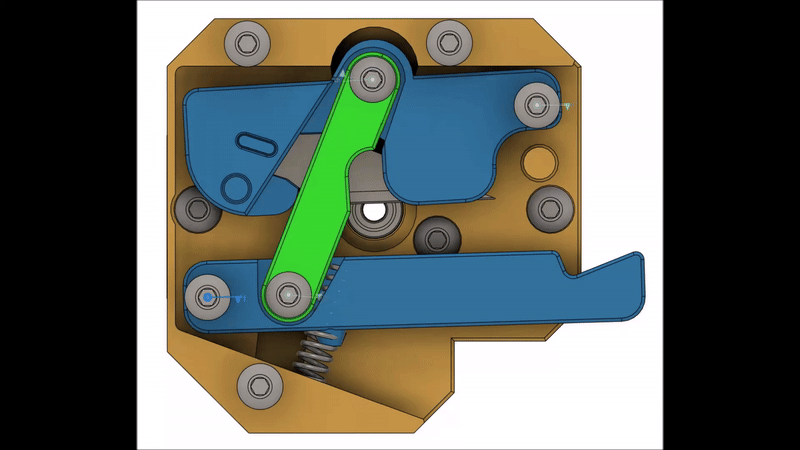

# Dragon Burner Cutter and Runout Sensor (BETA)

## BOM:

- Exacto Knife Blade #11

- JST-XH 5 pin

- 5.5mm Ball Bearing

- Microswitch

- 683 Bearing

- 5x20mm Compression Spring

- 4 x M3 4x5mm Heat Insert

- PTFE Tubing

- 2 x M3x5mm BHCS

- 2 x M3x6mm BHCS

- 5 x M3x12mm BHCS

- 2 x M3x16mm BHCS

- M3x6mm FHCS For Top parts using the runout sensor

## Assembly

Please be careful of the blade. It likes to poke holes in your fingertips.

You need to print one of each item apart from only one of Top_Orbiter2, Top_Sherpa_Mini, etc depending on your extruder mount pattern and whether you want a runout sensor.

The whole cutter is secured to a modified Sherpa Mini extruder mount.

1. Secure the heat inserts, two into the modified Sherpa Mini extruder mount, two into the Top part for the extruder

2. Secure the Bottom part to the modified Sherpa Mini extruder mount using 2 M3x6mm screws

3. Build the Carrier Lever by inserting the blade into the bottom of the lever carefully. It might be a tight fit and need a little persuasion to go in. Be careful not to cut yourself or shatter the blade. Then push-fit the Carrier Top on top, you may want to use a dab of superglue to hold that in place - I haven't needed to

4. Screw the Lever Link into the Carrier Lever using an M3x5mm screw gently. This is a pivot joint screwing in to plastic, so it only needs to be tightened lightly such that the Lever Link can still move

5. Screw the other end of the Lever Link into the Push Lever as above

6. Push the bearing into the Bottom part until flush

7. Push the spring into the hole in the Bottom part and carefully apply the nub on the Push Lever on to the other end of the spring and insert the Carrier Lever/Push Lever combination into the Bottom part (see CAD if necessary)

8. If using a runout Top, insert the Ball Bearing, Micro Switch and wired JST-XH 5 pin connector (one crimped wire into the two outer pins) into your chosen Top part and secure with the M3x6mm FHCS screw

9. Flip the Top part and screw into the Middle/Bottom part. This screws in to plastic, so don't hulk it, though you can tighten it down

10. Insert screws through the Top, Middle and Push Lever into the Bottom part. This is a pivot joint screwing in to plastic, so it only need to be tightened very lightly such that the Lever can still move

11. Do the same for the Carrier Lever as above

12. Use a 2mm drill bit or reamer to ensure the filament path is of the correct width and free from debris

That should be it. Test moving the Carrier Lever and check that the blade occludes the filament path. Then push some filament through and test the cutter. Test the filament runout sensor using a multi-meter.

The cutter is triggered by a long arm to be positioned at the front of the printer. One is included for the Voron Trident, others are left to the user to create.

## Changelog:

- 2024-07-03 Beta v1 released
  2024-07-04 Fixed orientation of parts
