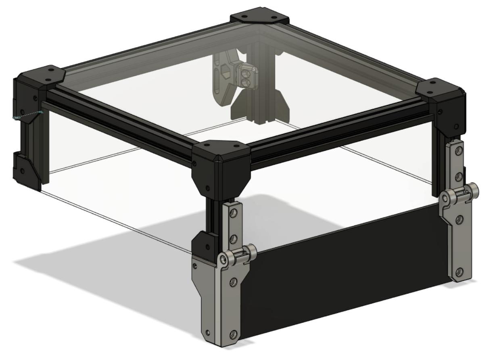
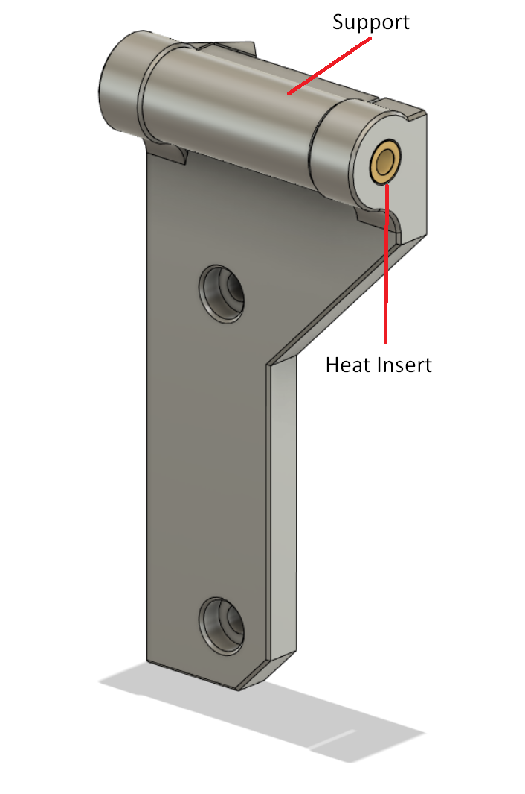

# Lift-Off Tophat Hinges

These hinges are for the v0.2 Tophat. They allow you to remove the Tophat by opening it completely and then you can simply lift the Tophat off.

This makes removal for PLA printing much easier.

This project is a Work in Progress, so may change as issues crop up. I'll post the CAD when it's finalised.

There are a couple of caveats at present:

- There is no stop on the hinge. This means if you open it, you either need the tophat to rest against something, or to carefully allow it to open fully and remove it

- The STL's are orientated to get the best strength for the hinges. This means they are printed on their sides

- The bottom hinges have inbuilt supports that have to be removed and tidied up a little

### BOM:

- 2x M3x4mmx5mm brass heat inserts

- 2x M3x25mm BHCS/SHCS screws

- Reuse the screws from the standard v0.2 Tophat hinges

## Assembly:

**Note:** Left and Right are always as viewed from the front of the printer.

Remove the supports from the bottom hinges and then fit a brass insert into the smaller of the two holes in each bottom hinge as show:

Tidy up the insides of the bottom hinge and check that the matching upper hinge will freely sit inside the gap.

Insert each of the M3x25mm screws but do not tighten. If you tighten them, they will pull the hinge lugs together causing friction with the upper hinge.

Remove the standard bottom hinges (if fitted) retaining the screws. Fit the new bottom hinges using those screws and tighten. Don't forget to refit your back panel at the same time if you are using one.

Remove the standard top hinges (if fitted) and retain the screws and nuts. Don't forget about those nuts as they will fall out unless held in place by no-nuts! Remove the Tophat from the printer.

Off from the printer, insert screws to the upper hinges and loosely attach the nuts. Slide the upper hinge onto the Tophat, being careful to get the nuts into the extrusion uprights. Tighten the top screws until it just grips so that they do not slide out. Don't tighten them yet.

Place the Tophat onto the printer, lining up the upper hinges with the lower screws. You will need to tilt the Tophat back around 270deg to fit it. Then carefully lift the Tophat on the hinge until it closes on top of the printer. Remember, the top hinges are not yet tight, so make sure they stay on the bottom hinge until the Tophat is closed.

Now completely loosen the upper hinges without unscrewing from the nuts and settle the Tophat so that it sits level. Then tighten each of the upper hinge top screws, check the Tophat is still level, then tighten each of the upper hinge lower screws.

You should now be able to tilt the Tophat all the way back. At the end of the tilt, the Tophat should lift off the bottom hinge easily.

Be careful when opening fully as the Tophat could easily fall off if not removed.
