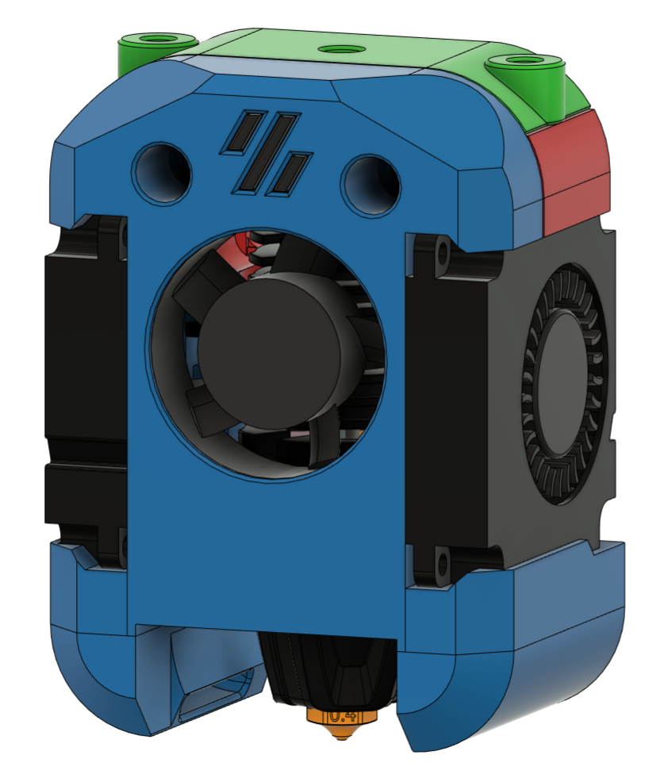

# Rapid Burner v7 BETA

This is the BETA release for the next iteration of the Rapid Burner toolhead.

Assembly is much the same as for the v6, so you can follow the instructions for that version.

NOTE: This is a BETA version. Parts and their assembly can change and may require the reprinting of the whole toolhead. CAD will not be available until release. If you only have a single printer, please be sure to keep your old toolhead in case of issues with this one.

## Changes:

- New aesthetic for the toolhead

- Exclusively supports the Dragon and Rapido UHF hotends (Goliath updates from v6 will follow). 

- Volcano sized hotends are now supported by the Dragon Burner toolhead

- Hotend moved back by 2mm to be closer to the stock toolhead position

- All new fan ducts. Size increase by 60% and tuned with CFD to improve part cooling

- 3010 hotend fan placed inside of the cowl

- Improved Bowden mount that uses ECAS 4mm PTFE retainer and improved strain relief

- To provide more space for cables snip off the screw lugs at the top rear of the 4010 fans as shown in the second picture above

- Removed the 4010 retainer lug on the cowl and lengthened to retaining guides to hole those fans in place

## Notes:

- Moving the hotend back 2mm means that you should redefine your X and Y limits to account for the new position

- This toolhead is approximately 1.5mm in depth compared to the miniSB which means it may come in contact with a v0 door at extreme Y. If this does cause problems, you may need to reduce your Y axis limit by 1-2mm

- The new nozzle LED mounts contain removable supports that help printability and should be removed

- It is simpler to load the 4010 fans before adding the hotend + mount to the toolhead

- Take care when handling the new cowl. There are thin sections that can be easily broken without care. The toolhead will become much more rigid once the fans ar mounted
  
  **Please contact me on Discord to provide feedback (@chirpy___) good or bad. I can't promise to make suggested changes but will try and accommodate what I believe will improve the toolhead**
