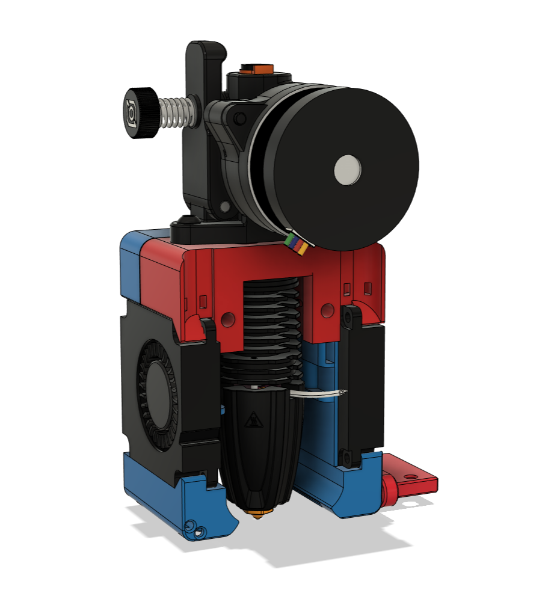

# Rapid Burner (Beta Release)
This toolhead for the Voron v0.1 has been specifically designed for the Rapido UHF and Dragon UHF hotends.

It uses the standard Voron X carriage, and is inspired by the [Mini-AfterSherpa](https://github.com/KurioHonoo/Mini-AfterSherpa)

## Features:

### Hotend support:
- Rapido UHF hotend
- Dragon UHF hotend

### Extruder support:
- LGX Lite extruder support
- Mini Sherpa extruder support
- Sailfin/Sharkfin extruder support
- Orbiter v1.5 extruder support
- Orbiter v2 extruder support
- [RoundHouse extruder](https://github.com/waytotheweb/voron/tree/main/general/RoundHouse) support

### Fan support:
- Single 3010 24v hotend cooling fan
- Twin 4010 24v blower part cooling fans
- Screwless hotend fan attachment

### Probe support:
- [SlideSwipe magnetic probe](https://github.com/chestwood96/SlideSwipe) support
- [(Un)Klicky Probe](https://github.com/jlas1/Klicky-Probe) support
- [ZeroClick probe](https://github.com/zruncho3d/ZeroClick) support

### Extras:
- ADXL345 mount point and board mount

## Printing:

- Use the Voron defaults and print in ABS or better. The parts are orientated correctly in the STL.
- Print the appropriate cowl for your sensor probe if you use one
- Print the appropriate hotend mount
- Print the extruder mount if needed

## BOM:

- 2x M3x20mm SHCS/BHCS (2 for the X carriage mount)
- 6x M3x5x4mm heat inserts (4 for extruder mount, optional: 2 for ADXL mount)
- 6x M3x8mm SHCS/BHCS (4 for extruder mount, optional: 2 for ADXL mount)
- 2x M2x10mm self tapping screws (for blower fans)
- 2x M2x8mm BHCS and nuts (optional: to mount ADXL)
- 2x 4010 blower fans (24v recommended)
- 1x 3010 hotend fan (24v recommended)

The cowls support a no probe setup, [SlideSwipe magnetic probe](https://github.com/chestwood96/SlideSwipe), [(Un)Klicky Probe](https://github.com/jlas1/Klicky-Probe) and [ZeroClick probe](https://github.com/zruncho3d/ZeroClick)

## Fans:

I am using these fans:

- 24v Axial 3010: [Gdstime](https://www.aliexpress.com/item/1005002857100082.html)
- 24v Blower 4010: [Gdstime](https://www.aliexpress.com/item/32799324058.html)

## Assembly:

For detailed photos, see the [Dragon Burner](https://github.com/waytotheweb/voron/tree/main/V0/Dragon_Burner) instructions. Be aware that mounting the cowl to the X carriage is different with this toolhead.

Add heat inserts into the cowl and hotend mount.

Insert the fans. You will need to release the cable from their tabs on the front-end and one of the 4010 fans. This is to allow the cables to be routed correctly. Care should be taken with the cables after doing this as too much movement could break off the wires from the fans.

Fit the 4010 fan that you released the cable from into the cowl, passing the cable through the provided round hole.

The 3010 hotend fan is meant to be press fit. If it's too tight, sand or file the opening but don't force it in otherwise it can deform and the blades will hit the casing. Routing of the fans cables are through the channel provided.

Now slot in the second 4010 fan and use 2x M2x10mm self tapping screws to secure the fans into the cowl.

Mount the extruder to the hotend mount.

The hotend mount now needs to be mounted to the X Carriage using 2x M3x20mm screws.

Offer the cowl to the hotend mount and from the front use 2 M3x8mm screws to secure the cowl and the hotend mount together.

Be careful not to catch any wires between the surfaces and that when the toolhead moves the X and Y axis endstops are triggered. Also check that the X axis can move completely to the left:

Zip-tie the wires at the back of the assembly.

Plugin, test the fans and redo your X offset as it will have changed.

## v1 Changelog:

- 2022-09-04 First beta release
- 2022-09-21 Fixed ZeroClick cowl
- 2022-09-22 Released bowden mount
