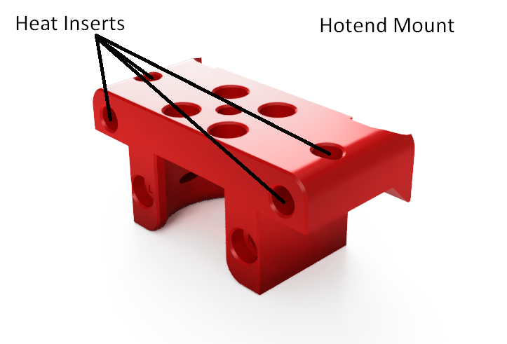
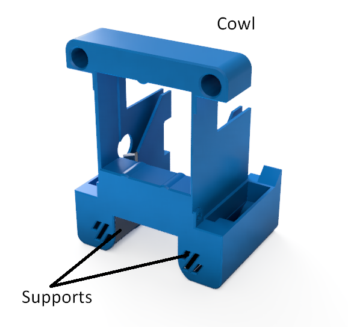

# Rapid Burner v3

This toolhead for the Voron v0.1 has been specifically designed for the Rapido UHF and Dragon UHF hotends. There are also alternative mounts for the Dragon + Volcano hotend combination.

It uses the standard Voron X carriage. There's no loss in X or Z, and at most 3mm in Y.

## Features:

### Hotend support:

- Rapido UHF hotend
- Dragon UHF hotend

### Extruder support:

- LGX Lite extruder support
- Sherpa Mini extruder support
- Sherpa Micro extruder support
- Sailfin/Sharkfin extruder support
- Orbiter v1.5 extruder support
- Orbiter v2 extruder support
- [RoundHouse extruder](https://github.com/waytotheweb/voron/tree/main/general/RoundHouse) support
- [RoundAbout extruder](https://github.com/waytotheweb/voron/tree/main/general/RoundAbout) support

### Fan support:

- Single 3010 24v hotend cooling fan
- Twin 4010 24v blower part cooling fans
- Screwless hotend fan attachment

### Probe support:

- MiniSlideSwipe (uses the [SlideSwipe magnetic probe](https://github.com/chestwood96/SlideSwipe))
- [SlideSwipe magnetic probe](https://github.com/chestwood96/SlideSwipe) support
- [(Un)Klicky Probe](https://github.com/jlas1/Klicky-Probe) support
- [ZeroClick probe](https://github.com/zruncho3d/ZeroClick) support

## Printing:

- Use the Voron defaults and print in ABS or better. The parts are orientated correctly in the STL.
- Print the appropriate cowl for your sensor probe if you use one
- Print the appropriate hotend mount
- Print the extruder mount if needed

## BOM:

- 2x M3x20mm SHCS/BHCS (2 for the X carriage mount)
- 6x M3x5x4mm heat inserts (4 for extruder mount, optional: 2 for ADXL mount)
- 6x M3x8mm SHCS/BHCS (4 for extruder mount, optional: 2 for ADXL mount)
- 2x M2x10mm self tapping screws (for blower fans)
- 2x M2x8mm BHCS and nuts (optional: to mount ADXL)
- 2x 4010 blower fans (24v recommended)
- 1x 3010 hotend fan (24v recommended)

The cowls support a no probe setup, [SlideSwipe magnetic probe](https://github.com/chestwood96/SlideSwipe), [(Un)Klicky Probe](https://github.com/jlas1/Klicky-Probe) and [ZeroClick probe](https://github.com/zruncho3d/ZeroClick)

## Fans:

I am using these fans:

- 24v Axial 3010: [Gdstime](https://www.aliexpress.com/item/1005002857100082.html)
- 24v Blower 4010: [Gdstime](https://www.aliexpress.com/item/32799324058.html)

## Assembly:

Add heat inserts into the cowl and hotend mount:

Fitting the fans: You will need to release the cable from their tabs on the 3010 frontend fan and one of the 4010 fans. This is to allow the cables to be routed correctly through the cowl. Care should be taken with the cables after doing this as too much movement could break off the wires from the fans. It helps if you can add a blob of hot glue as strain relief.

Fit the 4010 fan that you released the cable from into the cowl, passing the cable through the provided round hole:

The 3010 hotend fan is press fit. Feed the cable through the front of the cowl and then push the fan into the cowl from the front. If it's too tight, sand or file the opening. Don't force it in, otherwise it can deform and the blades will hit the casing. If it's too lose or rattles, use electrical tape to slightly widen the fan. If the gap is too tight, file/sand down the ridges on the inside of the cowl opening to give the fan more room.

Routing of the fans cables are through the channel provided:

Now slot in the second 4010 fan and use 2x M2x10mm self tapping screws to secure the fans into the cowl.

Route the 3010 cable through the provided channel in the cowl.

## Mounting:

Mount the extruder to the hotend mount. If using an LGX Lite you will need to use the LGX Lite Mount.

The hotend mount needs to be mounted to the X Carriage using 2x M3x20mm screws.

Offer the cowl to the hotend mount and from the front use 2 M3x8mm screws to secure the cowl and the hotend mount together.

Be careful not to catch any wires between the surfaces and that when the toolhead moves the X and Y axis endstops are triggered. Also check that the X axis can move completely to the left and right.

Zip-tie the wires at the back of the assembly.

Plugin, test the fans and redo your X offset as it will have changed.

## v1 Changelog:

- 2022-09-04 First beta release
- 2022-09-21 Fixed ZeroClick cowl
- 2022-09-22 Released bowden mount

## v2 Changelog:

- 2022-11-02 Version 2 release
- 2022-11-29 Hotend Mount geometry fixes
- 2022-11-29 Updated ZeroClick Cowl and Mount

## v3 Release:

- Updated ZeroClick mount

- Added Sherpa Micro extruder support

- Removed LED support to provide better air flow from the part cooling ducts

- Improved geometry of hotend mounts

- Updated ZeroClick cowl to allow ADXL mount on the right side of the toolhead

- Updated all cowls to better hold the 4010 fans

- Moved all hotend mounts to place the nozzle 2mm further forward to match the Mini AfterBurner - You will need to recalculate your Y limits to take advantage of this. The change should mean no loss of Y *unless* banging on the door is an issue

- All hotend mounts have the heatsink thermistor functionality

## v3 Changelog:

- 2022-12-13 v3 released
- 2022-12-20 Added Dragon Volcano mounts and cowls
