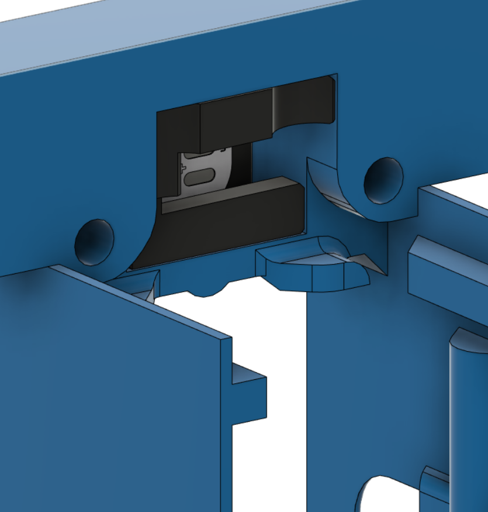

# Rapid Burner v5

This toolhead for the Voron v0.2 and various [Printers for Ants](https://3dprintersforants.com/).

It has been specifically designed for the Rapido UHF and Dragon UHF hotends. There are also alternative mounts for the Dragon + Volcano, Rapido HF, Dragon UHF without extender.

It uses the standard Voron v0.2 X carriage. There's no loss in X, Y or Z.

It supports Nozzle and Logo mounted LED's.


### Notes:

This version no longer supports the v0.1 X -carriage. This means that to use this release you will need to do the minimal upgrade from v0.1 to v0.2 of either:

New X Carriage, new X/Y joint tops and sensorless homing

or:

New X Carriage mod with built in microswitch for X available [here](https://www.printables.com/model/388228-voron-v02-x-carriage-w-endstop).

The toolhead currently stays within the v0.1 width measurements, so there's no loss in X if you don't change the X/Y joint tops.

You can also continue to use the [Rapid Burner v4](https://github.com/chirpy2605/voron/tree/main/V0/Rapid_Burner/Old_Versions/v4).

### Hotend support:

- Rapido UHF hotend
- Dragon UHF hotend
- Rapido HF
- Dragon + Volcano hotend
- Dragon UHF without Extender
- Goliath Air (experimental)**
- Goliath Water (experimental)**

** This is untested (I don't have either Goliath hotends), but support has been tested in CAD.

### Extruder support:

- LGX Lite extruder support
- Sherpa Mini extruder support
- Sherpa Micro extruder support
- Sailfin/Sharkfin extruder support
- Orbiter v1.5 extruder support
- Orbiter v2 extruder support
- [RoundHouse extruder](https://github.com/waytotheweb/voron/tree/main/general/RoundHouse) support
- [RoundAbout extruder](https://github.com/waytotheweb/voron/tree/main/general/RoundAbout) support
- [RoundTrip extruder](https://github.com/waytotheweb/voron/tree/main/general/RoundTrip) support

### Fan support:

- Single 3010 24v hotend cooling fan
- Twin 4010 24v blower part cooling fans
- Screwless hotend fan attachment

### Probe support:

- MiniSlideSwipe (uses the [SlideSwipe magnetic probe](https://github.com/chestwood96/SlideSwipe))
- [SlideSwipe magnetic probe](https://github.com/chestwood96/SlideSwipe) support
- [(Un)Klicky Probe](https://github.com/jlas1/Klicky-Probe) support
- [ZeroClick probe](https://github.com/zruncho3d/ZeroClick) support

## Extras:

- ADXL345 front mount
- Heatsink thermistor support
- Neopixel support (nozzle and logo)

## Printing:

- Use the Voron defaults and print in ABS or better. The parts are orientated correctly in the STL.
- Print the appropriate cowl for your sensor probe if you use one
- Print the appropriate hotend mount
- Print the extruder mount if needed

## BOM:

- 4x M3x10mm SHCS/BHCS (2 for the X carriage mount, 2 for the cowl mount)
- 4x M3x5x4mm heat inserts (4 for extruder mount)
- 6x M3x15mm SHCS/BHCS (2 for extruder mount if required)
- 1x M3x20mm SHCS/BHCS (for the rear of the v0.2 X carriage mount)
- 4x M2x10mm self tapping screws (for blower fans)
- 2x 4010 blower fans (24v recommended)
- 1x 3010 hotend fan (24v recommended)

The cowls support a no probe setup, [SlideSwipe magnetic probe](https://github.com/chestwood96/SlideSwipe), [(Un)Klicky Probe](https://github.com/jlas1/Klicky-Probe) and [ZeroClick probe](https://github.com/zruncho3d/ZeroClick)

## Fans:

I am using these fans:

- 24v Axial 3010: [Gdstime](https://www.aliexpress.com/item/1005002857100082.html)
- 24v Blower 4010: [Gdstime](https://www.aliexpress.com/item/32799324058.html)

## Heatsink Thermistor:

Each cowl includes a hole at the top to insert a thermistor. With this in place, klipper can track the temperature of the heatsink to watch for heat creep from the heatbreak. You can have klipper abort and shutdown before your whole toolhead melts! You only need a simple klipper entry for the appropriate pin on your MCU, e.g.:

```
[temperature_sensor Heatsink]
sensor_type: Generic 3950
sensor_pin: expander:PA5
max_temp: 85
```

Klipper will shutdown if the top of the heatsink hits 85C. You can use thermal paste to help keep a bulb thermistor in contact with the heatsink and route the wires through the provided groove, then fit the extruder on top to hold it in place.

## Assembly:


Add heat inserts into the cowl and hotend mount:


## LEDs:

Support has been added for either standard Neopixels or Sequins for the nozzle LEDs, Neopixels, Sequins and RainbowBarf for the Logo LED.

If you do not want to use the Logo LED you can fit the [a]_Carrier_Dummy.STL instead.

LED's are best cabled in series if they are addressable to allow independent control. For example, start with the (as seen from the front) right nozzle LED going to the left nozzle LED through the connecting gap, then up to the logo LED and back down and through the left cable channel to the back of the toolhead with the wire then extending up to the toolhead if you are using one.

### Logo LED:


You need to print the [c]*Diffuser.stl out of a transparent/translucent filament, such as natural ABS. You then will need to print the [o]_Carrier*[led type].stl of choice in an opaque filament to help prevent light bleed. The filament used to print the Cowl will likely be fine.

The LED is inserted into the side of the carrier. The diffuser sits inside the front of the carrier:


The logo unit is pushed into the cowl from the rear:


The cables route to the side of the inside of the cowl and then out through the cable channels to the rear:



### Nozzle Neopixels:

The LEDs can be fitted in series or parallel. If fitting in parallel, pass each one through from the wire channel into the cowling. Then twist the cables so that they are at 90 degrees from their pads (make sure the wires do not short themselves over each other) and push the LEDs into the slow with the wires coming out of the edge closest to the cable channels.

To fit in series, simply place an LED in each slot with the cable between them going across the bridge.

It's a bit of a tight squeeze, but they should slot in with a little manipulation and hold in place with friction and the wires once the fans have been attached.


### Nozzle Sequins:

Note: Use the Cowl_[probe]_Sequins.stl file for your chosen probe/noprobe

Sequins are fitted after soldering the cables to the sequins, but before crimping the cables. They can be fitted in series or parallel as explained in the Nozzle Neopixels section above.

Feed the sequin cables through the back of the sequin mount holes and then up and out through the cable channels in the cowl. You will need to secure the sequins with a dab of glue to prevent them from coming loose. Fitting the 4010 fans will then hold the cables in the channels in the cowl.


> **Credit to [MapleLeafMakers (Maple Leaf Makers) · GitHub](https://github.com/MapleLeafMakers) ("So I Says..." on the Voron Discord) for doing all the work on the Sequin integration.**

> **Credit to actualbigbobin (on the Voron Discord) for the original development and inspiration for the Logo LED.**

### LED Software:

To configure the Neopixels in Klipper, I'd suggest using the [[GitHub - julianschill/klipper-led_effect: LED effects plugin for klipper](https://github.com/julianschill/klipper-led_effect).

## Fans:

Insert the fans. You will need to release the cable from the tabs on the front-end 3010 fan. This is to allow the cable to be routed correctly. Care should be taken with the cables after doing this as too much movement could break off the wires from the fans.

Fit the 3010 and 4010 fans that passing the connector and cable through the provided hole and along the outer channel. The 4010 fans will hold the wires in place in the channels:


The 3010 hotend fan is meant to be press fit. If it's too tight, sand or file the opening but don't force it in otherwise it can deform and the blades will hit the casing. If it's too lose or rattles, use electrical tape to slightly widen the fan. If the gap is too tight, file/sand down the ridges on the inside of the cowl opening to give the fan more room.

Use 2x M2x10mm (4x M2x10mm on some cowl variants) self tapping screws to secure the fans into the cowl.

## Mounting:

Mount the hotend to the hotend mount:


Mount the extruder mount to the hotend mount:


The hotend mount needs to be mounted to the X Carriage using 2x M3x10mm screws:


Offer the cowl to the hotend mount and from the front use 2 M3x10mm screws to secure the cowl and the hotend mount together.

Be careful not to catch any wires between the surfaces and that when the toolhead moves the X and Y axis endstops are triggered (if using physical X/Y endstops). Also check that the X axis can move completely to the left and right.

Zip-tie the wires at the back of the assembly.

Plugin, test the fans and redo your X offset as it will have changed.

## v1 Changelog:

- 2022-09-04 First beta release
- 2022-09-21 Fixed ZeroClick cowl
- 2022-09-22 Released bowden mount

## v2 Changelog:

- 2022-11-02 Version 2 release
- 2022-11-29 Hotend Mount geometry fixes
- 2022-11-29 Updated ZeroClick Cowl and Mount

## v3 Release:

- Updated ZeroClick mount

- Added Sherpa Micro extruder support

- Removed LED support to provide better air flow from the part cooling ducts

- Improved geometry of hotend mounts

- Updated ZeroClick cowl to allow ADXL mount on the right side of the toolhead

- Updated all cowls to better hold the 4010 fans

- Moved all hotend mounts to place the nozzle 2mm further forward to match the Mini AfterBurner - You will need to recalculate your Y limits to take advantage of this. The change should mean no loss of Y *unless* banging on the door is an issue

- All hotend mounts have the heatsink thermistor functionality

## v3 Changelog:

- 2022-12-13 v3 released
- 2022-12-20 Added Dragon Volcano mounts and cowls
- 2022-12-22 Added improved ADXL mounts (front and side)

## v4 Release:

- New design

- Voron v0.2 support

- Improved cable routing space

- Additional M2x10mm self tapping screws to hold the 4010 fans in place on some cowl variants

- Improved rigidity of the toolhead

- Improved ZeroClick support

- Improved mounting screw depth

- Where possible, moved the heat inserts to opposing plastic for better screw retention

- Adding bridge cutters where needed

- Removed side-mount ADXL mount in favour of the v0.2 mount on the back of the X carriage

## v4 Changelog:

- 2023-01-23 v4 released

- 2023-01-27 Added sliders to the v0.2 cowls and hotend mounts to help prevent the toolhead from tilting

- 2023-01-27 Added experimental sequin support for v0.2 cowls

- 2023-02-26 Added missing heat insert hole to the orbiter v2 volcano mount

- 2023-02-26 Made all the v0.2 extruder mounts flush with the x-carriage rear screw mount

- 2023-02-26 Added new cable routing system that allows the easy fitting and removal of part cooling fans and simple routing for LEDs

- 2023-02-26 Added Neopixel cowls

- 2023-02-26 Added Sequin cowls

- 2023-02-26 Updated CAD with all the recent changes

- 2023-02-26 Changed LED configuration recommendation to [GitHub - julianschill/klipper-led_effect: LED effects plugin for klipper](https://github.com/julianschill/klipper-led_effect)

- 2023-03-07 Added from mounting ADXL mount plate

## Release v5:

With this release you will need to print a cowl, a hotend mount and an extruder mount

- v0.2 X Carriage only support going forwards
- Added Logo LED support for Neopixel, Sequin or RainbowBarf
- Nozzle LEDs no longer experimental
- Widened the SlideSwipe magnets holes slightly to help prevent printed part splitting when inserting the magnets
- Added experimental Goliath Air and Water hotend support

## v5 Changelog:

- 2023-03-23 v5 released
