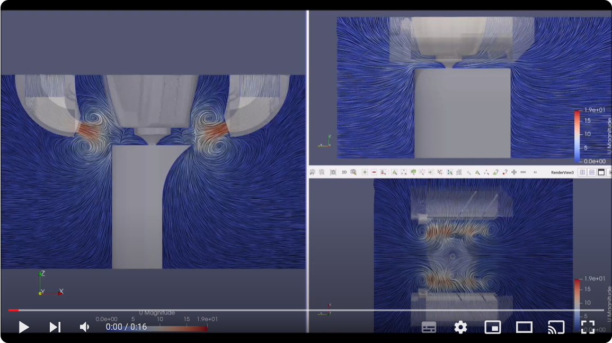

# CFD Development

This page outlines the development of the Dragon/Rapid Burner part cooling ducts. This work has taken many iterations over several months of work including duct design, CFD analysis, printing and physical testing. The changes may look simple and obvious, but journey to make them took a lot of minute detail changes to arrive at.

## CFD for v7

This is how the ducts were in DB/RB v7. While they do work very well, the image below shows a few problems.

Firstly, while the ducts are well aimed, their arrangement shows uneven flow comparing the left and right ducts when they hit the printed part.

Secondly, and most importantly, the image on the upper right shows poor flow away from the nozzle to the left and right. This means the flow of the hot air is not being pushed away from the printed part, limiting the cooling.

Lastly, the image on the lower right shows that the flow that is making it's way away from the nozzle is uneven and oscillates from left to right and back.

This is all down to opposing ducts delivering the air flow directly against each other limiting the flow away from the nozzle and printed part.

## CFD for v8:

These are the new ducts for DB/RB v8.

The flow being directed from the ducts more evenly reaches the nozzle. The flow from left to right in the upper right of the image shows much better flow away from the nozzle to the left and right.

The flow away from the nozzle in the lower right  is straight so is no longer oscillating left to right.

This has been achieved by using angled baffles that you can see in the lower right image, as well as opening up ducts so that more air is allowed to flow through the duct from the fan outlet.

What we have also discovered is that the air flow through the ducts from inlet to outlet is distributed fairly evenly along the duct. This is despite the fact that the velocity of the flow coming from the 4010 fan outlet is biased quite strongly from one end to the other of the fan outlet. This is important as the fans are arranged in effective opposite directions when mounted against the sides of the cowl.

## Print quality improvement

This picture shows the duct improvement. The v7 ducts are on the top and the equivalent v8 on the bottom.

The print is a torture test designed for duct design comparison. The aim is not for a perfect print, it's to show differences between iterations of duct design for cooling and flow direction. There are two versions here, the first with a 55deg overhang, the second with an 85deg overhang.

The prints use the same GCODE with the following set configuration in the slicer:

- 10,000 acceleration for all settings

- 500 speed for all settings

- 0 min layer time

- 0 flow rate restriction

- 2 walls

- no infill

- no top layer (the parts are shown upside down)

All chamber temps, print temps, print times, hardware and filament is identical

## CFD video of the Dragon Burner v8 ducts

This shows the output flow of the ducts from start to fully on:

# Credits

None of this analysis would have been possible without the tools and advice from [YellowFish](https://github.com/yellowfish543/StdToolheadOpenfoam/)

