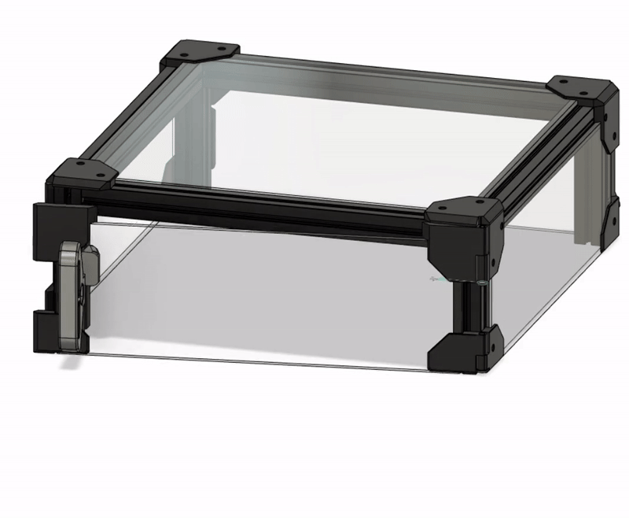

# Tophat Cat Flap

- Tophat clamped closed?

- Want to get to the toolhead?

- Can't quite reach?

- Don't want to have to open the cam lock?

#### You need a Tophat Cat Flap!

## Bom:

- 1x M3x30mm SHCS/BHCS screw

- 1 x M3x18mm SHCS/BHCS screw

- 4 x 6x3mm Neodymium magnets

- VHB tape

- Printed parts (Voron printing specs)

## Additional Notes:

The door fits and lifts on and off in exactly the same way as the main printer door
