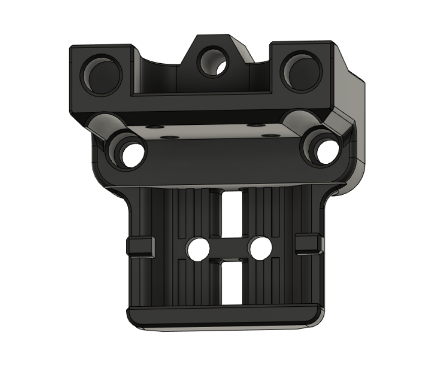

# Modified v0.2 X-Carriage

This is a modified v0.2 x-carriage that uses heat inserts rather than encapsulated M3 nuts.

I find that after time the M3 nuts can wear the plastic and spin loose. This mod helps that by going back to heat inserts.

If you use this x-carriage with heat inserts, make sure push the inserts in flush and file any plastic burrs after inserting them to ensure you have flat mating surfaces when mounting to the X rail.
