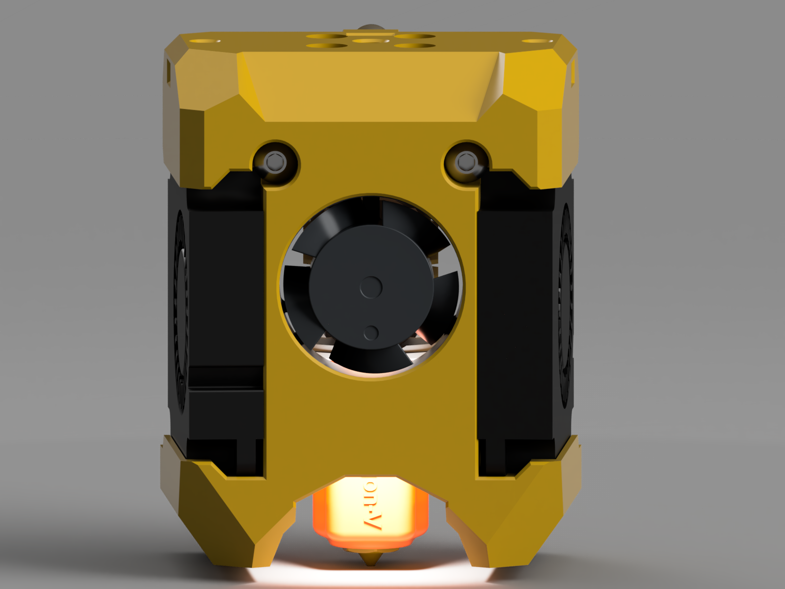
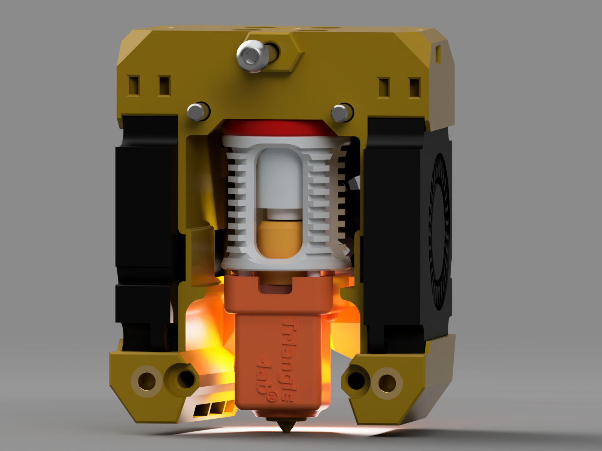
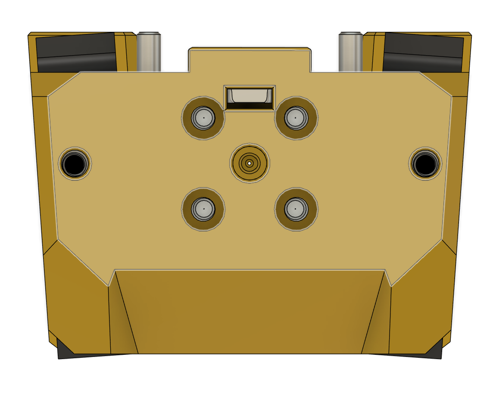
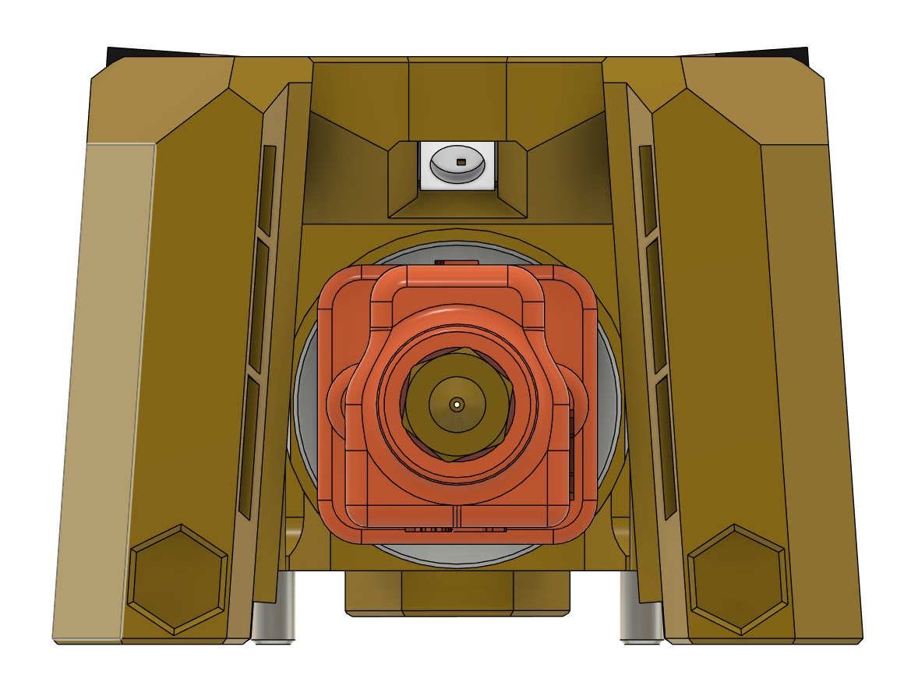
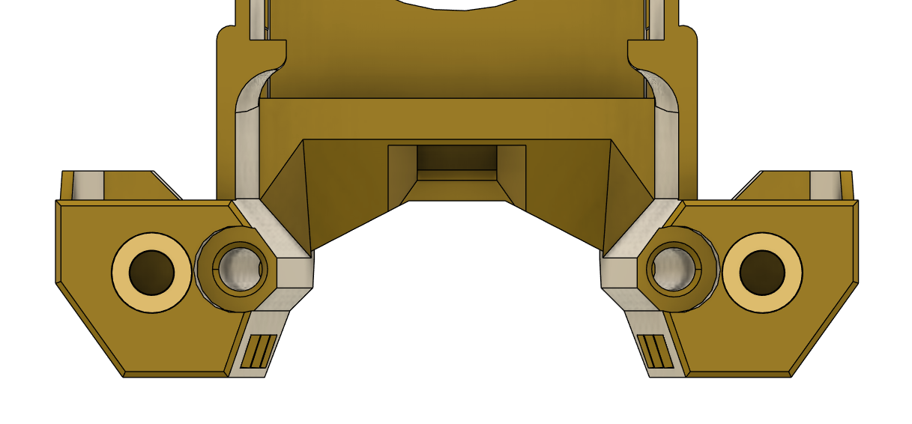
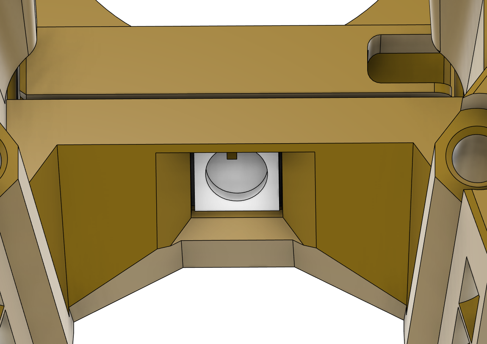
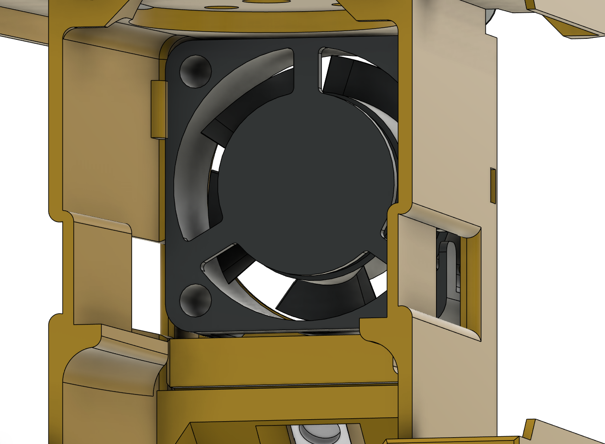
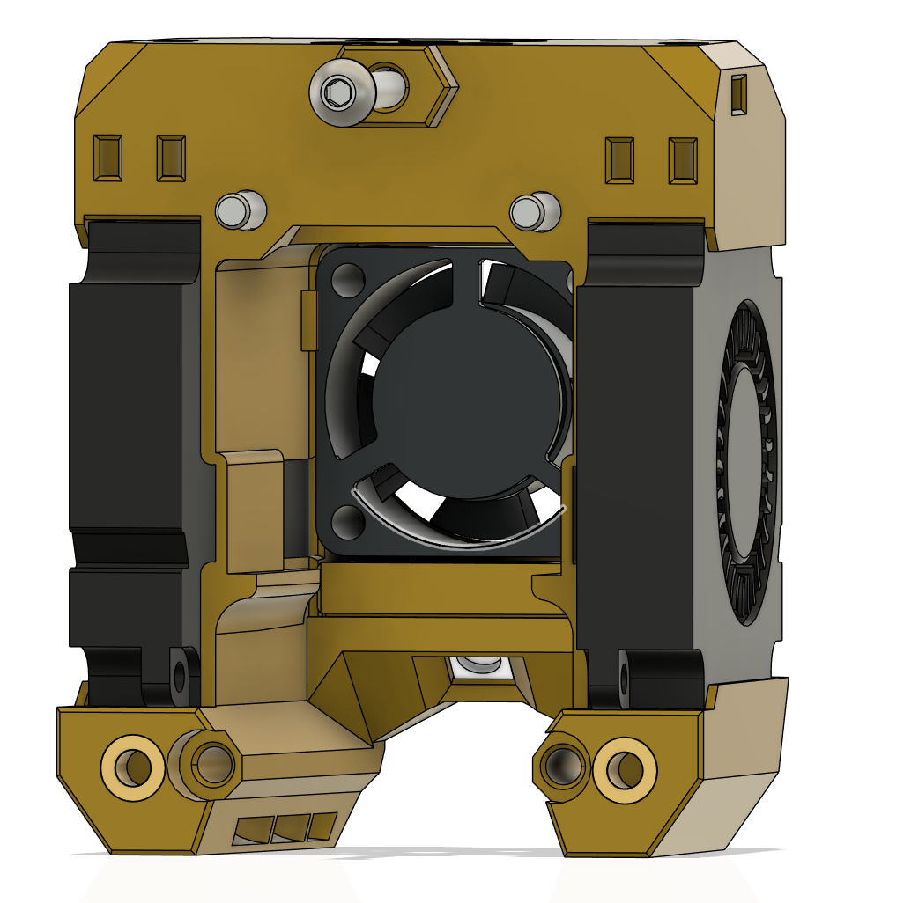
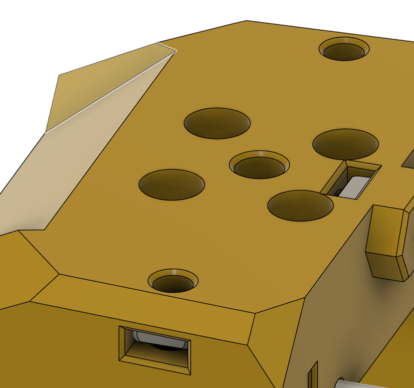
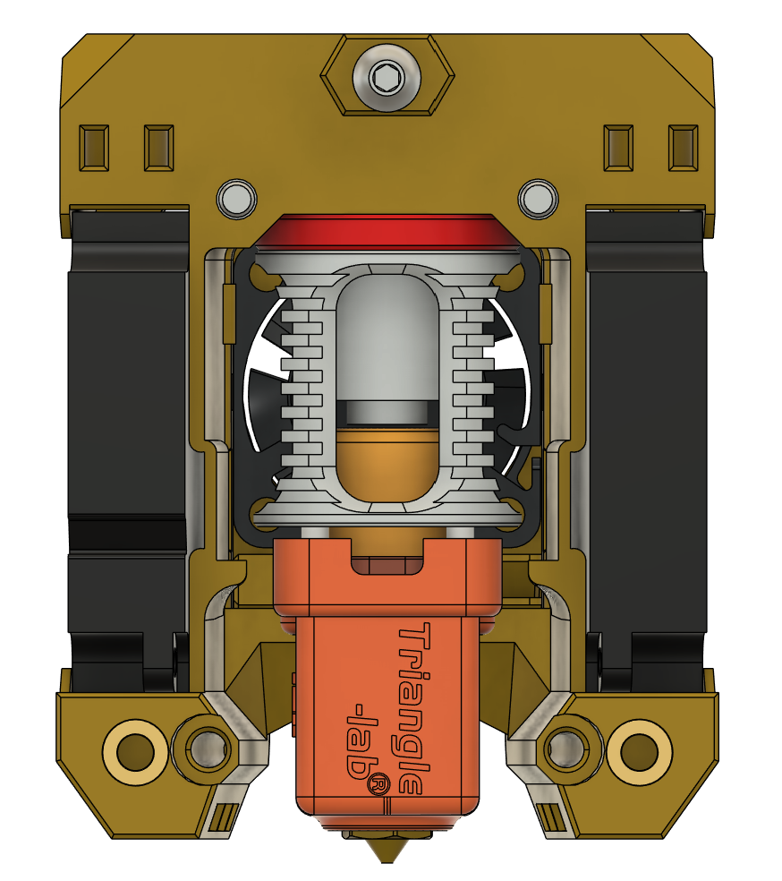

# Yavoth - A Toolhead for Voron Printers (BETA)

This is a toolhead for High Flow style hotends using angled 4010 part cooling fans and a 2510 hotend fan.

This is a unibody toolhead for any of the printers with supported x carriage mounts as are available at [Alternative_Voron_Mounts](https://github.com/chirpy2605/voron/tree/main/general/Alternative_Voron_Mounts). It is targeted specifically to longer hotends that can benefit from having the hotend fan positioned higher up within the cowl.

It is designed with extruder support for Sherpa Mini and Orbiter v2 style mount patterns. It mostly stays within the dimensions of the v0.2 stock MiniSB toolhead. Some installations may find the toolhead tapping the front door of the v0.2 in the same was as the [Dragon Burner](https://github.com/chirpy2605/voron/tree/main/V0/Dragon_Burner) can.

There are several cowls available:

- Dragon mount pattern cowl

- Revo Voron pattern cowl

- [Peck](https://github.com/chirpy2605/voron/tree/main/general/Experimental/Peck) mounts for the above (Soon)

No probe mounts are currently available, so if used on anything other than the v0, any probes should be mounted on the printer specific x carriage mounts at [Alternative_Voron_Mounts](https://github.com/chirpy2605/voron/tree/main/general/Alternative_Voron_Mounts).

The unibody has been designed to offer a sturdy, easily printed design with no supports needed, with limited hotend and extruder support to keep within these design parameters.

It uses a 2510 hotend fan sighted at an advantageous height to offer improved hotend cooling performance compared to a 3010 hotend fan.

It also uses two 4010 part cooling fans that are angled from the front to the rear, to better improve airflow from the ducts to the tip of the nozzle.

It is also designed to use any of the extras available for the [Dragon Burner](https://github.com/chirpy2605/voron/tree/main/V0/Dragon_Burner) toolhead and the [Alternative_Voron_Mounts](https://github.com/chirpy2605/voron/tree/main/general/Alternative_Voron_Mounts).

## BOM:

- 2 x 4010 blowers fans
- 1 x 2510 axial fan
- 2 x M3x5x4mm heat inserts
- 1 x Neopixel LED
- 3x M3 square nuts (DIN 562 preferred)
- 3 x M3x10 SHCS/BHCS screws
- 1 x Spool of Neon Green ABS/ASA (optional, but preferred)

**NOTE**: For those with a sensitive disposition, 2510 fans can be quite a bit louder than 3010's

## Hotend Support:

The following hotends are supported by this toolhead. Other hotends may work, but have not het been confirmed:

- Dragon with Volcano style heater block

- Rapido v1/v2 HF

- Dragon Ace (with ~3mm spacer)

- Revo Voron (with ~5mm spacer)

**Note**: Hotends that require a spacer will require longer mounting screws than normal to account for the extra length due to the spacer.

## Extruder Support:

The following extruders are supported by this toolhead. Currently this is limited to Orbiter v2 and Sherpa Mini mounting pattern extruders:

- Galileo v2 Standalone

- WristWatch BMG

- WristWatch Galileo v2

- Sherpa Mini

- Sherpa Micro

- Sharkfin

- Sailfin

- Orbiter v2

## Probe Support:

- Currently no probes are supported within the toolhead. The [Peck](https://github.com/chirpy2605/voron/tree/main/general/Experimental/Peck) hotend probe will be added when available

## Printing:

- Use Voron Design slicer settings and print in ABS/ASA or better (see BOM)

- Do not use Arachne or similar slicer settings as it may cause print problems

## CAD:

When it is out of Beta.

## Assembly:

This is pretty straightforward given the unibody design.

- First install the two heat insert tools at the lower rear of the part cooling ducts. The inner holes add rigidity to the toolhead design. M3x30mm screws can be added if more weight and rigidity are desired:

- Insert the hotend Neopixel in the LED carrier and then insert that into the cowl from the rear and feed the wires through the gap in the cowl and along the cable channels:

- Insert the 2510 hotend cooling fan from the rear of the cowl until it clicks in place above the LED carrier. Feed the wires for the 2510 through the gap in the cowl and along the cable channels:

- Insert both of the 4010 part cooling fans in the same manner as the [Dragon Burner fans](https://github.com/chirpy2605/voron/tree/main/V0/Dragon_Burner#fans-1):

- Insert 3 square M3 nuts into the cowl, one for the rear mount and two from the sides for the extruder mount. You may want to use a very small dab of superglue to ensure that they stay in place before the extruder is fitted:

- Attach the hotend to the cowl. If your hotend requires the use of a spacer, be sure to print and add it as you attach the hotend:

That's it. Check your Z offset before attempting to print anything.

## Contact:

- You can contact me on Discord on the Voron Design server as *chirpy*

## Credits:

Thanks go to the individuals that helped with the design, printing, testing and providing feedback on the Voron Discord server:

- *PiotrK*

- *Shlongky*

- *pnewb*

## Release:

- 24-06-01 Initial BETA release

## Changelog:

- 24-06-01 Initial BETA release
- 24-06-02 Fixed the missing hotend mounts in the Sherpa Micro cowls
