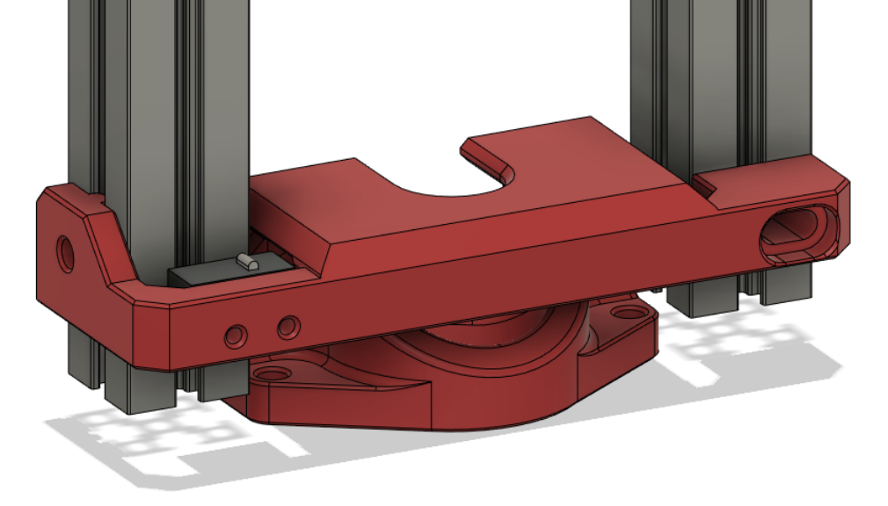
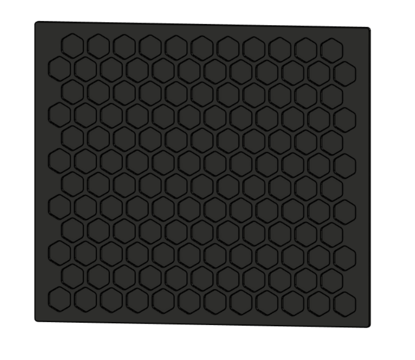
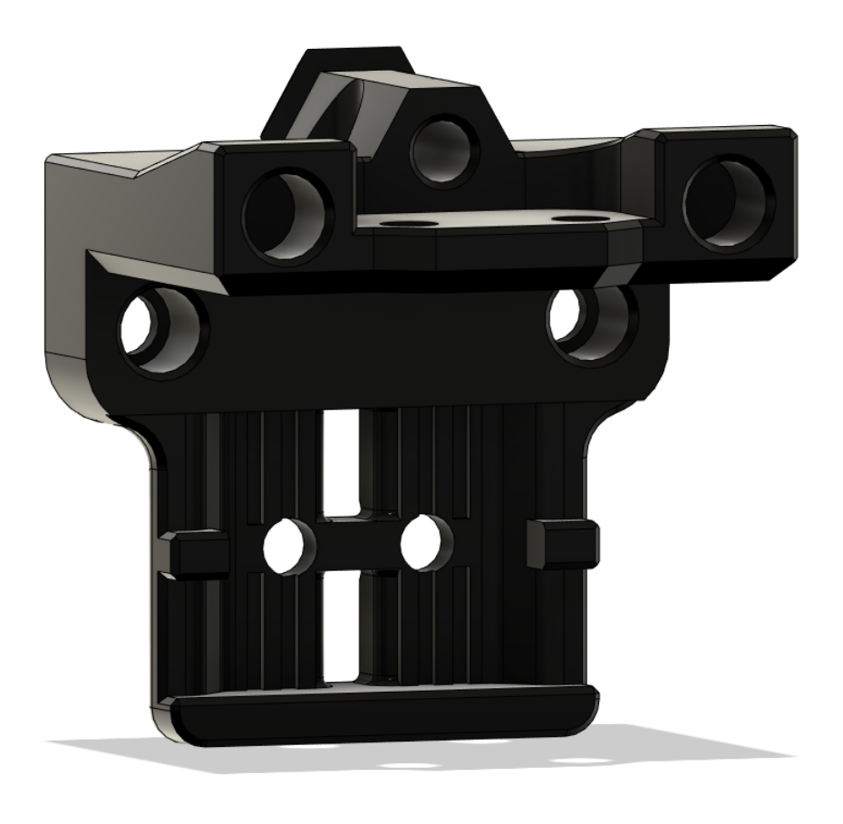
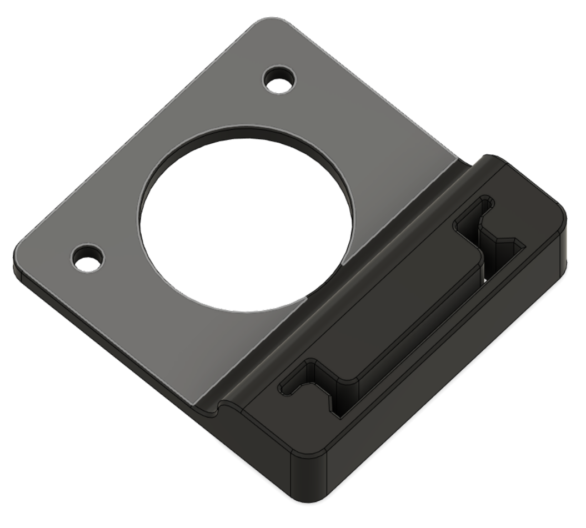
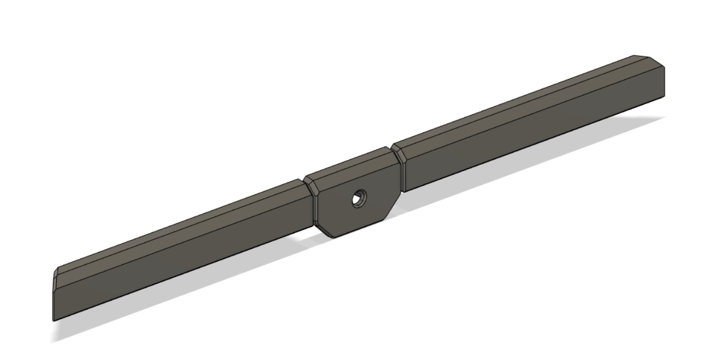
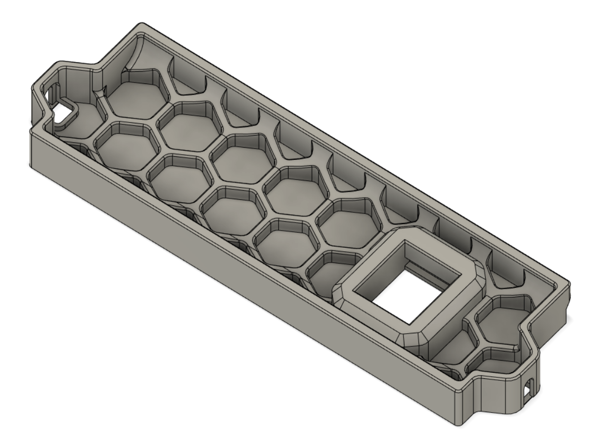

# Voron v0.2 Mods:

Z Cover to prevent stuff falling through the chamber into the lead screw hole:

Rear Panel Hex Mesh from [Printables](https://www.printables.com/model/153997-voron-v01-rear-panel-with-better-cooling):

MGN9C X Carriage with inserts from [VoronUsers/printer_mods/ruiqimao/V0.2_MGN9C_X at v0.2-mgn9c · ruiqimao/VoronUsers · GitHub](https://github.com/ruiqimao/VoronUsers/tree/v0.2-mgn9c/printer_mods/ruiqimao/V0.2_MGN9C_X):

DIN Rail mounts:

Gap Seals:

Rear Skirt Keystone Mesh from [VoronUsers/printer_mods/hartk1213/Voron0.2_Rear_Keystone_Skirt at master · VoronDesign/VoronUsers · GitHub](https://github.com/VoronDesign/VoronUsers/tree/master/printer_mods/hartk1213/Voron0.2_Rear_Keystone_Skirt):

