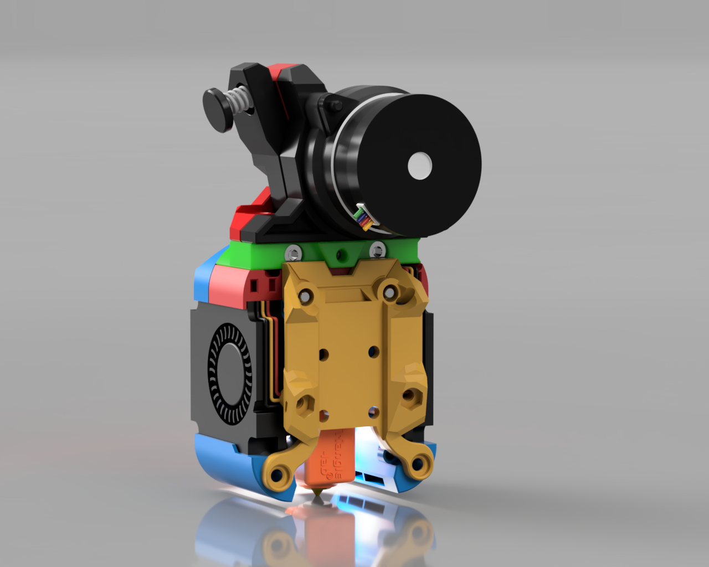

# Boop replacement front mount

This release is in BETA, this means parts may change and the CAD will not be release until this moves into the final version.

This mount is designed to be used with Boop v4 Beta. It is a modification of the stock boop_front.stl that it will work with the Dragon Burner and Rapid Burner toolheads.

If you would prefer to use the stock Boop v4 Beta front mount you can use [this spacer](STLs/Boop_Spacer.stl) which will extend that mount 3mm further forwards.

## Front Mount:

### STLs:

- [Boop_Front.stl](STLs/Boop_Front.stl)

Once printed, remove the two small supports.

For the angled screw holes that go between this part and the upper sensor part, you must use BHCS (Button Head) screws. This is to prevent contact issues between the screws used and the 4010 fans.

You _may_ have to snip off the screw lugs on the rear top of the 4010 fans for this part to fit.

You do not lose any additional Y from the stock boop_front part.

If you need more space between the toolhead and the boop front you can use [this spacer](STLs/Boop_Spacer.stl) which will extend that mount 3mm further forwards.

## Contact:

Please provide feedback to me on Discord @chirpy__

## Changelog:

2023-07-23 Published CAD
