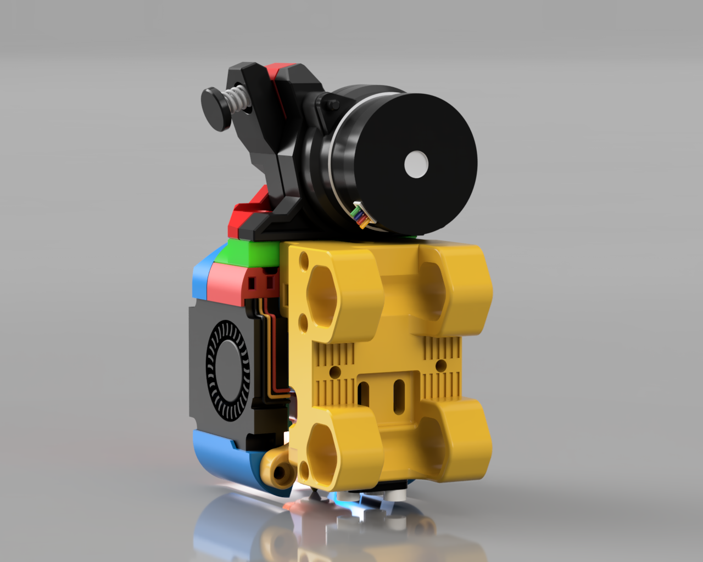

# Legacy Replacement mount

This release is in BETA, this means parts may change and the CAD will not be release until this moves into the final version.

**NOTE: Do not forget to adjust your nozzle offset or calibrate your probe after adding any of these mounts or you will damage your flex plate**

### STLs:

- [DB_VL_Carriage_Left.stl](STLs/DB_VL_Carriage_Left.stl)

- [DB_VL_Carriage_Right.stl](STLs/DB_VL_Carriage_Right.stl)

This mount replaces the stock mount to allow secure attachment of the Dragon/Rapid Burner toolhead the printer with addition of two lower mount points to rear of the ducts on the toolhead.

## Contact:

Please provide feedback to me on Discord @chirpy__ 

## v1 Changelog:

2023-07-23 CAD published
