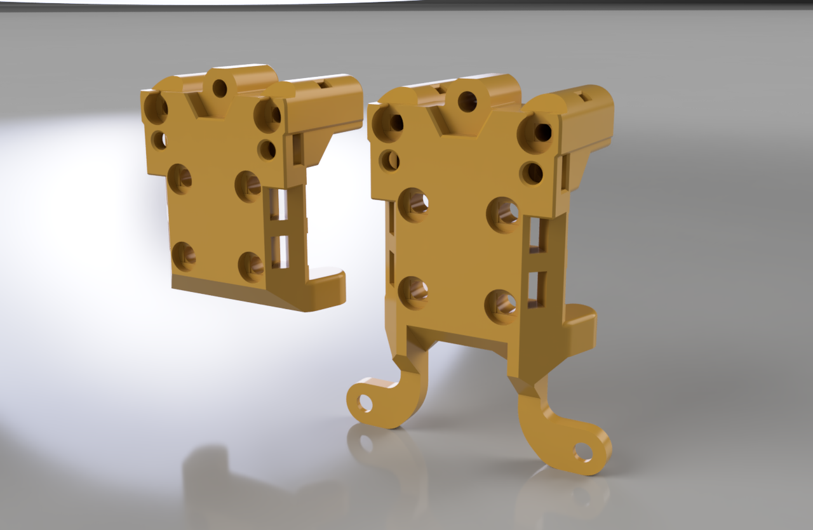

# Micron and Pandora X Carriage Replacement Mount

**NOTE: Do not forget to adjust your nozzle offset or calibrate your probe after adding any of these mounts or you will damage your flex plate**

This mount is designed to be used as a replacement for the stock Micron and Pandora X carriage  mounts to add 2 more mount points for the toolhead to attach to, adding rigidity.

In addition to the mounts, there are sets of 3mm and 5mm [Spacers](STLs/) to provide more room at the rear for cabling.

- MGN9H mount with provision for M3x16mm screws to decrease plastic flex, increase rigidity, increase durability which includes two lower mount points for the toolhead to the carriage

- MGN9H mount with provision for M3x16mm screws to decrease plastic flex, increase rigidity, increase durability which does not includes two lower mount points

- 3mm Spacer set

- 5mm Spacer set

When fitting square or hex nuts into the carriages with side holes it can help to use a little superglue to prevent them falling out during fitting.

When using the 3mm or 5mm spacer set, you might find it easier to glue the bottom and top spacers in place to avoid having to juggle with so many pieces at one time.

## Contact:

Please provide feedback to me on Discord @chirpy__

## Changelog:

2023-12-04 Published CAD
