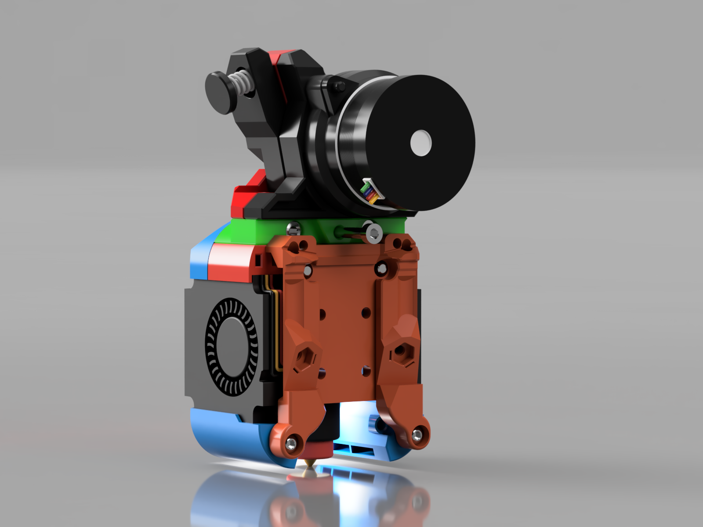
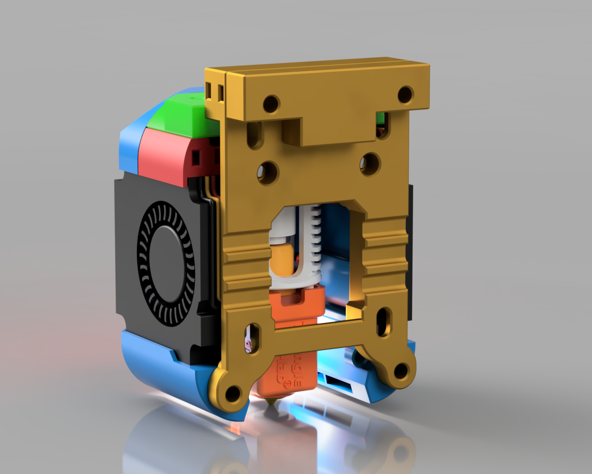

# Tap mounts

**NOTE: Do not forget to adjust your nozzle offset or calibrate your probe after adding any of these mounts or you will damage your flex plate**

These mounts allow you to mount the Dragon Burner and Rapid Burner toolheads to Voron Tap RC8. There are 2 options to choose from:

## Option 1: Tap replacement probe front

This mount replaces the Tap Front piece reducing the Y loss from the official mount and adding extra contact face area with these toolheads. Y loss is only 1.3mm compared to the CWS mount. The rest of Tap needs to be RC8.

You may also need to use the extruder mounts listed in the [Extended_Extruder_Mounts](../../Extended_Extruder_Mounts/) directory so that they clear the probe.

### STLs:

- [Tap_Front_Extended.stl](STLs/Tap_Front_Extended.stl)

- [Tap_Extruder_Spacer.stl](STLs/Tap_Extruder_Spacer.stl)

## Option 2: Tap adapter

This adapter is to be used between the toolhead and the stock Tap front. It is based on Tap RC8. This is useful if you prefer to use the stock Tap setup and want to simply add the toolheads to a working configuration. It does result in a loss of Y of ~7mm in addition to Tap Y loss.

Note: The picture shows the old style mount, there is a new two piece design courtesy of [MapleLeafMakers](https://github.com/MapleLeafMakers) 

### STLs:

- [Tap_Main_Spacer_New_Top.stl](STLs/Tap_Main_Spacer_New_Top.stl)

- [Tap_Main_Spacer_New_Bottom.stl](STLs/Tap_Main_Spacer_New_Bottom.stl)

- [Tap_Top_Spacer.stl](STLs/Tap_Top_Spacer.stl)

---

## Notes:

- Using Tap plus the spacer, the nozzle will move 10mm forwards compared to using the non-tap mount which places the nozzle at the same place when using CW2 mount. Tap RC8 moves the nozzle 3mm forward, so this mount adds a further 7mm to that

- Using the replacement Tap front part only moves the nozzle 1.3mm forwards compared to using the non-tap mount

- Using the replacement Tap front part on Rapid Burner, you must trim off the 4010 fan screw lugs at the top rear of each fan to be flush

- The taller the toolhead (i.e. if using chains or a Rapid Burner) the closer it is going to get to the top of the printer

- You will need longer screws to go through these mounts

- None of the Dragon or Rapid Burner probe mounts on the fan ducts will work on these supported printers unless you design your own probe frame mounts. the intention is for probes supported by the CW2 to be used

## Additional Info:

If you are going to use the Dragon Burner on a printer that is using an X cable chain, or a printer using the Tap probe, you may need to use the extruder mounts listed in the [Extended_Extruder_Mounts](../../Extended_Extruder_Mounts/) directory so that they clear the chain or probe. These mounts are extruder specific and replace their equivalents in the Dragon Burner repo.

## Belt Help:

I would recommend using the following mod to swap out your X carriage mount so that you do not have to re-tension your belts:

[VORON AB Belt Installation Helper (Clamp)](https://www.printables.com/model/479348-voron-ab-belt-installation-helper-clamp)

## Contact:

Please provide feedback to me on Discord @chirpy__ 

## Changelog:

- 2023-12-04 Published CAD
- 2023-12-12 Updated Tap_Extruder_Spacer.stl uploaded
- 2024-05-24 Replaced the Tap Spacer with a 2 piece spacer from [MapleLeafMakers](https://github.com/MapleLeafMakers)
