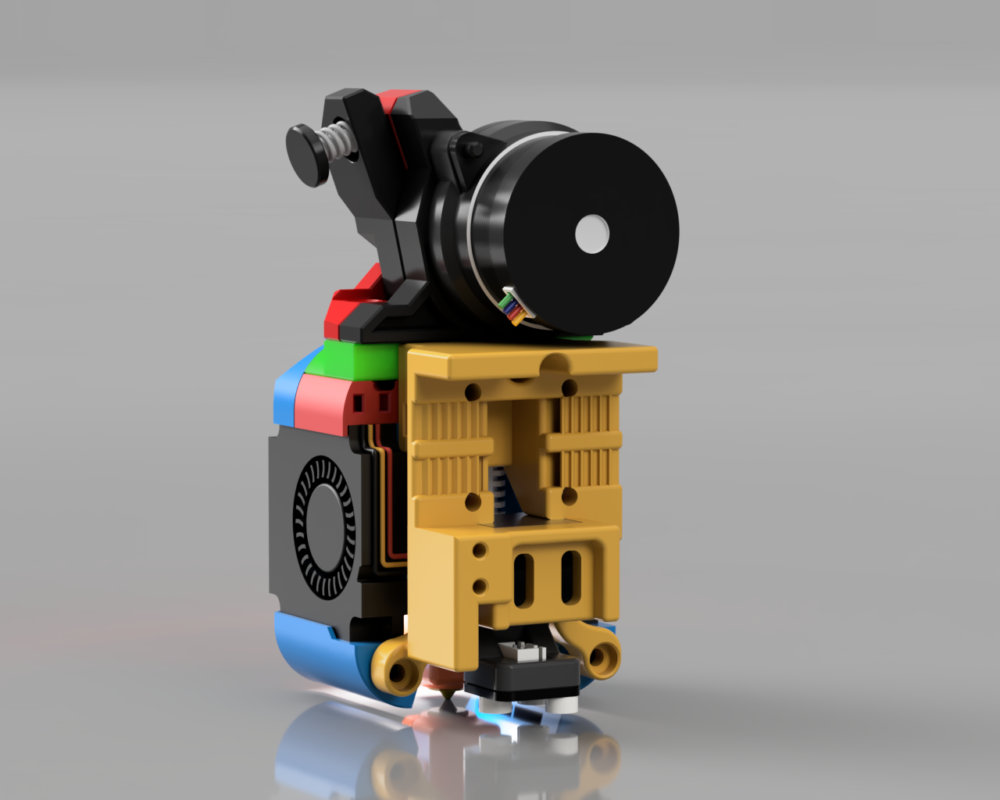
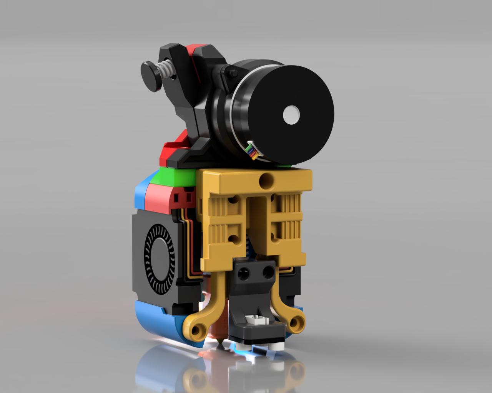
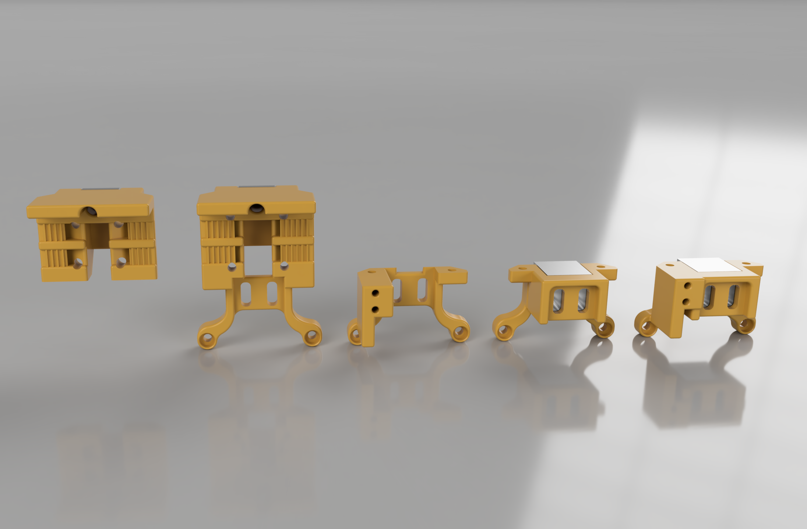
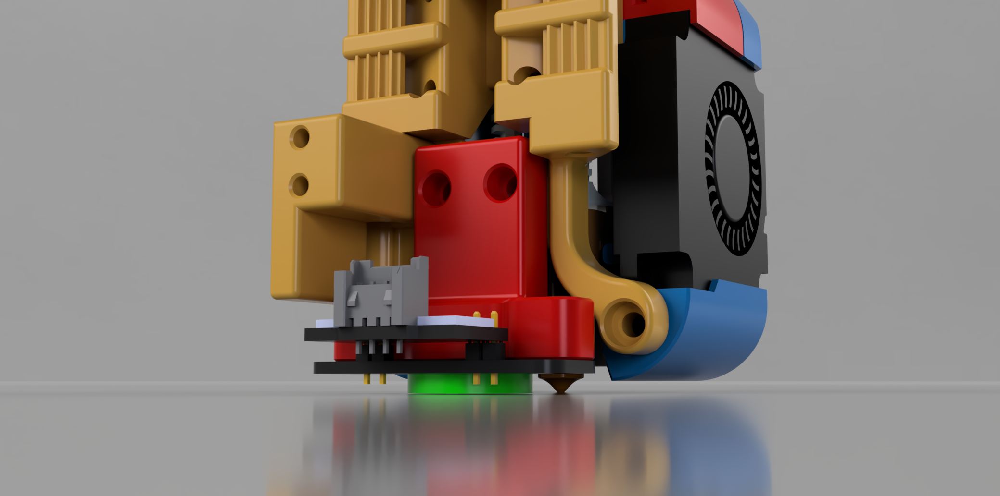
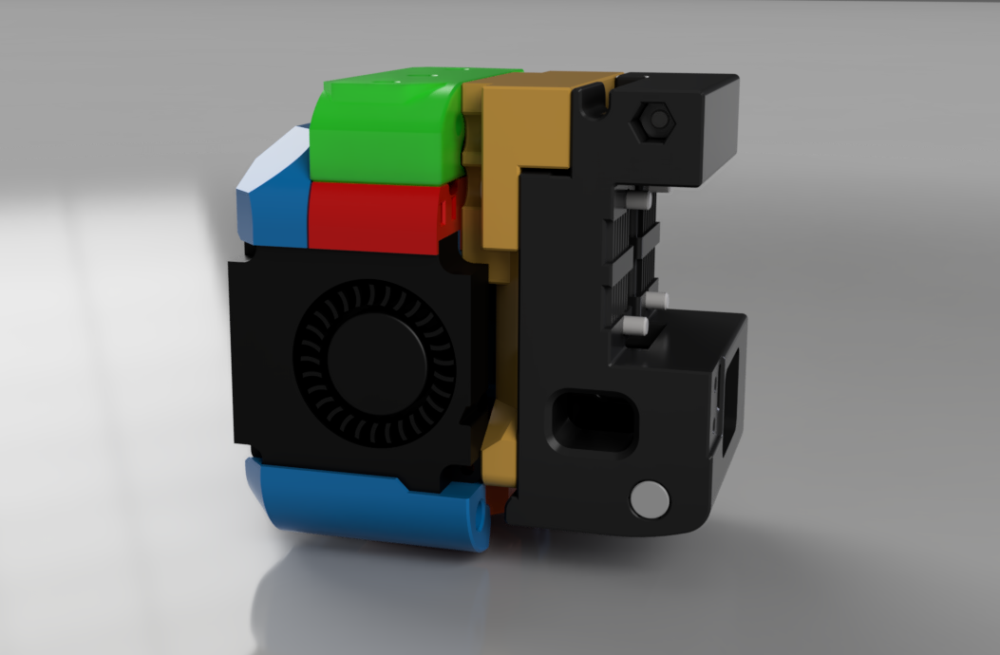

# Trident and v2.4 Mounts

**NOTE: Do not forget to adjust your nozzle offset or calibrate your probe after adding any of these mounts or you will damage your flex plate**

These mounts allow you to mount the Dragon Burner and Rapid Burner toolheads to the Trident and v2.4.

There are various designs to choose from, all are 2 part mounts with the top being the rail mount and the bottom for attaching probes and the 2 extra mount points to the toolhead:

- MGN12H mounts

- MGN9H mounts

- CW2 adapter

## Option 1: MGN12H Mounts

There is a choice of MGN12H mounts:

- MGN12H replacement mount ([MGN12H_X_Carriage_Lite](STLs/MGN12H/MGN12H_X_Carriage_Lite.stl))

- MGN12H replacement mount with PCB Mount holes ([MGN12H_X_Carriage_Lite_Lugs](STLs/MGN12H/MGN12H_X_Carriage_Lite_Lugs.stl))

## Option 2: MGN9H Mounts

There is a choice of several MGN9H mounts:

- MGN9H replacement mount ([MGN9H_X_Carriage_Lite](STLs/MGN9H/MGN9H_X_Carriage_Lite.stl))

- MGN9H replacement mount with PCB Mount holes ([MGN9H_X_Carriage_Lite_Lugs](STLs/MGN9H/MGN9H_X_Carriage_Lite_Lugs.stl))

- MGN9H replacement mount variants of the above but for a narrower and shorter mount to fit on printers using the same belting as the MGN12H gantry ([MGN9H_X_Carriage_Lite_short](STLs/MGN9H/MGN9H_X_Carriage_Lite_short.stl)) ([MGN9H_X_Carriage_Lite_Lugs_short](STLs/MGN9H/MGN9H_X_Carriage_Lite_Lugs_short.stl)) 

There is also a [spacer ](STLs/MGN9H/MGN9H_X_Carriage_Spacer_short.stl)for the MGN9H_X_Carriage_Lite_short mounts to go between the linear rail carriage and the X carriage mount to bring the belt forward so that it runs perpendicular to the rail rather than at an angle.

## Carriage Base Mounts for MGN12H and MGN9H mounts:

There is a also [choice ](STLs/Carriage_Bases/)of probe carriers shared between the MGN12H and MGN9H mounts:

- Carriage Base Short is the pared back carriage where you can mount a probe at the rear close to the toolhead

- Carriage Base Long provides a way to mount a probe in a similar way to the CW2 carriage mount and can hold the probe further from the toolhead

- Both of the above two have an alternative that includes a X end-stop switch mount at the equivalent position as the CW2 carriage mount if needed

### Additional Parts for MGN12H and MGN9H mounts:

- [Probe_Spacer.stl](STLs/MGN12H/Probe_Spacer.stl) (provides support for probes inside the main mount)

- [Probe_Bracket.stl](STLs/MGN12H/Probe_Bracket.stl) (allows the probe to be affixed to the main mount through the probe support at the rear)

You need to put 2 brass heat inserts into the front of the mount for the toolhead to screw on to. You will need an additional 2 brass heat inserts for the Probe_Bracket.

## Probe Mounts for MGN12H and MGN9H mounts:

There is also a [selection](STLs/Probe_Mounts/) of probe mounts available.

## Option 3: CW2 Adapter

If you would rather leave the stock CW2 carriage mount in place you can use this adapter plate instead. It requires two brass heat inserts. It is the least desired solution as it only has 2 mountpoints for the toolhead and you will lose ~6mm in Y:

### STLs:

- [CW2_Adapter_Plate](STLs/CW2_Adapter_Plate/CW2_Adapter_Plate.stl)

You will likely need to use the [Extended Extruder mounts](../../Extended_Extruder_Mounts).

---

## Additional Info:

If you are going to use the Dragon Burner on a printer that is using an X cable chain, or a printer using the Tap probe, you may need to use the extruder mounts listed in the [Extended Extruder_Mounts](../../Extended_Extruder_Mounts) directory so that they clear the chain or probe. These mounts are extruder specific and replace their equivalents in the Dragon Burner repo.

## Belt Help:

I would recommend using the following mod to swap out your X carriage mount so that you do not have to re-tension your belts:

[VORON AB Belt Installation Helper (Clamp)](https://www.printables.com/model/479348-voron-ab-belt-installation-helper-clamp)

## Contact:

Please provide feedback to me on Discord @chirpy__ 

## Changelog:

- 2023-12-04 Published CAD
