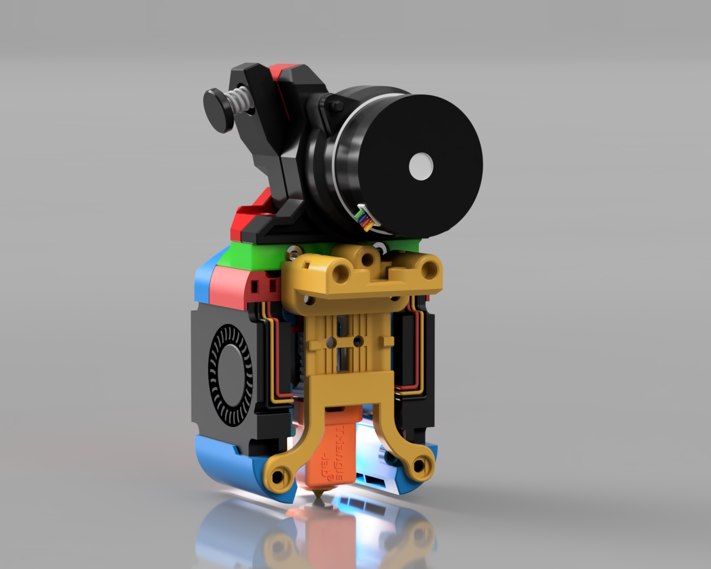
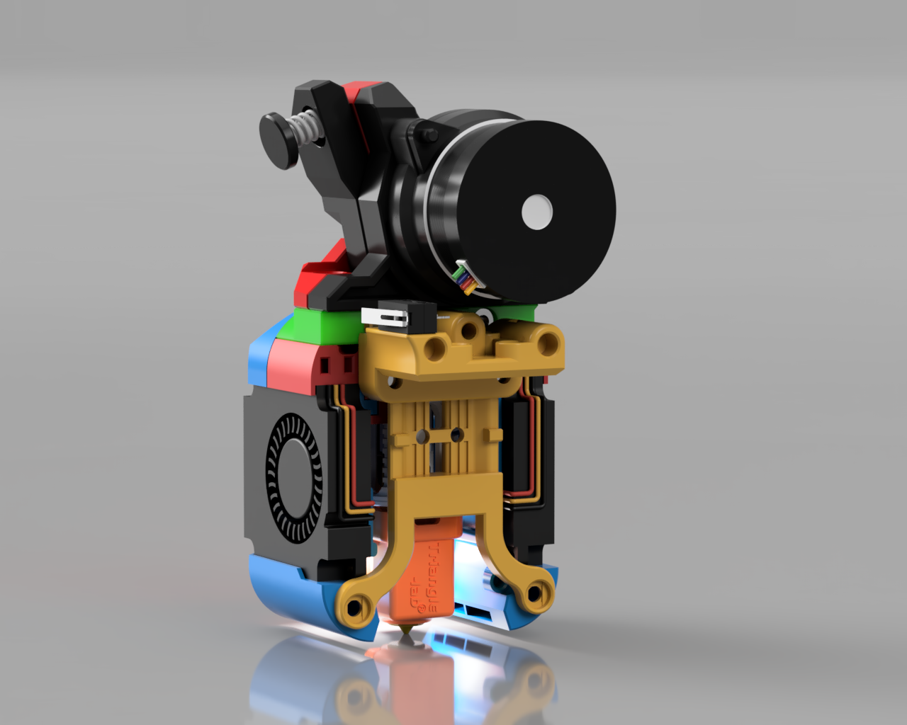
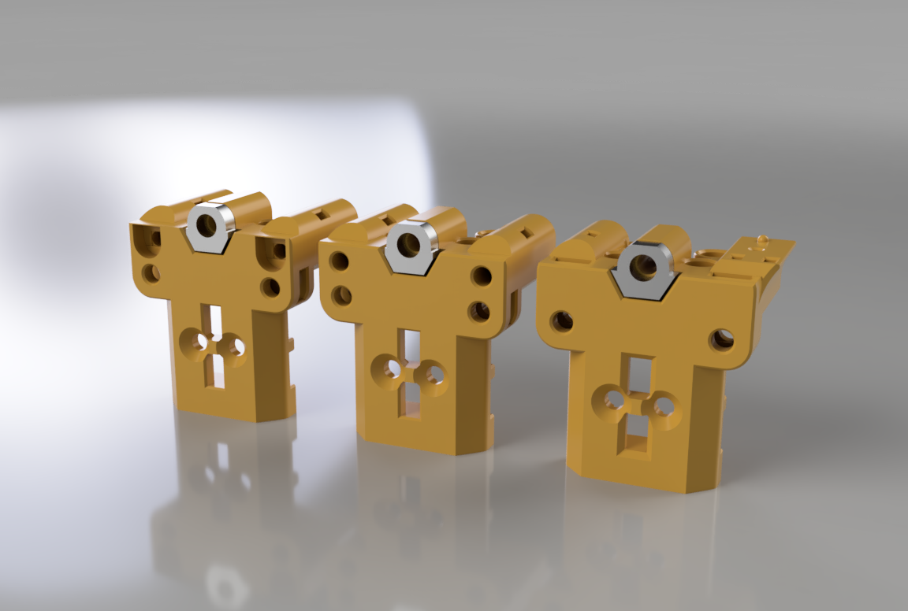

# v0.2 X Carriage Replacement Mount

This release is in BETA, this means parts may change and the CAD will not be release until this moves into the final version.

**NOTE: Do not forget to adjust your nozzle offset or calibrate your probe after adding any of these mounts or you will damage your flex plate**

This mount is designed to be used as a replacement for the stock v0.2 mount to add 2 more mount points for the toolhead to attach to, adding rigidity.

The mount comes in two sections. The top part is the X carriage mount which comes in several variations and the lower part which screws into the top part and the rear of the toolhead ducts.

The lower part replaces the need for the rear brace and requires 2 BHCS M3x8mm screws.

The top part comes in 6 variations and requires 2 brass heat inserts at the bottom for the lower part to screw in to.

- MGN7H mount with provision for M3x16mm screws to decrease plastic flex, increase rigidity, increase durability

- MGN7H mount with provision for M3x20mm pins (available from BMG kits or cut your own carbon rods) to decrease plastic flex, increase rigidity, increase durability

- MGN7H mount with provision for an X axis switch if not using sensorless homing

- MGN9C mount with provision for M3x16mm screws to decrease plastic flex, increase rigidity, increase durability

- MGN9C mount with provision for M3x20mm pins (available from BMG kits or cut your own carbon rods) to decrease plastic flex, increase rigidity, increase durability

- MGN9C mount with provision for an X axis switch if not using sensorless homing

When fitting square or hex nuts into the carriages with side holes it can help to use a little superglue to prevent them falling out during fitting.

For the mounts with provision for a microswitch, there is a replacement bumper which is taller to account for the higher position of the switch [here](STLs/[a]_X_Endstop_Bumper_Tall.stl).

For the MGN9C mounts you will still need replacement A/B motor mounts from [here](https://github.com/ruiqimao/VoronUsers/tree/v0.2-mgn9c/printer_mods/ruiqimao/V0.2_MGN9C_X).

## Contact:

Please provide feedback to me on Discord @chirpy__

## Changelog:

2023-07-23 Published CAD
