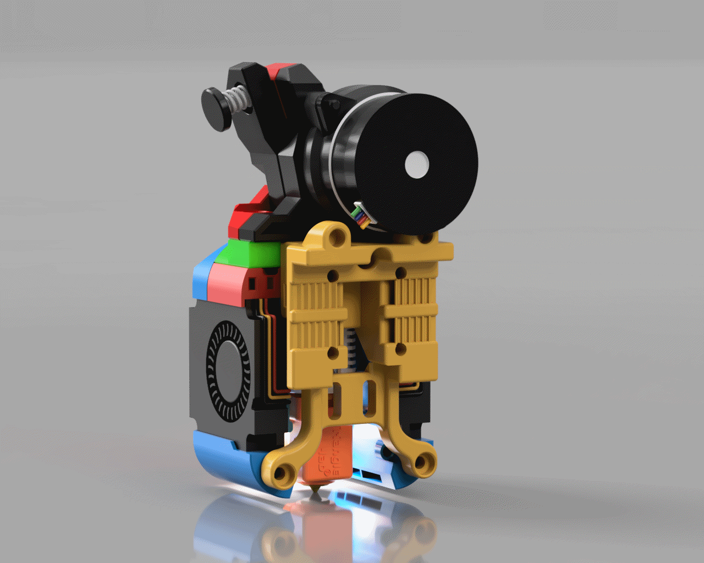

# Alternative Mounts v2 BETA

The following are a series of mounts for the Dragon Burner and Rapid Burner Toolheads for mounting on Voron Trident, Voron 2.4, Voron Legacy, Voron Switchwire, v0.2 and Printers for Ants.

**NOTE: Do not forget to adjust your nozzle offset or calibrate your probe after adding any of these mounts or you will damage your flex plate.**

---

### [v0.2](Modified_Mounts/v0.2)

- MGN7H replacement mounts

- MGN9C replacement mounts

- Optional Y end stop mounts

### [Trident and v2.4 CW2](Modified_Mounts/V1_V2)

- MGN12H replacement mounts

- MGN12H replacement mounts for 9mm belts

- MGN9H replacement mounts

- CW2 adapter

### [Tap](Modified_Mounts/Tap)

- Tap replacement front mount

- Tap adapter

### [Boop](Modified_Mounts/Boop)

- Boop replacement front mount
- Boop spacer

### [Switchwire](Modified_Mounts/Switchwire)

- Replacement mount

### [Legacy](Modified_Mounts/Legacy)

- Replacement mount

### [Micron and Pandoras Box](Modified_Mounts/Micron_Pandora)

- MGN9H replacement mounts
- 3mm and 5mm Spacers

## ChangeLog:

2023-11-18 v2 initial BETA release

2023-11-23 Added Euclid probe for Trident and v2.4

2023-12-04 Published CAD

2023-12-?? Added MGN12H 9mm belt mounts
