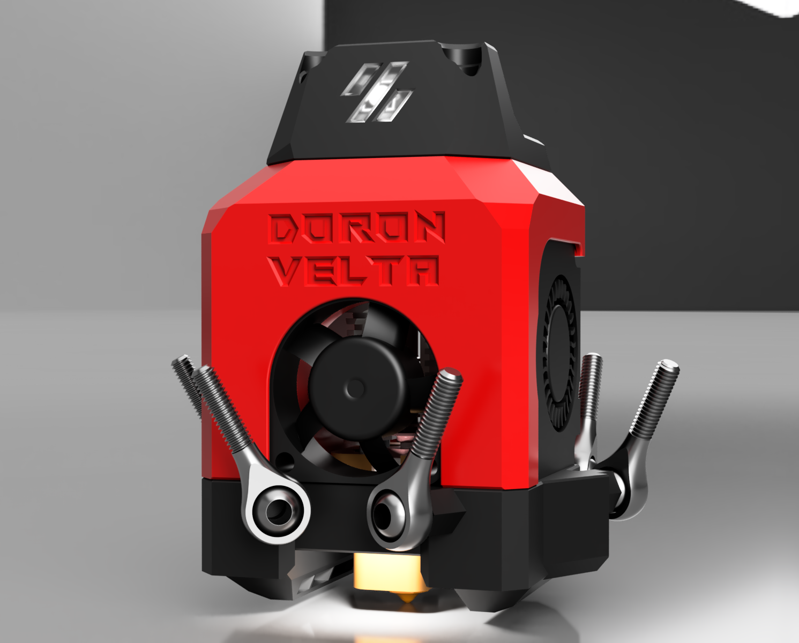
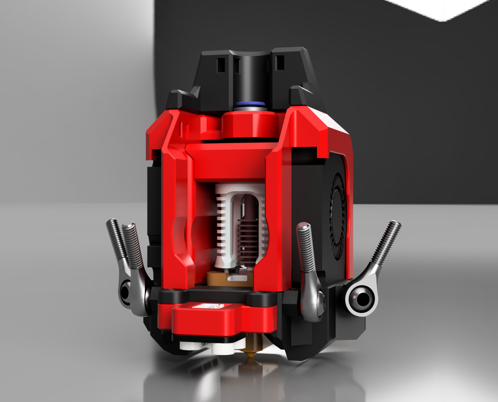
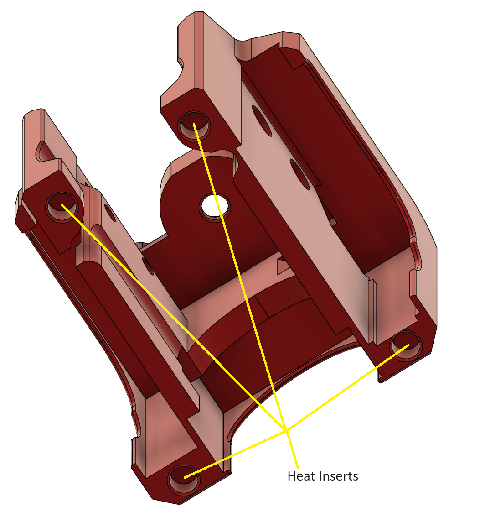
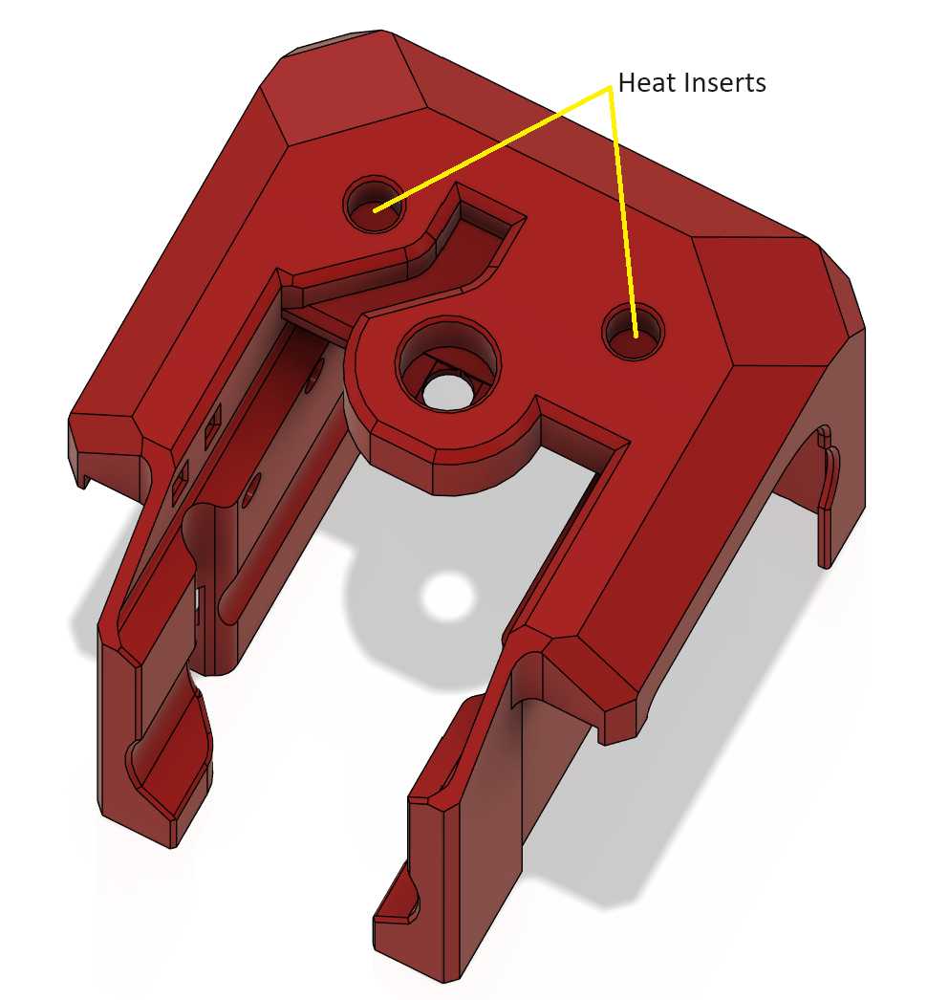
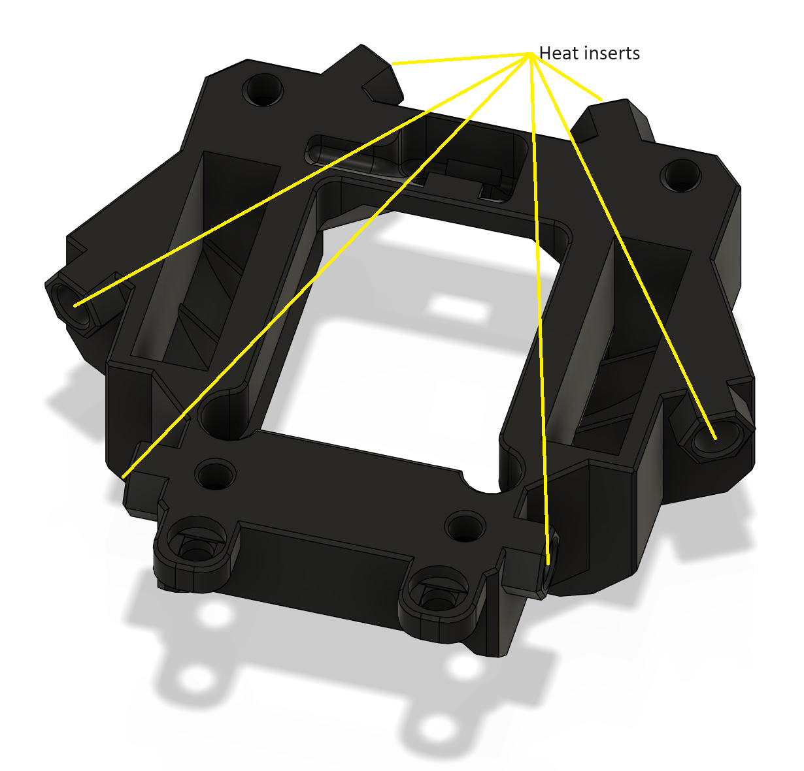
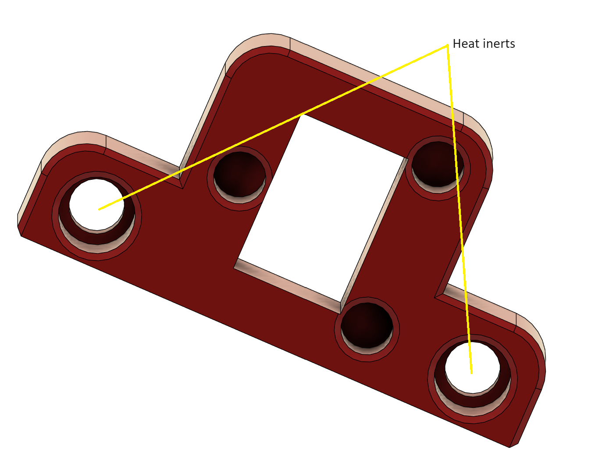
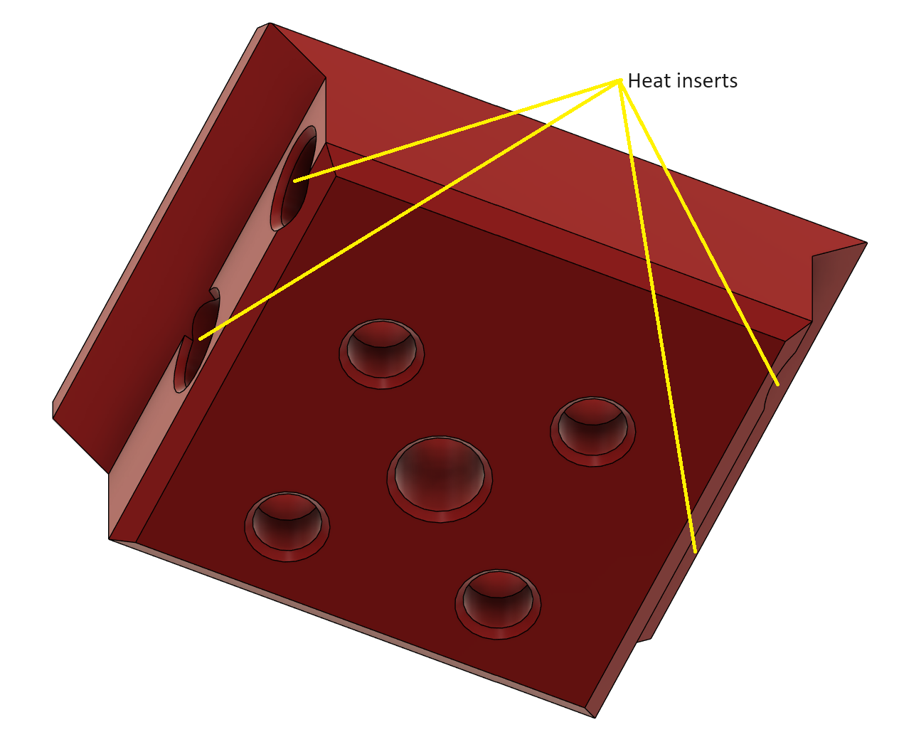
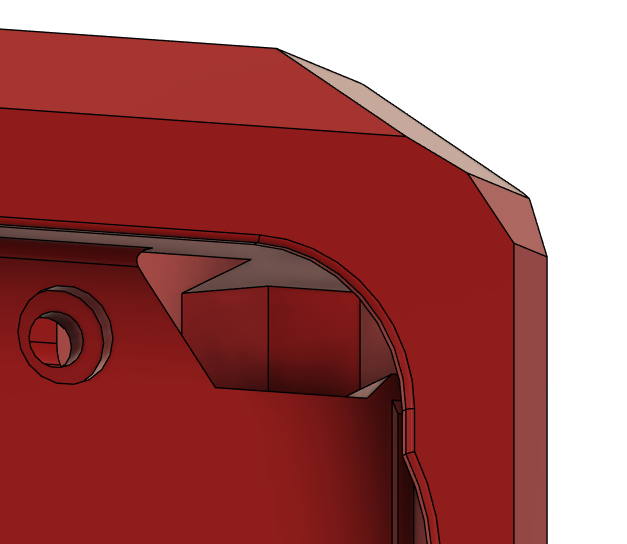
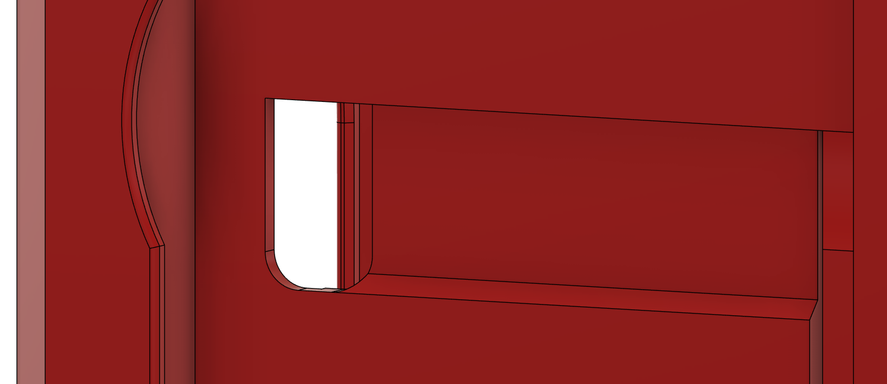
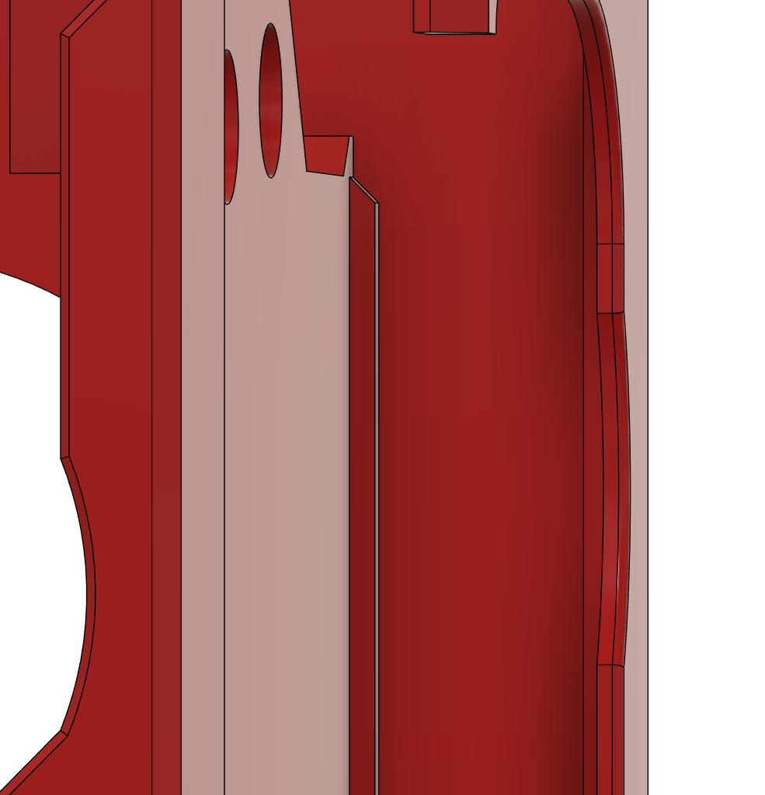

# CraneFly Effector for the Doron Velta (BETA2)

This is a BETA release of the CraneFly effector (3d Delta Printer toolhead) that has been designed for use on the [Doron Velta](https://github.com/rogerlz/Doron-Velta) designed by [rogerlz](https://github.com/rogerlz)

## BOM:

8x M3x8mm BHCS/SHCS screws

6x M3x6mm BHCS screws

20x M3x4x5mm Brass heat inserts

2x 4010 blower fans

1x 3010 axial fan

2x Neopixels

## Hotend Support:

- Dragon SF/HF

- Dragon ACE

- Rapido v1/v2

- Dragon Volcano (Dragon UHF without MZE)

- Revo Voron

- Bambu Labs X1C (and clones)

## Printing:

- Use Voron spec slicer settings and print in ABS/ASA or better

- Do not use Arachne or similar slicer settings as it may cause print problems

## Parts:

You will need:

- The effector plate

- The effector cage

- The Strain Relief

- Lens (opaque, translucent or any other filament if not using Neopixels)

- Lens_Carrier

- The Probe Mount (optional)

## Assembly:

It is _very_ important to assemble the effector in the correct order, otherwise you will end up having to dismantle to achieve certain steps.

### Heat inserts:

Add heat inserts at the following locations:

### Left Fan:

Push the wire for the left hand fan through the hole within the cage. Do _not_ fit the fan at this stage:

### Hotend Mount:

Screw the hotend to the hotend mount. With the left fan cable going up through the middle of the cage, slide the hotend into the cage from the rear. Using 4x M3x6mm BHCS screws, attach the hotend mount to the cage on both sides.

### Hotend Peck Mount:

Peck support is very much ALPHA - it has not been tested on this printer, so proceed with caution.

Works in a similar way to the [Dragon Burner Peck](https://github.com/chirpy2605/voron/tree/main/general/Experimental/Peck) mount. The main difference is that the lower grub screw needs to be screwed in further until it passes the hole where the wire comes in for that side of the switch.

With the Peck hotend mounts, heat inserts are not use to secure it to the cage, instead use 4x M3x6mm screws which go straight into plastic - so do not overtighten them.

### Hotend Fan:

Orientate the 3010 fan such that the cable is to the right of the cage and insert through the gap to the right to feed through the channel alongside the right 4010 fan and then back inside the cage through the slot:

### Hotend Neopixel:

Route the hotend Neopixel wires through the channel and up through the gap in the cage to the right to feed through the channel alongside the right 4010 fan and then back inside the cage through the slot.

### Right Fan:

Insert the right 4010 fan being careful to route the cable through the same slot into the cage being careful to lay the routed wires against the wire channel and not pinch them.

### Left Fan:

Insert the left 4010 fan being careful to route the fan cable though the slot to the front of the cage while pulling the fan cable out as you push the fan in:

### Effector plate:

Insert the hotend Neopixel into the effector plate.

Using 4x M3x8mm screws and attach the effector plate onto the cage being careful not to pinch any cables.

## Finishing up:

Attach the effector arms and route any cables using the provided zip-tie points.

## Changelog (BETA1):

- 2024-06-08 Strengthened the arm heat insert mounts

- 2024-06-08 Fixed some geometry issues with the plate and cage

- 2024-06-11 Fixed mis-aligned mounting holes on the plate and cage

- 2024-06-11 Centred mounting holes for probe mounts

- 2024-06-11 Added CAN/USB PCB mount strain relief parts

## Changelog (BETA2):

- 2024-06-20 Modifications to the Plate and Cage to tidy up geometry and features

- 2024-06-20 Added alternative plate that uses M3 square nuts (DIN 562 preferred) instead of heat inserts

- 2024-06-20 Added 2 additional holes to the top of the Cage for additional support for the Stress Relief mounts

- 2024-06-20 Added extruder support for various mount patterns - some extruders may not fit within the dimensions of the arms

- 2024-06-20 Added Peck hotend flexure mounts - these should be considered ALPHA releases as they have had no printer mounted testing for this printer

- 2024-06-20 Release BETA2 CAD - This _will_ change as the BETA is developed

- 2024-06-21 Added Stress Relief mount for the hartk MiniSB Bowden PCB

- 2024-06-29 Minor modifications to the effector cage, including the ECAS04 fitment

- 2024-07-05 Reduced hotend mount holes sizes for the Dragon pattern mounts

- 2024-07-05 Added more room for the left hand 4010 fan wires

- 2024-07-05 Reduced hotend mount holes sizes for the Dragon Peck pattern mounts

- 2024-07-05 Updated CAD

- 2024-07-06 Added DV logo lens, holder and Strain Relief options (DV = Doron Velta, VD = Voron Delta)

- 2024-07-06 Added Rainbow Barf lens holder for VD logo lens carrier

- 2024-07-06 Updated CAD
