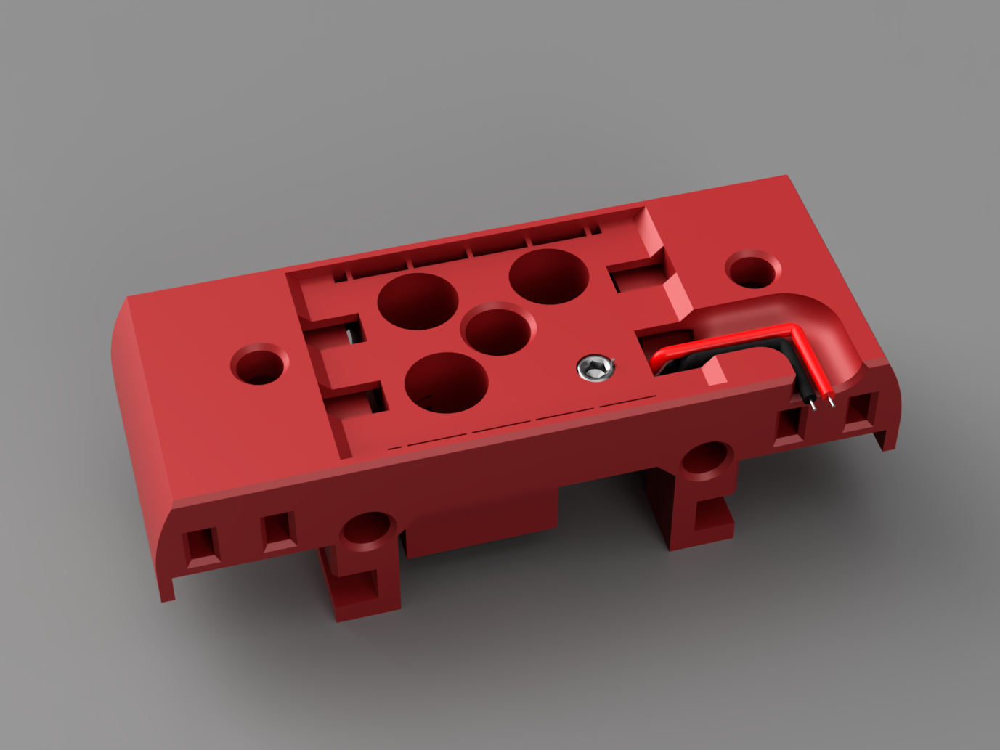
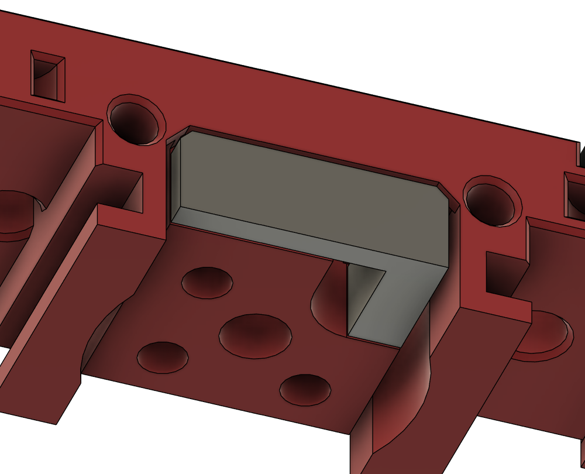
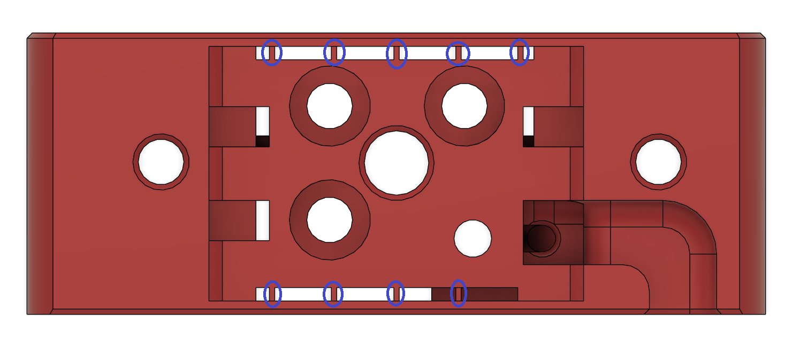
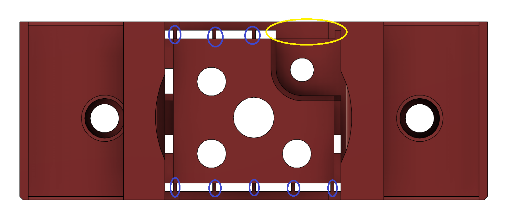
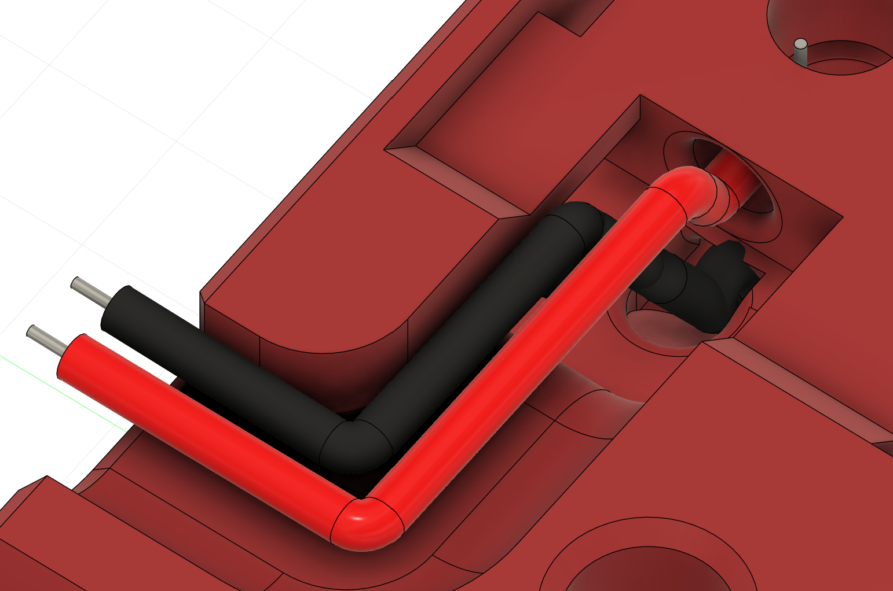
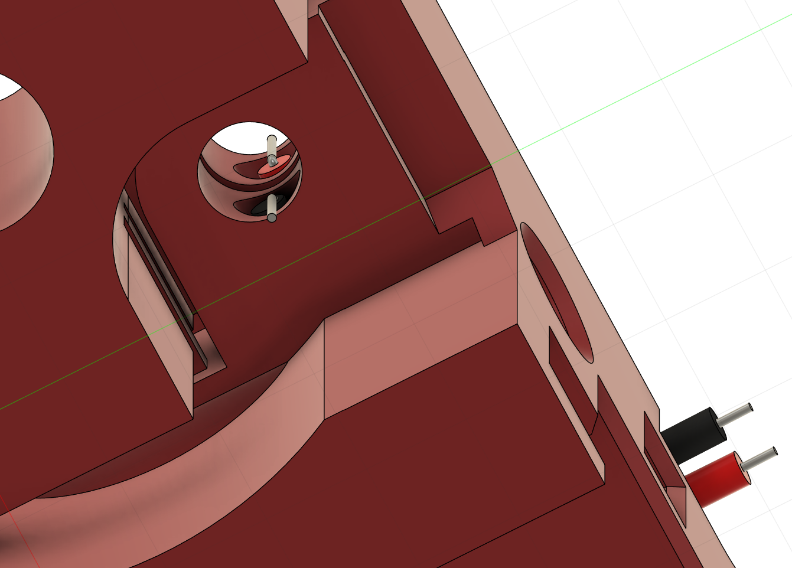
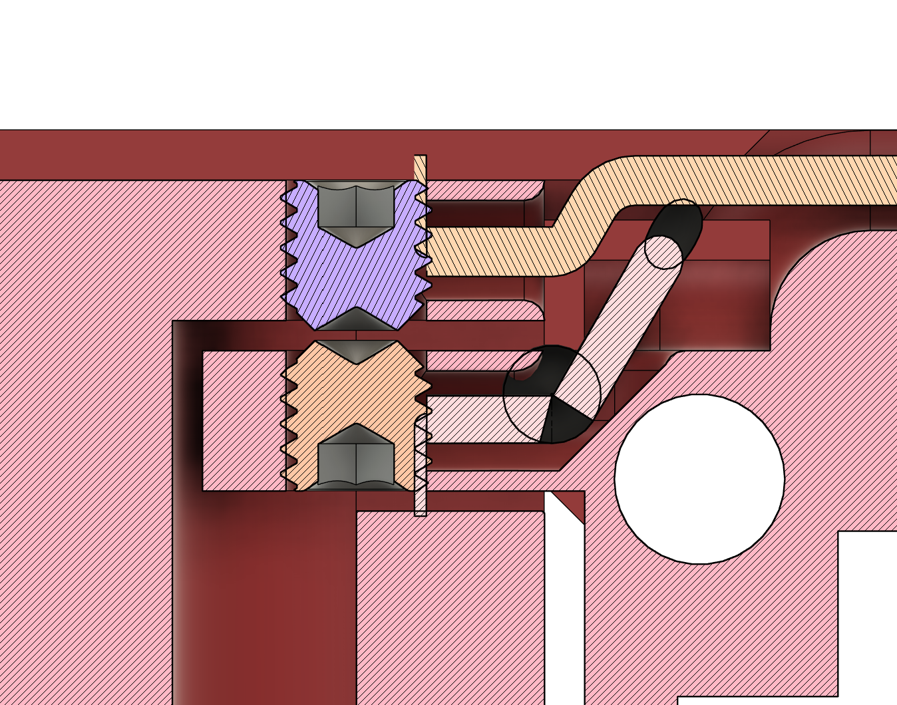

# Dragon Burner Peck (Experimental)

This is a flexure Probe for the Dragon Burner toolhead.

**NOTE**: This is an Experimental release, it's not even Beta yet and there's a possibility that it won't be released depending on test results.



I have created a mount where the centre square is suspended from the rest of the hotend mount by flexures. This gives the user the ability to use the hotend as a probe like FlexTap to determine your Z offset and to create a bed mesh.

There are 8 hotend mounts available for testing made up of 4 for use with the Sherpa Mini mount pattern and 4 for the Orbiter v2 mount pattern, for the following hotends:

- Dragon ST/HF
- Rapido HF
- Revo Voron
- Dragon Ace

Note: Not all hotends and extruders will be supported

## BOM:

- 2 x M3x3mm grub screws, preferably stainless steel

## Note:

This is a Normally Closed (NC) probe which means that it will fail to probe if the screws are not touching or either of the wires is disconnected or broken.

## Caveats:

Please be sure to read the following:

- Don't attempt this if you only have one printer as failures could require reprinting new parts
- Do use an old flex plate, it is very easy to damage the flex plate when doing this sort of testing
- Don't attempt this unless you do not mind rebuilding your toolhead frequently
- As with any bed probe, this will not give you an accurate bed mesh on a v0 due to the cantilever bed and the trigger force required. However, for the purposes of testing as an end stop at the middle rear of the bed, using a v0 should be fine
- Print with the Voron defaults. Not doing so, or using slicer features such as "Arachne" is likely to lead to problems with the printed parts
- The probe will significantly change its properties depending on the chamber temps. So either probe cold or when the chamber has been fully heat soaked. Do not probe while the printer and chamber are still coming up to temperature
- There are currently no channels for the logo LED wires

## CAD:

When it is out of Beta.

## Assembly:

- Remove break away support from the hotend mount where it touches the bed:
  

- Using a craft knife, carefully cut through the thin walls on both sides of the hotend mount to free the inner section of the mount. Do *not* cut through the flexures and do not cut through the lower section highlighted in yellow:
  
  

- Once the centre is no longer being constrained by the thin walls, gently press the centre of the mount upwards until you feel around 0.5mm of movement at the front and back of the mount.  Expect to hear some cracking as stray filament breaks. The flexures on the top will likely show white stress marks where it connects to the centre of the mount. This is normal, do not force it any higher

- Feed each wire, one at a time, into the holes on the top of the mount
  
  

- Feed the ends so that the wires *do not touch*, with the bottom wire coming out at the bottom and the top wire coming out of the top. Ensure that there are no stray wires
  
  
  

- Take the first M3x3mm grub screw and screw it in from the bottom such that it retains the wire coming out of the hole. Turn until the bottom of the grub screw is flush to the bottom of the mount

- Take the second M3x3mm grub screw and screw it in from the top such that it retains the wire coming out of the hole. Turn until flush with the top of the mount

- Attach the ends of the wires to a multimeter and setup for continuity checking

- The multimeter will likely register that there is no continuity, if it does register continuity unscrew the top grub screw until it shows the continuity is broken. If that does not happen, you likely have the two wires touching and need to check how you have fed them into the mount

- Slowly screw in the top grub screw until there is continuity and stop. Turn the screw a half turn more to add a little preload

- Attach the hotend

- With the multimeter attached, push the base of the hotend while bracing the mount. You should see no continuity until you remove the upward pressure

- Test with pushing the the nozzle against a hard surface holding only the sides of the hotend mount, not the centre

- If it appears that too much pressure is needed to trigger the switch, try unscrewing the top grub screw a little (quarter turns at most). If it still requires too much pressure, make sure that the thin walls are definitely cut through and gently rock the hotend left and right, forwards and backwards to remove some tension from the flexures

- To add some strain relief, consider using hot glue to hold the wires in place where they exit the hotend mount. Don't put hot glue where it could restrict the flexure movement

## Initial Testing:

1. Attach and configure the switch cable to your MCU. Klipper example (change to suit your printer setup):
   
   ```
   [probe]
   pin: ^pin_name
   x_offset: 0
   y_offset: 0
   speed: 20.0
   samples: 3
   sample_retract_dist: 5.0
   lift_speed: 30.0
   samples_tolerance: 0.01
   samples_tolerance_retries: 15
   deactivate_on_each_sample: 0
   ```

2. Use an old flex plate or the steel side of a single sided flex plate, otherwise you may well end up with an etched or dented flex plate!

3. Attach the toolhead to the printer

4. Go to the Machine tab and update the Endstops. Make sure the Probe is **OPEN**. If it isn't you need to remove the toolhead and find out why

5. Home the printer
   **NOTE**: if homing Z involves using the probe be ready to hit **EMERGENCY STOP**!

6. If using a v0 for testing, move the toolhead to the centre rear of the bed, e.g. X60, Y110

7. Test the probe using:
   
   Be ready to hit **EMERGENCY STOP**!
   
   `PROBE_ACCURACY SAMPLES=1`

8. If the probe works and the toolhead does not flex too much, try increasing the samples to 10 and then 100

9. Run more 100 sample probes. The probe may need a few hundred probes to break in

10. Once the probing yields reasonable results, heat soak the chamber as you would for printing and repeat probe accuracy and try creating a BED_MESH

11. If the probe fails after a heat soak, you may need to remove the toolhead and add or remove a bit of the preload on the grub screws

## Further Testing:

It is then up to you if you would like to continue with the mount in place or revert to your previous mount for print testing.

If you do continue, please keep me appraised on the Voron Discord (chirpy_\_).

The following additional tests would be appreciated:

- Before and After Input Shaping graphs
- PROBE_ACCURACY test Standard Deviation in a heated chamber compared to a cold one
- Before and After print quality

## Feedback:

Please contact chirpy on the Voron Discord.

## Credits:

- Initial design and implementation of the Flexure concept by andrewmcgr (on Voron Discord)
- Further designs and suggestions by zruncho (on Voron Discord)
- Printed part testing by reth_xv (on Voron Discord)