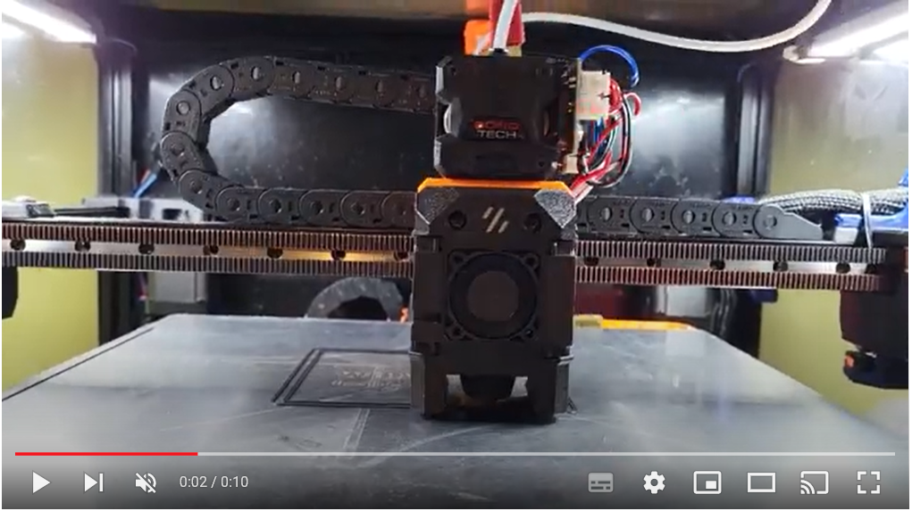
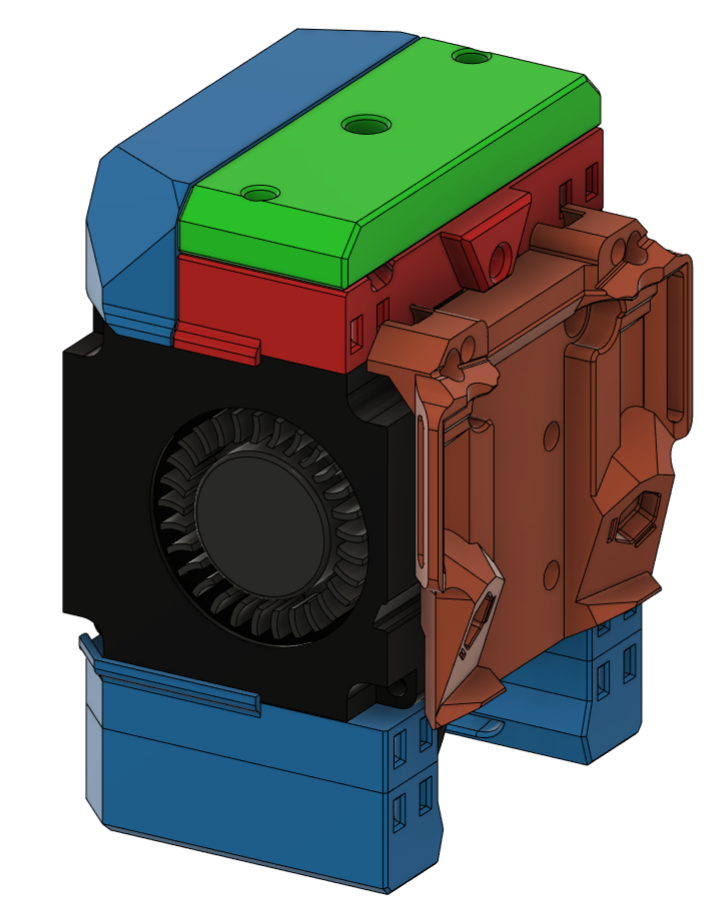
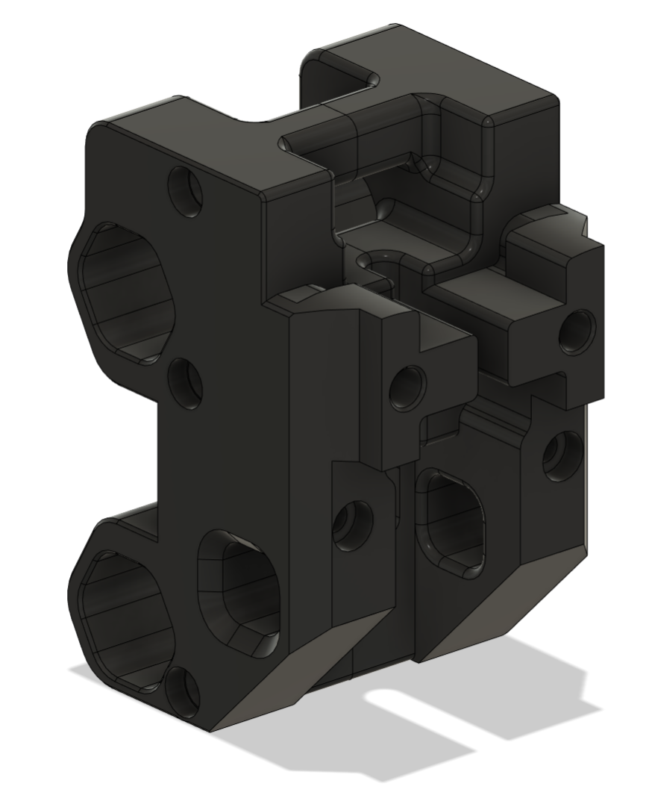

# Dragon and Rapid Burner Mounts for Trident and 2.4

**NOTE: All information and STL's in this directory are a Work In Progress. This means I cannot guarantee that they won't break something on the printer or damage your flex sheet!**

**NOTE: Do not forget to adjust your nozzle offset or calibrate your probe after adding any of these mounts**

The series of mounts in this section have been designed to allow mounting of any of the Dragon Burner, Rapid Burner and Mailbox toolheads to the Voron Trident and Voron 2.4.

There are 3 separate designs:

1. An [MGN12 mount](#option-1-mgn12-mount) that is based on the CW2 mount

2. A replacement [Tap front part](#option-2-tap-probe-front) that is based on the Tap RC8

3. A [Tap spacer](#option-3-tap-probe-plate) which goes between Tap and the toolhead, compatible with the Tap RC8

4. A Switchwire mount

5. A Legacy mount

6. A CW2 adapter plate

### Supported Hotends (for the various toolhead combinations):

- Dragon SF

- Dragon HF

- Dragon UHF (volcano length)

- Dragon UHF

- Rapido HF

- Rapido UHF

- Revo Voron

- Dragonfly

- Creality Spider Pro

- NF Crazy

- Goliath Air

- Goliath Water (not tested)

### Supported Extruders:

- LGX

- LGX Lite

- Sherpa Mini

- Sherpa Micro

- Sharkfin

- Sailfin

- Vz-HextrodORT

- Roundtrip

- Roundabout

- Orbiter v1.5

- Orbiter v2.0

- Double Folded Ascender

### Supported Probes:

- Voron Tap

- Omron TL-Q5MC2 (or similar) Inductive Probe

- Beacon

- Klicky

- UnKlicky

- Voron PCB Klicky

- Euclid (developed by @QUINX#7278 on Discord)

## Option 1: MGN12 Mount

This mount is based on the CW2 and allows you to use any of the probes that mount can use. This mount uses:

- MGN12_X_Carriage.stl (the main mount)

- Probe_Support.stl (provides support for probes inside the main mount)

- Probe_Bracket.stl (allows the probe to be affixed to the main mount through the probe support at the rear)

You need to put 2 brass heat inserts into the front of the mount for the toolhead to screw on to. You will need an additional 2 brass heat inserts for the Probe_Bracket.

**Note:** If you are going to use a Euclid probe, you will need to print MGN12_X_Carriage_Euclid.stl and do not need either the Probe_Support.stl or the Probe_Bracket.stl

## Option 2: Tap probe front

This mount replaces the Tap Front piece reducing the Y loss from the official mount and adding extra contact face area with these toolheads. Y loss is only 1.3mm compared to the CWS mount. The rest of Tap needs to be RC8. This mount uses:

- Tap_Front.stl

## Option 3: Tap probe plate

The Tap directory contains a spacer to be used on the back of the Tap probe. It is based on Tap RC8. This is useful if you prefer to use the stock Tap setup and want to simply add the toolheads to a working configuration. It does result in a loss of Y of ~7mm in addition to Tap Y loss.

## Option 4: Switchwire Mount

## Option 5: Legacy Mount

## Option 6: CW2 Adapter Plate

If you would rather leave the stock CW2 carriage mount in place you can use this adapter plate instead. It requires two brass heat inserts:

## Notes:

- Using Tap plus the spacer, the nozzle will move 10mm forwards compared to using the non-tap mount which places the nozzle at the same place when using CW2 mount. Tap RC8 moves the nozzle 3mm forward, so this mount adds a further 7mm to that

- Using the replacement Tap front part only moves the nozzle 1.3mm forwards compared to using the non-tap mount

- Using the replacement Tap front part on Rapid Burner, you must trim off the 4010 fan screw lugs at the top rear of each fan to be flush

- The taller the toolhead (i.e. if using chains or a Rapid Burner) the closer it is going to get to the top of the printer

- You will need longer screws to go through these mounts

- None of the Dragon or Rapid Burner probe mounts on the fan ducts will work on these supported printers unless you design your own probe frame mounts. the intention is for probes supported by the CW2 to be used

- CAD will be released once this mod is out of the Work In Progress state

## Additional Info:

If you are going to use the Dragon Burner on a printer that is using an X cable chain, or a printer using the Tap probe, you may need to use the extruder mounts listed in the [Extended_Mounts](Extended_Mounts/) directory so that they clear the chain or probe. These mounts are extruder specific and replace their equivalents in the Dragon Burner repo.

## Belt Help:

I would recommend using the following mod to swap out your X carriage mount so that you do not have to re-tension your belts:

[VORON AB Belt Installation Helper (Clamp)](https://www.printables.com/model/479348-voron-ab-belt-installation-helper-clamp)

## Contact:

Please provide feedback to me on Discord @chirpy#2605 whether positive or negative while testing these mounts.

## v1 Changelog:

2023-06-06 Added MGN12_X_Carriage_Euclid.stl developed by @QUINX#7278 on Discord

2023-06-23 Added Switchwire mount

2023-07-13 Modified the Extended Mounts to match the hole position and aesthetic of the Dragon Burner v7
