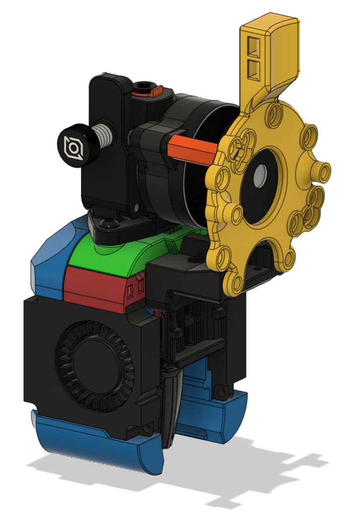
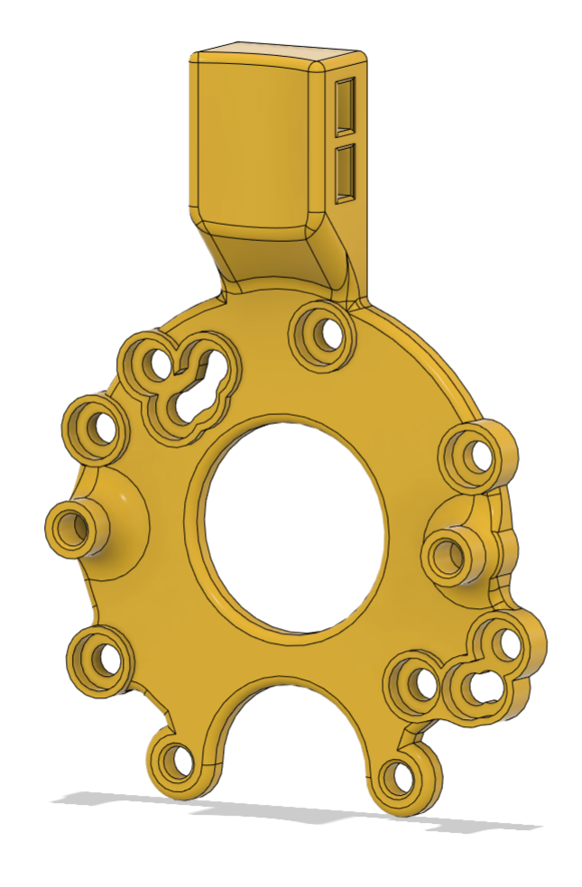

# PCB Carrier and Strain Relief Mounts

This mount is for a common set of extruders, plus the [RoundTrip](https://github.com/chirpy2605/voron/tree/main/general/RoundTrip) series of extruders that I have made. There are variants for the Dragon Burner (_DB) and the Rapid Burner (_RB).

Each mount is made up of a PCB carrier plus at least 2 stand-offs.

The carriers allow you to attach a PCB board meant to attach to the screws on a Nema14 36mm pancake motor (a universal 42mm PCB mount is also available). This is then also connected on a Voron v0 to the rear X carriage brass inserts for additional stability.

## Supported Extruders:

- LGX Lite

- Orbiter v1.5

- Orbiter v2

- Sharkfin

- Sherpa Mini

- Sherpa Micro

- Hextrudort

- RoundTrip LGX

- RoundTrip TBG

- RoundTrip OB1

- RoundTrip OB1 Reverse

- RoundTrip OB2

- RoundTrip OB2 Reverse

There are individual carriers for each extruder plus a universal carrier if the aesthetics are not important to you (does not include the Hextrudort or Sharkfin mount holes).

Each extruder requires at least 2 stand-offs (_long) between the motor and the PCB carrier. Some of the extruders require 2 additional (_short) spacers between the X carriage and the rear of the PCB carrier where the motors extend beyond the X carriage.

If the extruder requires the X carriage (_short) spacers, they are intended to be fitted with screws passing through the PCB Mount, then the spacer and into the X carriage.

The _long spacers have been designed to take M3 4x5mm brass inserts if needed. They also have through holes if you prefer to mount that way. They are hexagonal so that they can be printed on their sides so that load is applied along their length rather than width which often leads to broken stand-offs in other designs. Alternatively, metal spacers or stand-offs can be used instead so long as they project 1~2mm beyond the rear of the extruder motor.

The stand-offs are designed to place the PCB carrier 1~2mm beyond the extruder motor to help prevent heat from the motor going directly into the PCB carrier.

It has been designed to work with most toolhead boards that fit a Nema14 36mm pancake motor, such as the v0 Umbilical, plus the Mellow Fly SHT36 and BTT EBB36 CAN boards.

You should use BHCS screws with this Mount to ensure there is no contact with the rear of the PCB's. You should also use nylon washers between the screws and the PCB board mount holes.

The PCB carrier also has a vertical strain relief for the cable coming from the toolhead PCB. The cable is restrained by using 1 or 2 cable ties.

## ChangeLog:

- 2023-08-03 BETA release

- 2023-08-03 Added Universal 42mm Dragon Burner PCB Mount

- 2023-08-04 Released PCB Mounts for the Rapid Burner toolhead

- 2023-08-08 Added chamfer and countersink to the x carriage mount points

- 2023-08-22 Published CAD

- 2023-09-08 Updated Sherpa Mini mounts to allow for backlash adjustment
