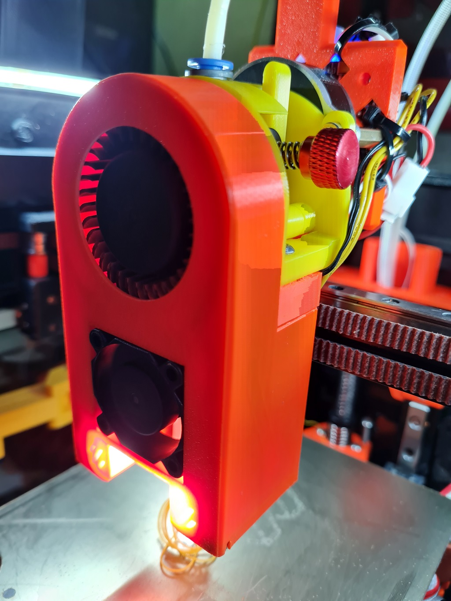
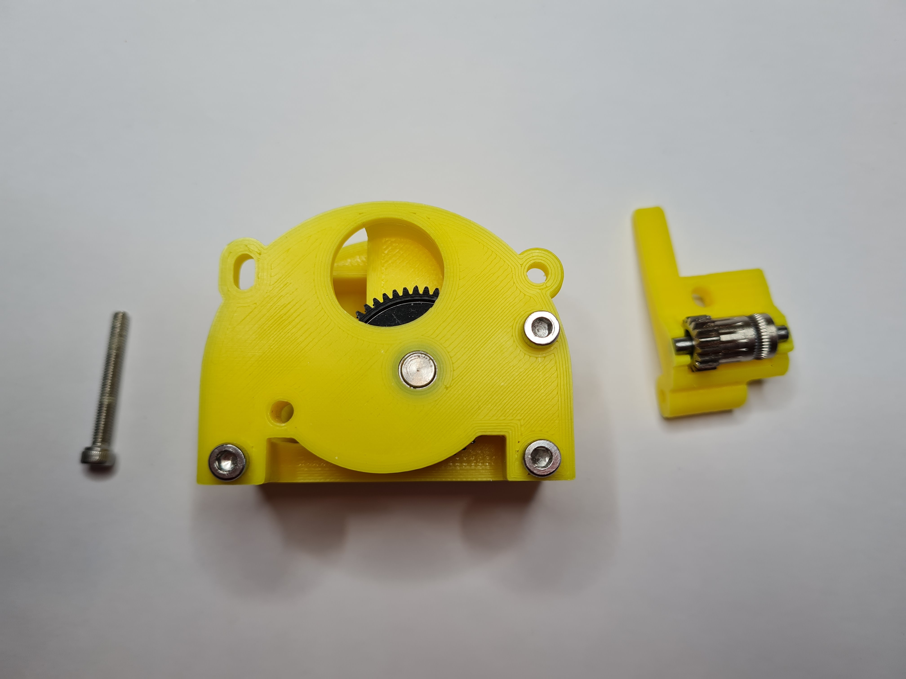
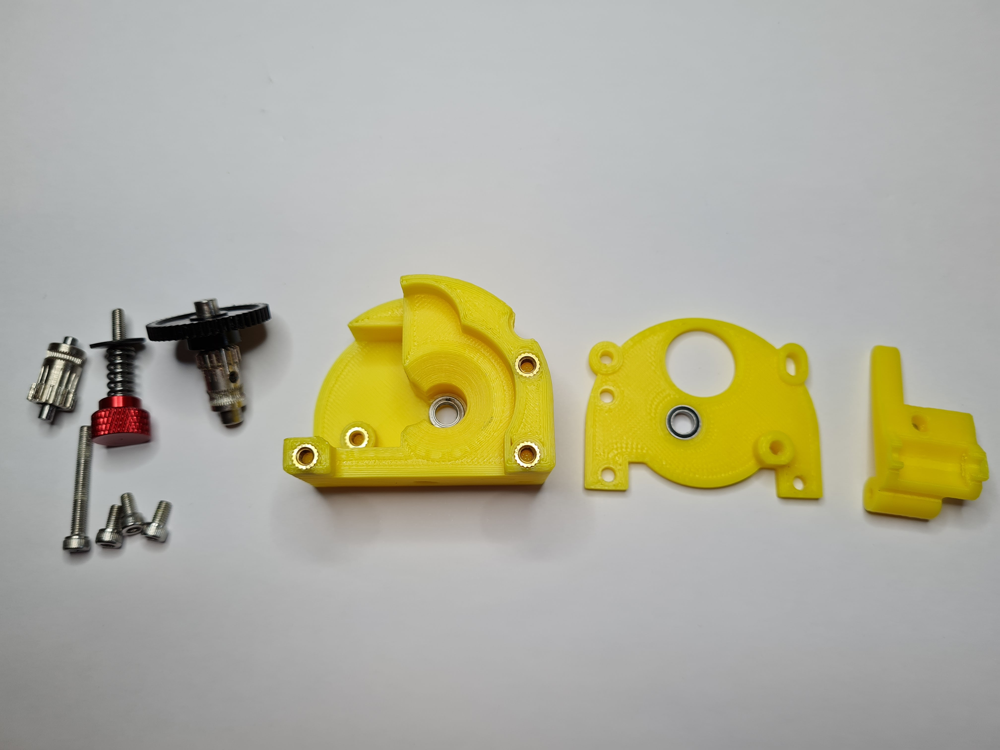
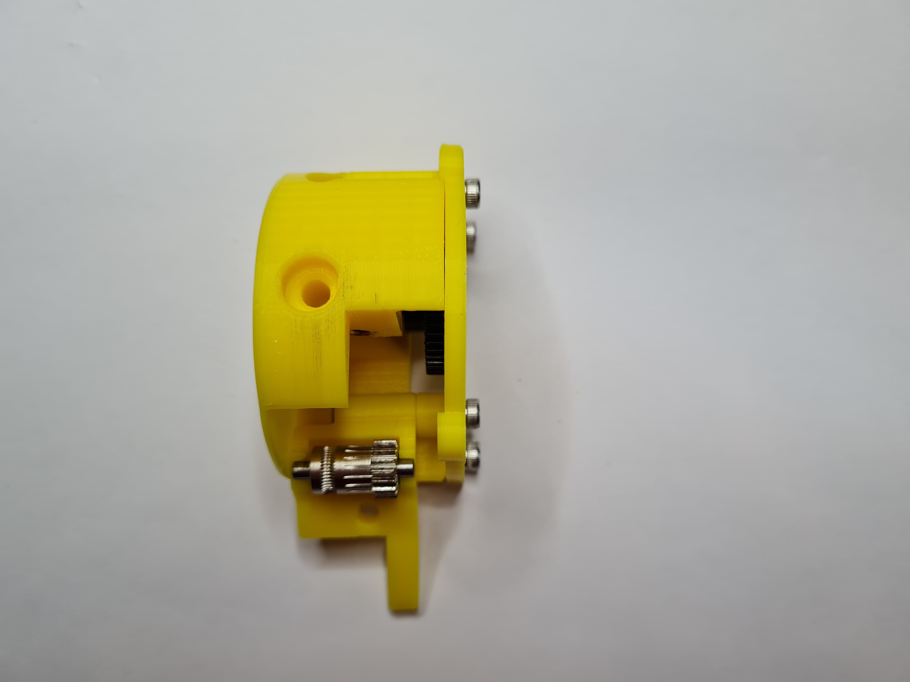
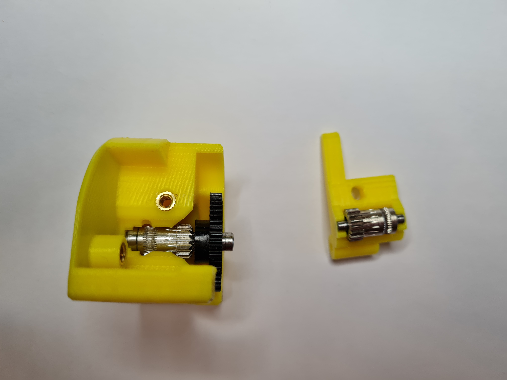
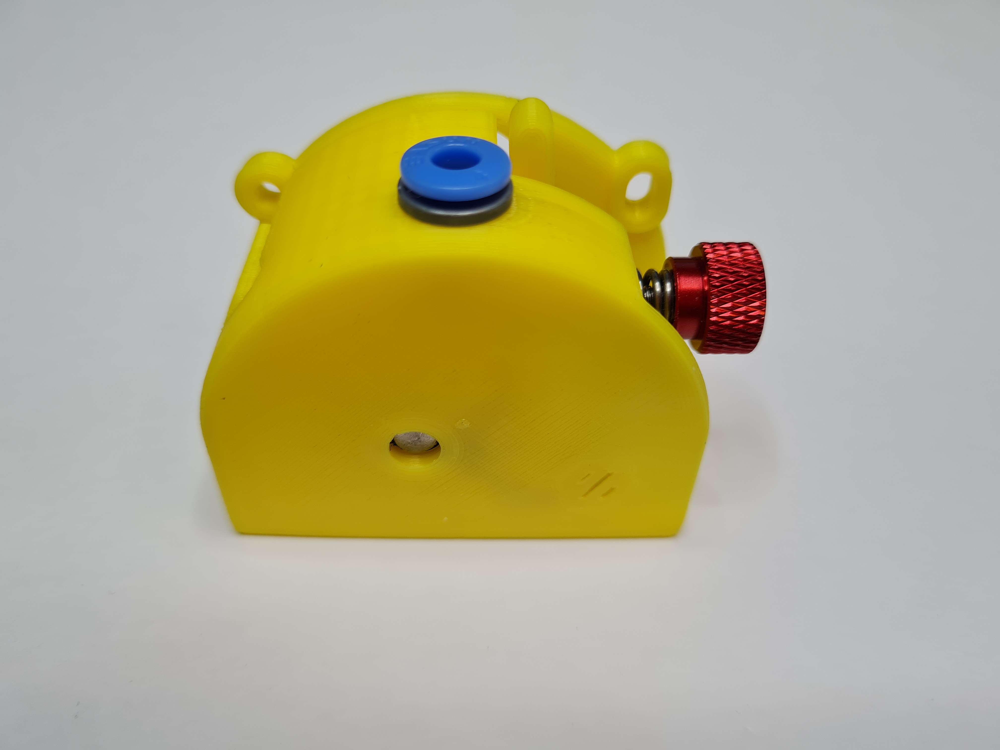

# RoundHouseBMG Direct Extruder

The RoundHouseBMG is a direct drive extruder designed for the Voron v0.1

It uses the mounts from the [Mini-AfterSherpa](https://github.com/KurioHonoo/Mini-AfterSherpa) and was designed to complement the [5015 Toolhead](https://github.com/waytotheweb/voron/tree/main/V0/5015_Toolhead) toolhead. It can be used on any toolhead that uses the [Mini-AfterSherpa](https://github.com/KurioHonoo/Mini-AfterSherpa) design.

Please Note: This is a Work In Progress and things will likely change as issues are fixed and enhancements are made.

## Printing:

- Use the Voron defaults and print in ABS or better
- The parts are orientated correctly in the STLs

## BOM:

- 4x M3x6 or 8mm SHCS/BHCS (for securing the front to the back of the extruder)
- 1x M3x25mm  SHCS/BHCS (for the lever pivot)
- 5x Brass heat inserts (4 for the mount, 1 for the lever)
- 1x BMG Extruder Kit 
- 1x NEMA14 36mm pancake Motor with 10 tooth gear
- 1x ECAS04 Embedded Collet (optional)

## Sources:

- BMG Extruder Kit, e.g. [AliExpress](https://www.aliexpress.com/item/4000021186440.html) or direct from Bondtech
- NEMA14 36mm pancake Motor with 10 tooth gear, e.g. [AliExpress](https://www.aliexpress.com/item/1005003056906725.html)
- ECAS04 Embedded Collet, e.g. [Aliexpress](https://www.aliexpress.com/item/1005002538357279.html)

## Assembly:

Instructions to follow...

