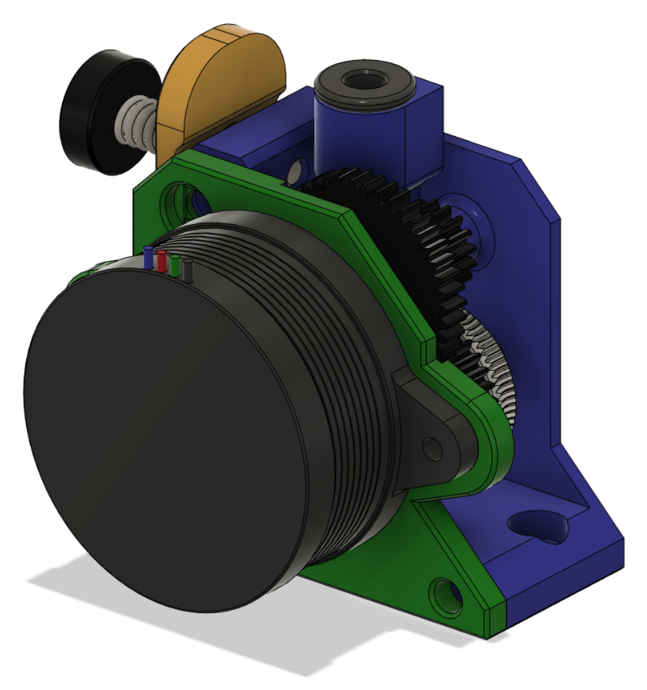
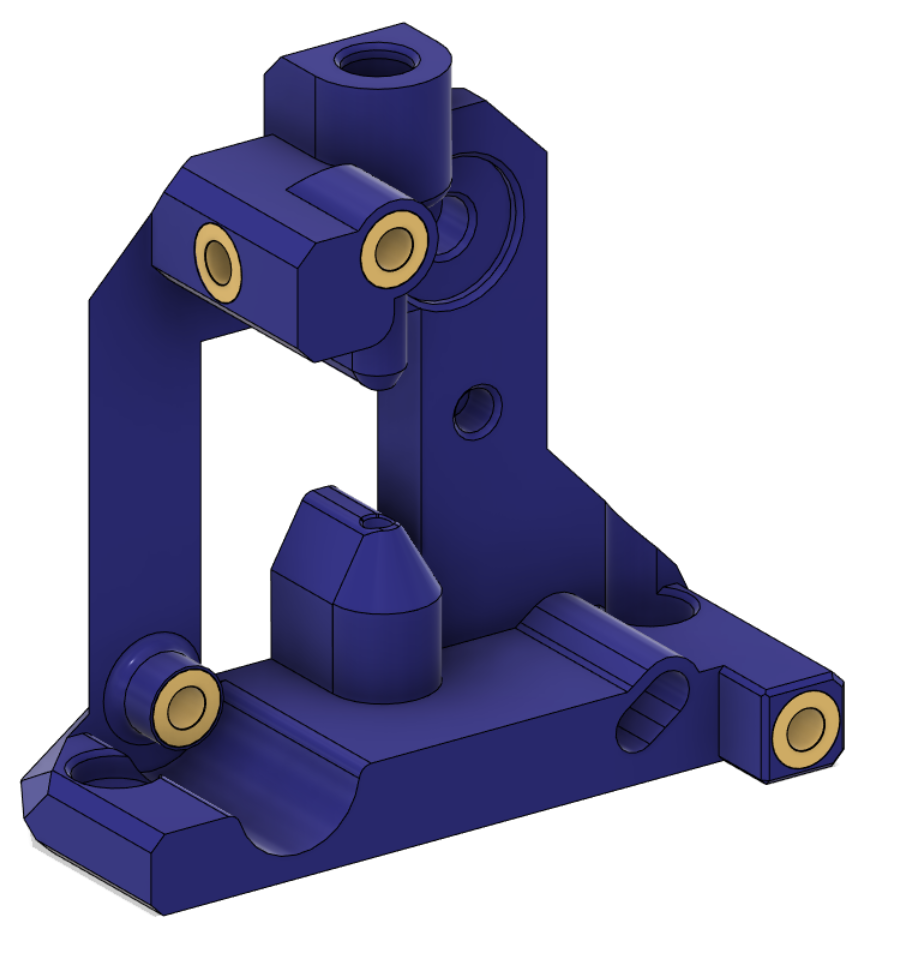
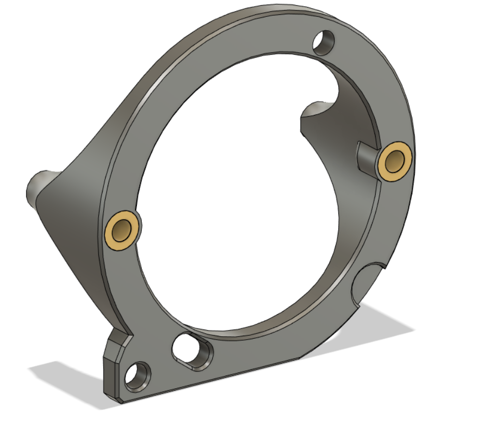

# RoundTrip Extruder

This extruder uses the LGX Lite gears. It is an open air design, so that the workings are easily seen. There is provision to alter backlash to avoid extruder artefacts in prints.

This is a work in progress, CAD will be released when testing is finished.

[Youtube video](https://youtube.com/shorts/o_dMHLuLg6s).

## BOM:

- 1x set of LGX Lite gears

- 1x [NEMA14 36MM 17MM geared motor](https://www.aliexpress.com/item/1005003056906725.html)

- 1x Extruder screw, spring and washer (not part of the LGX Lite)

- 6x Brass heat inserts

- 1x UM2 4mm coupling collet to hold the PTFE tube (optional, but recommended). If you have a spare TBG Lite or LGX Lite you can use the one with those

- An assortment of M3 SHCS/BHCS screws 

## Klipper:

- Don't set gear_ratio

- Set rotation_distance: 5.70

- Adjust flow in EM

## Assembly:

Melt 4 heated inserts into the Front piece as shown:

Melt 2 heat inserts into the toolhead board mount:

Push one hobbed gear with a shaft through it into the guidler. It might need a bit of force to push it in. Ensure it spins smoothly:

Fit the second hobbed gear plus the large gear in between the front and back pieces.

Use a 20mm screw and screw through the back, through the guidler into the heat insert in the front. Don't overtighten otherwise it will interfere with the guilder.

Use a 20mm screw to screw the front backlash control to the motor. Leave this loose for now.

Use a 10mm screw to screw the toolhead board mount, the motor, the back into the front. Leave this screw loose for now.

Use a 6mm screw through the toolhead board mount into the front.

You can now rotate the motor until the motor gear meshes with the  large extruder gear. You want enough contact so that there's no or little backlash, but not so much that the motor gear is pushing the large extruder gear away from it.

Once in position tighten the backlash screw. Then tighten the 3 screws on the back.

Feed some filament through the extruder and check that the hobbed gears pull the filament smoothly though by turning the large extruder gear. Check that there's no backlash when this happens. If there is, loosen the screws mentioned in the procedure above and redo the backlash setup.

## Releases:

- Initial WIP release

## Changelog:

- 2023-02-04 Initial WIP release
- 2023-02-07 Updated Front and Back STLs to cover the guidler to retain the pin if it's loose
