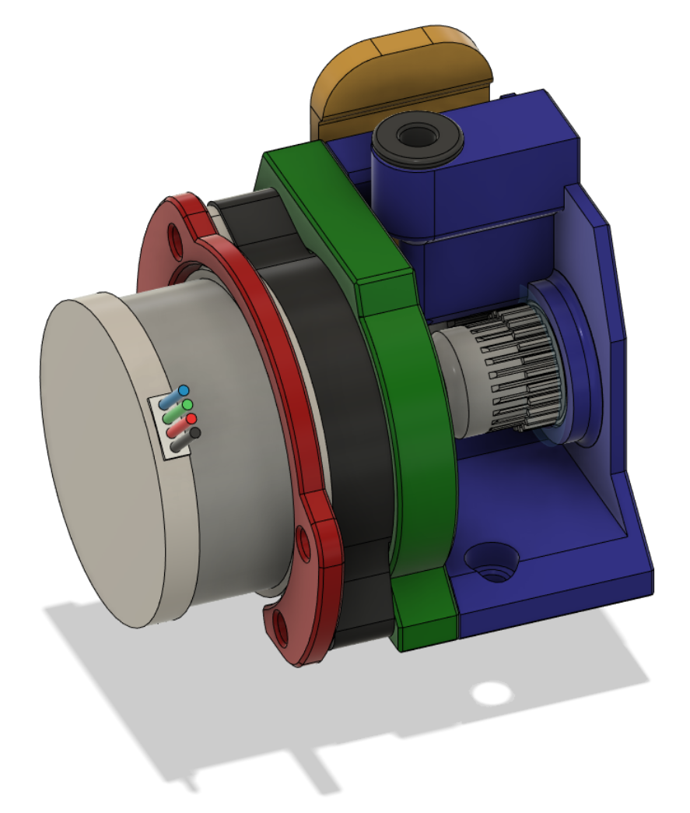
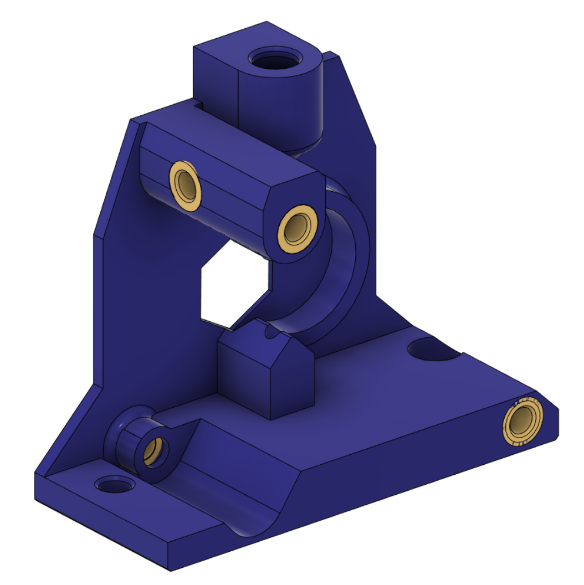
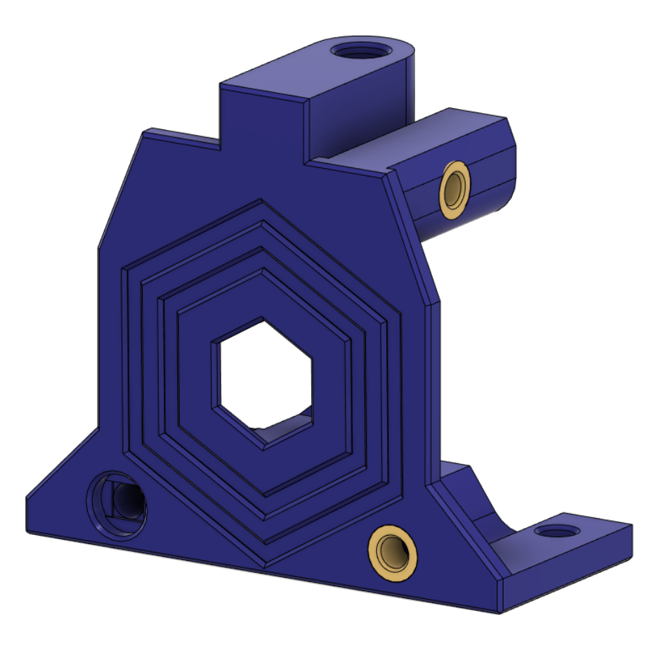
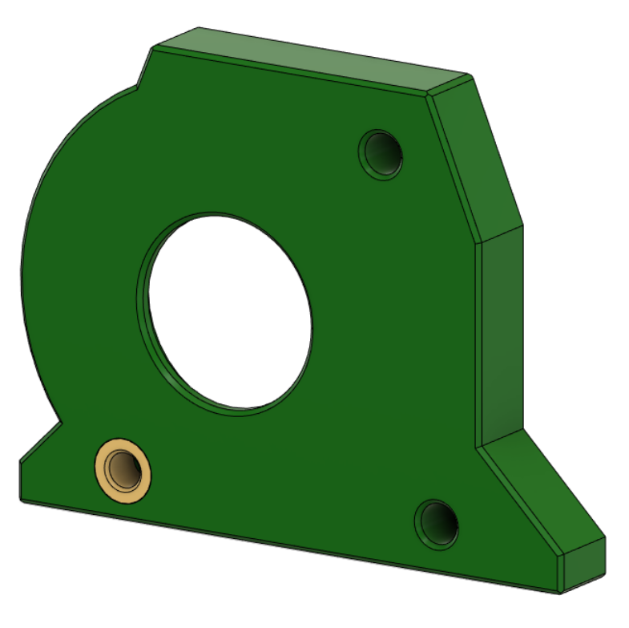
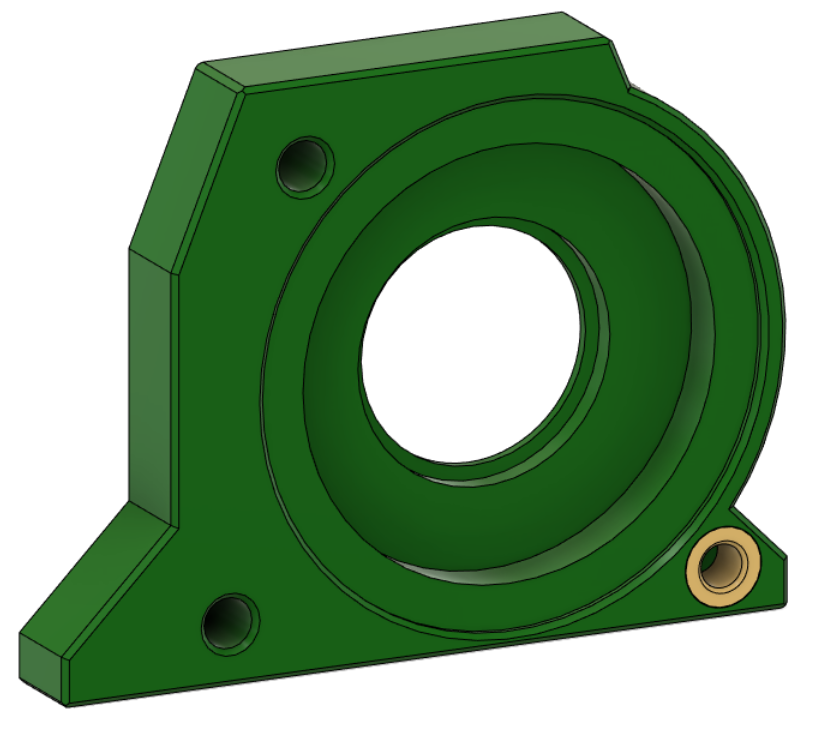

# RoundTrip Extruder (ORB1)

This extruder uses the Orbiter v1.5 gear set. It is an open air design, so that the workings are easily seen. There is provision to alter backlash to avoid extruder artefacts in prints.

This extruder comes in two variants:

- The Front Feed version has the filament feed at the front of the extruder. This means it can fit on toolheads where space to the front of the extruder is limited. The extruder and motor will hang further off the back when mounted.

- The Rear Feed version has the filament feed at the rear of the extruder. This means it can fit on toolheads where space to the back of the extruder is limited. The extruder and motor will hang less far off the back when mounted.

The version that you choose, will depend on the toolhead and the position you want the weight distributed.

## BOM:

- 1x Orbiter v1.5 drive gear set

- 1x [NEMA14 36MM 17MM geared motor](https://www.aliexpress.com/item/1005003056906725.html)

- 1x Extruder screw, spring and washer

- 3x or 4x Brass heat inserts

- 1x UM2 4mm coupling collet to hold the PTFE tube (optional, but recommended)

- An assortment of M3 screws 

## Assembly:

Melt 3 heated inserts into the Front piece as shown:

Front feed version:

The Rear feed version:

Push one hobbed gear with a shaft through it into the guidler. It might need a bit of force to push the shaft in from one side so that it goes through the hole on the other. Ensure it spins smoothly.

Push the main gear assembly through the rear part and into the front part where you should insert one of the bearings.

Secure the guidler between the front and back parts using a screw from the rear to the front.

If using the rear feed version, secure the front to the back part using another screw from the front to the rear.

Now stack the motor to the main gear assembly, then the PCB mount on the motor. Screw from the rear through from the PCB mount, through the motor screw holes, through the gear assembly shroud, through the rear part and into the front part. Once the screw has gone through the motor screw holes, push all the parts together to ensure there is no slack once the screw is tighten, between the parts after the motor going forward.

## Klipper:

- Don't set gear_ratio

- Set rotation_distance: 4.637

- Adjust flow in EM

## Release v1:

- Initial Release

## Changelog:

- 2023-03-28 First full release
