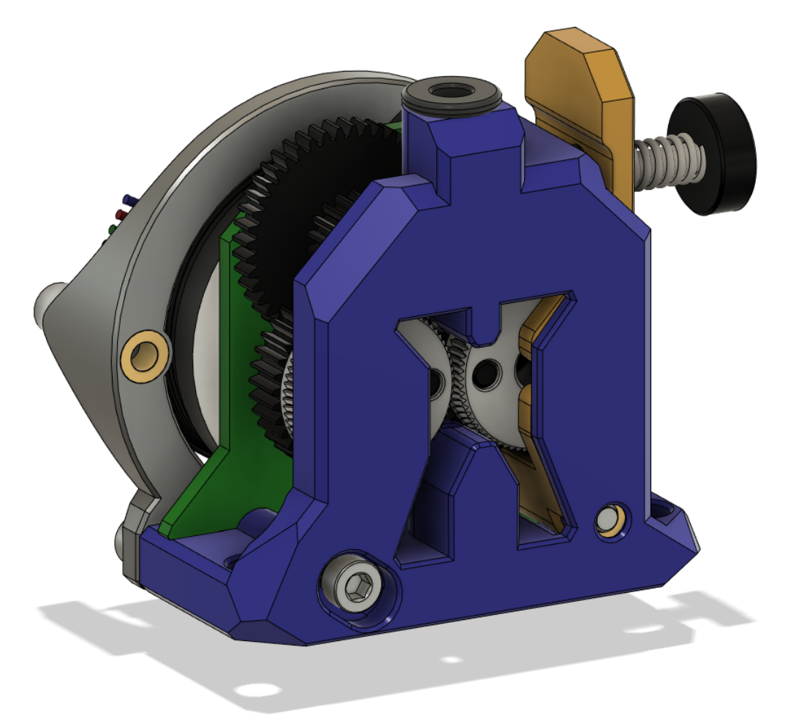

# RoundTrip Extruder

This extruder is an open air design, so that the workings are easily seen. There is provision to alter backlash to avoid extruder artefacts in prints.

There ware two variants:

1. The first uses the gear set from an LGX Lite Extruder
   [RoundTrip LGX Lite](LGX/)

2. The second uses the gear set from the Trianglelab TBG Extruder
   [RoundTrip TBG Lite](TBG/)
