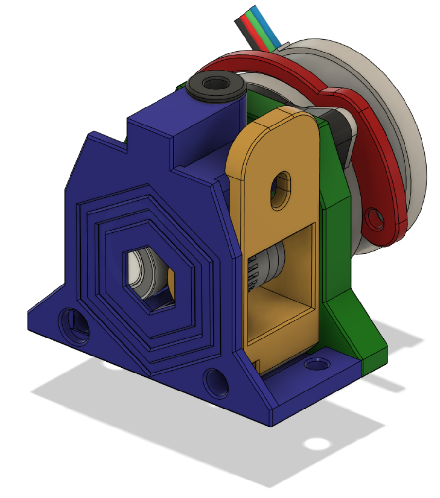

# RoundTrip Extruders

These extruders are an open air design, so that the workings are easily seen. 

The LGX and TBG variants provide backlash adjustment. The Orbiter v1.5 and v2.0 do not need this.

There ware four variants, two with additional versions:

1. The first uses the gear set from an LGX Lite Extruder
   [RoundTrip LGX Lite](LGX/)

2. The second uses the gear set from the Trianglelab TBG Extruder
   [RoundTrip TBG Lite](TBG/)

3. The third uses the gear set from the Orbiter v1.5 Extruder [RoundTrip ORB1](ORB1/) and has two versions: one with the filament feed near the front, the other with the feed near the back

4. The fourth uses the gear set from the Orbiter v2.0 Extruder [RoundTrip ORB2](ORB2/) and has two versions: one with the filament feed near the front, the other with the feed near the back
