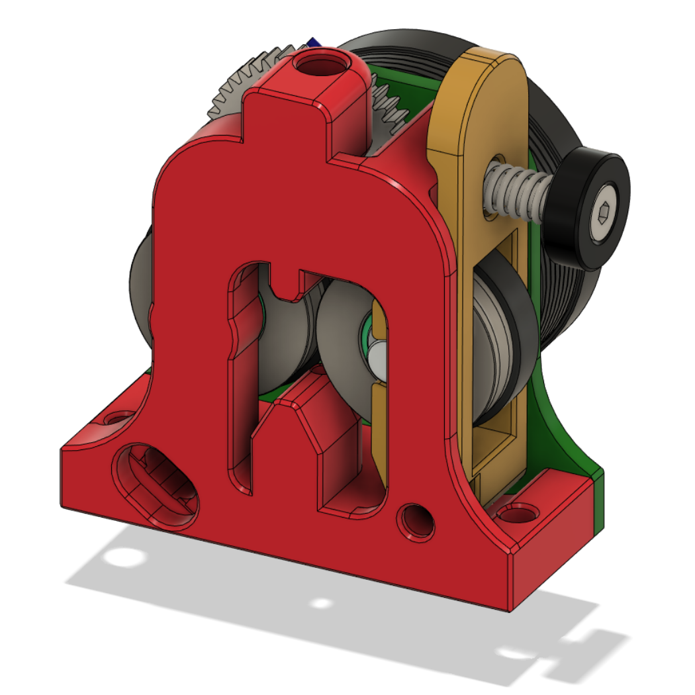
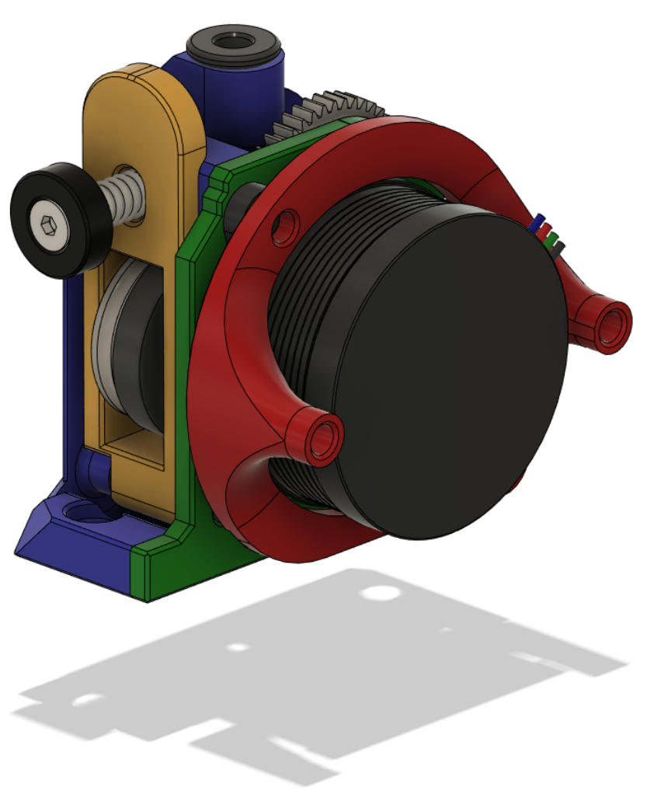
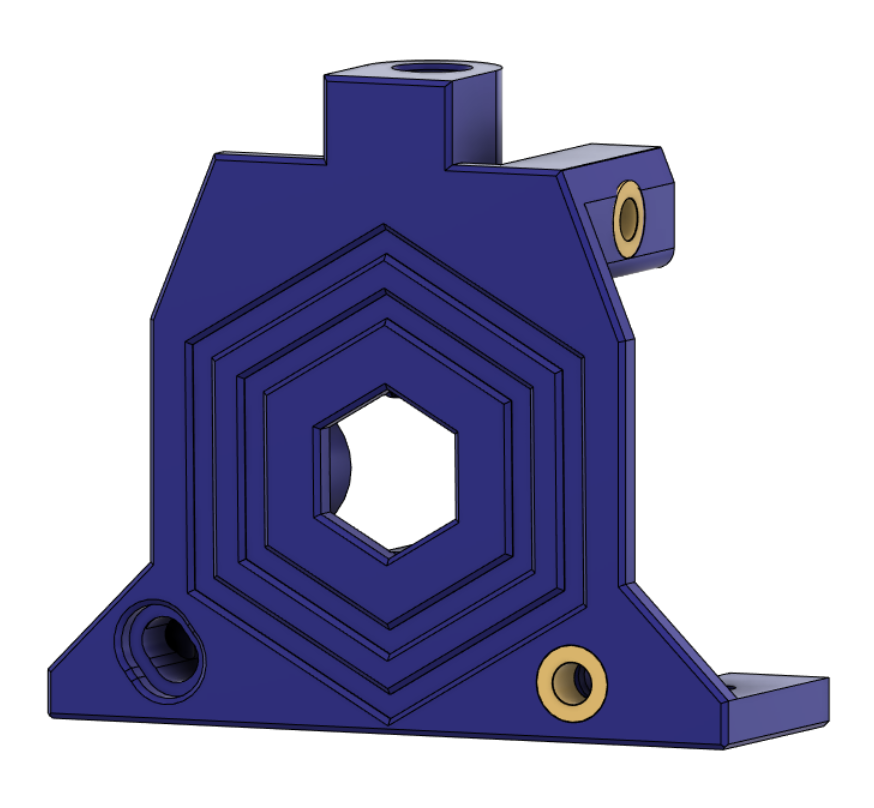
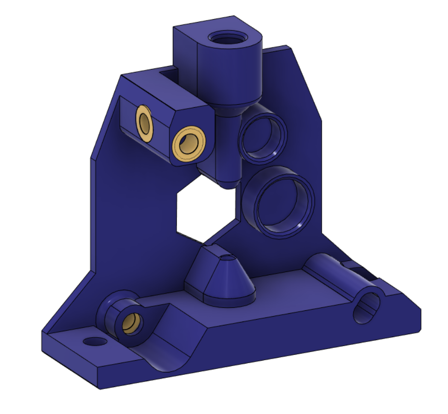

# RoundTrip Extruder

This extruder uses the Trianglelab TBG gear set. It is an open air design, so that the workings are easily seen. There is provision to alter backlash to avoid extruder artefacts in prints.

## BOM:

- 1x [Trianglelab TBG Lite gear set](https://www.aliexpress.com/item/1005004050167328.html)

- 1x [NEMA14 36MM 17MM geared motor](https://www.aliexpress.com/item/1005003056906725.html)

- 1x Extruder screw, spring and washer (not included in the TBG gear set)

- 4x Brass heat inserts

- 1x UM2 4mm coupling collet to hold the PTFE tube (optional, but recommended). If you have a spare TBG Lite or LGX Lite you can use the one with those

- An assortment of M3 BHCS screws 

## Assembly:

Melt 3 heated inserts into the Front piece as shown:

Push one hobbed gear with a shaft through it into the guidler. It might need a bit of force to push it in. Ensure it spins smoothly.

Fit the second hobbed gear plus the large gear in between the front and back pieces.

Screw the back and front together using BHCS screws.

Attach the motor, leaving the screws a little loose.

Rotate the motor until the motor gear meshes with the large extruder gear. You want enough contact so that there's no or little backlash, but not so much that the motor gear is pushing the large extruder gear away from it.

Once in position tighten the motor screws.

Feed some filament through the extruder and check that the hobbed gears pull the filament smoothly though by turning the large extruder gear. Check that there's no backlash when this happens. If there is, loosen the screws mentioned in the procedure above and redo the backlash setup.

## Klipper:

- Don't set gear_ratio

- Set rotation_distance: 5.20

- Adjust flow in EM

## Release v1:

- Initial Release

## Changelog:

- 2023-03-08 First full release including CAD
- 2023-03-12 Reduced the number of heat inserts to one
- 2023-03-12 Angled the motor and added PCB mountpoints. Use standoffs from these points to mount a PCB behind the motor
- 2023-03-12 Moved the backlash adjustment to the front and increased the amount of adjustment
