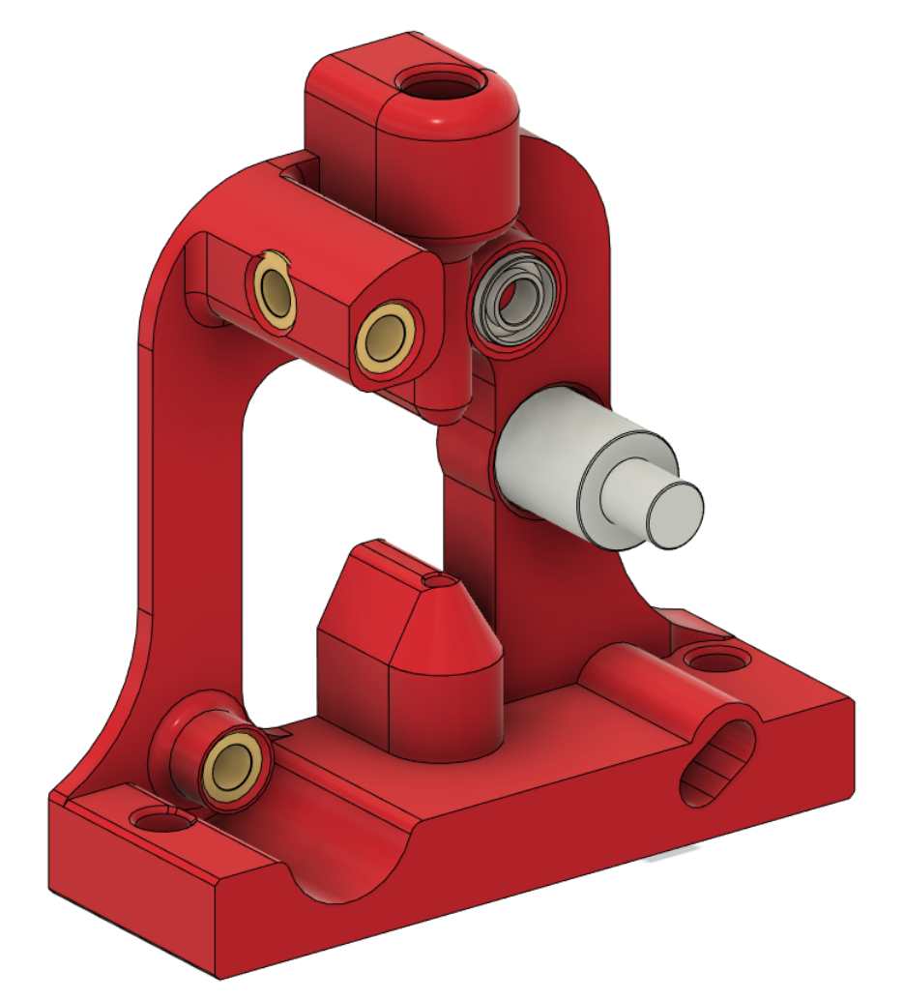
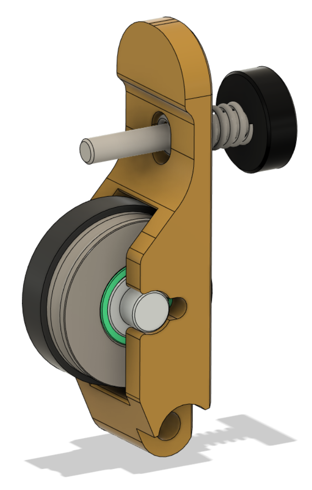

# RoundTrip Extruder

This extruder uses the Trianglelab TBG gear set. It is an open air design, so that the workings are easily seen. There is provision to alter backlash to avoid extruder artefacts in prints.

This is a work in progress, CAD will be released when testing is finished.

[Youtube video](https://youtube.com/shorts/BWLd8I14_3c).

## BOM:

- 1x [Trianglelab TBG Lite gear set](https://www.aliexpress.com/item/1005004050167328.html)

- 1x [NEMA14 36MM 17MM geared motor](https://www.aliexpress.com/item/1005003056906725.html)

- 1x Extruder screw, spring and washer (not included in the TBG gear set)

- 4x Brass heat inserts

- 1x UM2 4mm coupling collet to hold the PTFE tube (optional, but recommended). If you have a spare TBG Lite or LGX Lite you can use the one with those

- An assortment of M3 SHCS/BHCS screws 

## Klipper:

- Don't set gear_ratio

- Set rotation_distance: 5.20

- Adjust flow in EM

## Assembly:

Note: There is now an additional heat insert to the lower right of this picture:

